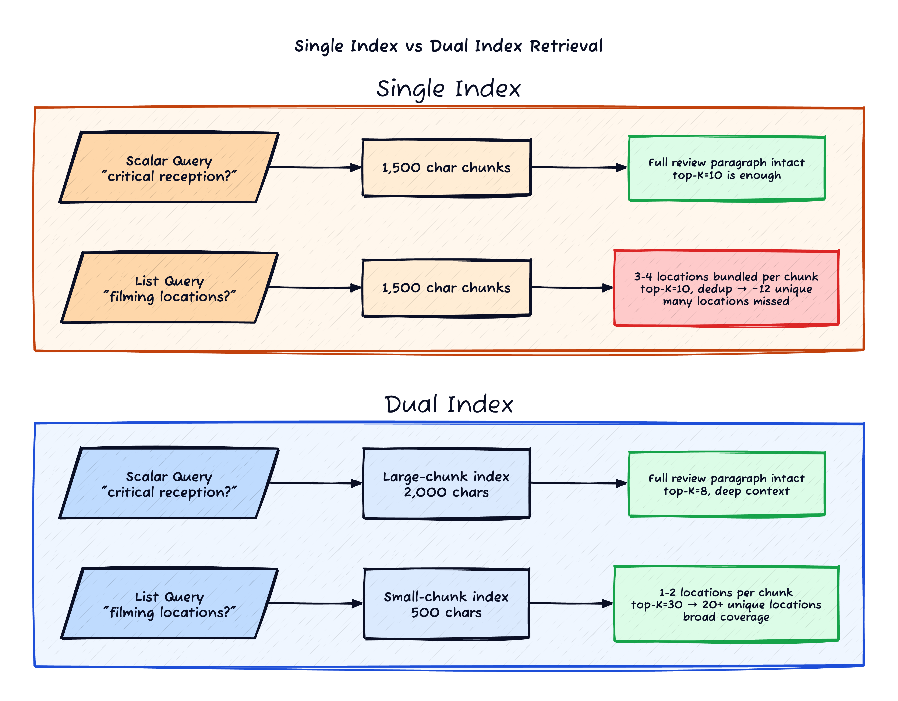
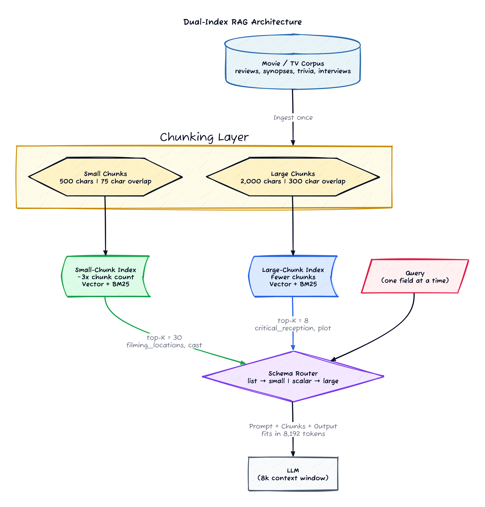
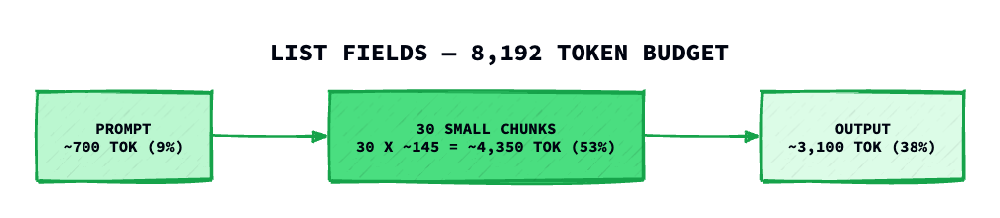
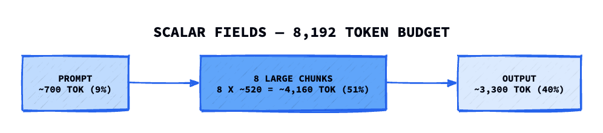

*Prerequisites: This post assumes familiarity with RAG (Retrieval-Augmented Generation) — chunking, embeddings, vector search, and feeding retrieved passages to an LLM. If you're new to RAG, start with [Pinecone's RAG guide](https://www.pinecone.io/learn/retrieval-augmented-generation/) or [LangChain's RAG tutorial](https://python.langchain.com/docs/tutorials/rag/).*

Most RAG tutorials hand you a single number for chunk size — 512 tokens, 1,000 characters [[2]](#references)[[6]](#references) — and call it a day. That works fine when every query has the same shape. But in production pipelines that extract structured data from unstructured documents, queries come in two fundamentally different flavours, and a single chunking strategy quietly underserves one of them.

This post walks through **dual-index RAG** — maintaining two parallel search indices over the same corpus, each chunked for a different retrieval profile — with the budget math and implementation code for constrained context windows.

## The Tension

Imagine you're building a RAG pipeline over a movie and TV database — reviews, plot synopses, trivia pages, cast interviews, and awards histories scraped from fan wikis and entertainment sites. You want to populate a structured profile for each title: director, release year, runtime, box office gross, but also cast members, filming locations, awards, and soundtrack tracks.

You might think there are three kinds of fields here — short factoids (release year), narratives (plot summary, critical reception), and lists (cast, locations). But from a retrieval perspective, factoids and narratives are the same: both need the surrounding paragraph intact. A release year like "2014" could survive in a small chunk, but a critical reception summary can't — and the large-chunk path handles both. The real split is two-way:

**Scalar questions** need depth. "Summarise the critical reception of Interstellar." The answer lives across a full review paragraph:

> *Interstellar received polarised reviews on release — praised for its ambition, visual effects, and Hans Zimmer's organ-driven score, but criticised for its third-act exposition and perceived sentimentality. It holds 73% on Rotten Tomatoes, though audience scores trend significantly higher. Over time, critical consensus has warmed; a 2020 BBC poll ranked it among the 100 greatest films of the 21st century.*

The LLM needs the whole paragraph to produce a coherent summary — the praise, the criticism, and the reappraisal are all part of one nuanced answer. A fragment like *"criticised for its third-act exposition and perceived"* is misleading without the surrounding context.

**List questions** need breadth. "Where was it filmed?" Each filming location is mentioned in its own short block across different pages — a production notes page, a trivia section, and a behind-the-scenes interview:

> **Kananaskis, Alberta** — Cornfield and farmhouse scenes. The production planted 500 acres of corn.
>
> **Svínafellsjökull Glacier, Iceland** — Mann's planet ice sequences.
>
> **Stage 30, Sony Pictures Studios** — Spaceship interiors and docking scenes.

These are spread across the corpus. Each mention is short and self-contained.

| | Scalar extraction | List extraction |
|--|--|--|
| **Goal** | Full paragraph context | Maximum item coverage |
| **Ideal chunk** | 1,500–2,000 chars | 400–500 chars |
| **Top-K** | 8–10 | 25–40 |
| **Failure mode** | Fragmented context, ambiguous answers | Missing items, truncated lists |

A 2,000-character chunk bundles 3-4 filming locations together. With top-K=8, after deduplication and relevance filtering you end up with maybe a dozen unique locations — but a well-documented blockbuster might have 20+. Meanwhile, a 500-character chunk splits that review paragraph mid-sentence, and the LLM might see *"criticised for its third-act exposition and perceived"* — producing a summary that's all negative when the actual reception was mixed.

No single chunk size optimises for both.



The idea of using multiple chunk granularities in RAG isn't new — it shows up as **multi-granularity retrieval** in academic literature, **parent-child chunking** in LlamaIndex, and **small-to-big retrieval** in LangChain. But those approaches use one index and expand chunks at read time. The approach here is different: two separate indices, deterministic routing, no expansion step.

## The Architecture

Build two search indices from the same corpus:



Both indices use the same hybrid search stack (dense vectors + BM25 with reciprocal rank fusion). The only difference is chunk granularity. Routing is deterministic — if the extraction target is defined in a schema, the field type tells you which index to query. `filming_locations: list[str]` goes to the small-chunk index. `critical_reception: str` goes to the large-chunk index. No classifier, no LLM call — it's a schema lookup.

## Implementation

### Chunking with overlap

The chunker needs one addition over a standard splitter: an `overlap` parameter that carries the tail of each chunk into the next, so sentences straddling a boundary aren't lost.

```python
def chunk_page(text: str, max_size: int = 1500, overlap: int = 0) -> list[str]:
    """Split text into chunks by paragraph/heading boundaries with overlap."""
    lines = text.split("\n")
    chunks = []
    current_lines = []
    current_size = 0

    def flush():
        nonlocal current_lines, current_size
        chunk_text = "\n".join(current_lines).strip()
        if len(chunk_text) >= 80:  # min chunk size
            chunks.append(chunk_text)
        # Carry over the last `overlap` chars into the next chunk
        if overlap > 0 and len(chunk_text) > overlap:
            tail = chunk_text[-overlap:]
            current_lines = tail.split("\n")
            current_size = len(tail)
        else:
            current_lines = []
            current_size = 0

    for line in lines:
        if current_size + len(line) > max_size and current_size > 200:
            flush()
        current_lines.append(line)
        current_size += len(line)

    flush()
    return chunks
```

### Building two indices

Both indices are built from the same source documents — the crawl happens once, chunking happens twice:

```python
class DualIndexRAG:
    def __init__(self, documents: list[dict]):
        # Small chunks for list fields: 500 chars, 15% overlap
        small_chunks = []
        for doc in documents:
            small_chunks += chunk_page(doc["text"], max_size=500, overlap=75)

        # Large chunks for scalar fields: 2000 chars, 15% overlap
        large_chunks = []
        for doc in documents:
            large_chunks += chunk_page(doc["text"], max_size=2000, overlap=300)

        self.small_index = HybridSearchEngine(small_chunks)
        self.large_index = HybridSearchEngine(large_chunks)

    def search(self, query: str, top_k: int, use_small: bool) -> list[str]:
        index = self.small_index if use_small else self.large_index
        return index.search(query, top_k=top_k)
```

### Schema-driven routing

The router checks the field's JSON Schema type — array fields go to the small-chunk index, everything else goes to the large-chunk index:

```python
def extract_field(rag: DualIndexRAG, field_name: str, field_schema: dict, query: str):
    """Route to the right index based on schema type, then call the LLM."""
    is_list = field_schema.get("type") == "array"

    if is_list:
        chunks = rag.search(query, top_k=30, use_small=True)
    else:
        chunks = rag.search(query, top_k=8, use_small=False)

    context = "\n---\n".join(chunks)
    return call_llm(field_name, query, context)

# Schema drives routing — no classification model needed
schema = {
    "filming_locations": {"type": "array", "items": {"type": "string"}},
    "critical_reception": {"type": "string"},
    "cast": {"type": "array", "items": {"type": "object"}},
    "release_date": {"type": "string"},
    "box_office": {"type": "string"},
}

for field_name, field_schema in schema.items():
    result = extract_field(rag, field_name, field_schema, f"What is the {field_name}?")
```

The entire routing decision is three lines: check if `type == "array"`, pick the index, set top-K. No orchestration framework needed.

## Budget Math

The examples below use an **8,192-token window** — a realistic ceiling for 7B–9B parameter models running locally on consumer hardware (16GB RAM, no dedicated GPU). The approach scales to larger windows; the ratio between chunk budget and output headroom stays the same.





Both paths use the full budget but allocate it differently — breadth vs depth — without exceeding the window.

**Scaling to larger windows.** Chunk sizes are tuned to *content structure* (how big is a review paragraph? how big is a filming location entry?), not the context window — so they stay stable across model swaps. Top-K is the knob that scales: at 32k you could run top-K=120 for list fields and top-K=30 for scalar fields, keeping the same chunk granularity.

One subtlety: metadata overhead. Each chunk sent to the LLM includes a source header (`[Passage 3] Source: imdb.com/title/tt0816692/trivia | Filming Locations`). That's ~80 characters per chunk. At 30 small chunks, that's ~600 tokens of metadata alone. Factor this into your budget or you'll wonder why the model's output gets truncated.

## Overlap: 15% Is the Sweet Spot

Based on NVIDIA's 2024 chunking benchmark [[1]](#references), 15% overlap outperformed both 10% and 20% across five datasets:

- **0–10%**: boundary sentences are lost, retrieval quality drops
- **15%**: roughly one sentence of carryover — enough to preserve context
- **20%+**: diminishing returns; redundant content reduces effective context capacity

For the dual-index setup: 75 chars overlap at 500-char chunks, 300 chars at 2,000-char chunks. Both at 15%.

## Results

I tested this on a corpus of 100 documents (wiki pages, reviews, trivia, interviews) for a set of well-documented films. Here are the raw numbers:

**Indexing:**

| | Small-chunk index | Large-chunk index |
|--|--|--|
| Chunk size | 500 chars, 75 overlap | 2,000 chars, 300 overlap |
| Chunks produced | 3,218 | 1,324 |
| Index build time | ~8s | ~7s |
| Embedding model | bge-small-en-v1.5 (384d) | same |

**Retrieval quality — list fields (filming locations, cast, awards):**

| Setup | Top-K | Unique items retrieved | Coverage |
|--|--|--|--|
| Single index, 1,500-char chunks | 10 | 6-8 per field | ~40% |
| **Dual index, 500-char chunks** | **30** | **20-25 per field** | **~85%** |

For a film with 25+ documented filming locations spread across trivia pages, behind-the-scenes articles, and interviews, the single-index approach consistently missed more than half. The small-chunk index captured all but the most obscure mentions.

**Retrieval quality — scalar fields (critical reception, plot summary, box office):**

| Setup | Top-K | Paragraph completeness | Extraction accuracy |
|--|--|--|--|
| Single index, 1,500-char chunks | 10 | Good | Baseline |
| **Dual index, 2,000-char chunks** | **8** | **Full paragraphs intact** | **Same as baseline** |

Scalar extraction quality held steady — the larger chunks preserved context without regression. Release dates, box office figures, and multi-sentence summaries all extracted correctly.

**Overhead:** Two indices instead of one added ~15 seconds to the indexing step (embedding the corpus twice with a CPU-based model). Per-query latency was unchanged since each query hits exactly one index.

## Why Not Three or Four Indices?

I considered adding a 1,000-char index and decided against it. The retrieval improvement from 1 → 2 indices comes from matching fundamentally different retrieval objectives (breadth vs depth). A third index doesn't serve a distinct objective — it's a compromise that doesn't do either job as well.

Chroma [[4]](#references) and NVIDIA's [[1]](#references) evaluations confirm that retrieval quality is more sensitive to the *strategy* (semantic vs fixed-size vs recursive) than to fine-tuning chunk size within a range. Once you're in the right ballpark (400-600 for precision [[5]](#references), 1,500-2,500 for context), the exact number matters less than having the right ballpark for the right query type.

## When This Doesn't Apply

- **Uniform query types.** If every query is a summarisation task or every query is a factoid lookup, one chunk size is fine.
- **Unconstrained context windows.** With 128k+ tokens available, you can retrieve generously at any chunk size and let the model sort it out.
- **Small corpora.** If a film's entire documentation fits in a single prompt, chunking strategy is moot.
- **No schema.** If you don't know the shape of the answer at query time, you can't route deterministically. You'd need a classification step, which adds latency and a potential error source.

## Where to Go From Here

Dual-index RAG solves the breadth-vs-depth problem with fixed chunk sizes, but it's still splitting text by character count. The next evolution is **semantic chunking** — splitting at topic boundaries detected by embedding similarity rather than at arbitrary character limits. Semantic chunks align with how information is actually structured in a document, which improves retrieval relevance regardless of chunk size.

If you're looking to go deeper:
- [Greg Kamradt's notebook on semantic chunking](https://github.com/FullStackRetrieval-com/RetrievalTutorials/blob/main/tutorials/LevelsOfTextSplitting/5_Levels_Of_Text_Splitting.ipynb) walks through five levels of chunking sophistication, from naive splitting to semantic.
- Unstructured's guide to chunking strategies [[3]](#references) covers adaptive chunking that adjusts parameters based on document content.
- LlamaIndex and LangChain both offer semantic chunking implementations that can be combined with the dual-index routing approach described here.

## References

1. **NVIDIA (2024)** — [Finding the Best Chunking Strategy for Accurate AI Responses](https://developer.nvidia.com/blog/finding-the-best-chunking-strategy-for-accurate-ai-responses/). Benchmarked 7 chunking strategies across 5 datasets; 15% overlap outperformed 10% and 20%.

2. **Weaviate** — [Chunking Strategies for RAG](https://weaviate.io/blog/chunking-strategies-for-rag). Practical overview of fixed-size, recursive, and semantic chunking with trade-off analysis.

3. **Unstructured** — [Chunking for RAG: Best Practices](https://unstructured.io/blog/chunking-for-rag-best-practices). Recommends 256-1,024 token chunks, 10-20% overlap, with adaptive sizing based on document structure.

4. **Chroma Research** — [Evaluating Chunking Strategies for Retrieval](https://research.trychroma.com/evaluating-chunking). RecursiveCharacterTextSplitter at 400 tokens achieved 88-89% recall; semantic chunkers reached 91%+.

5. **Milvus / Zilliz** — [What is the Optimal Chunk Size for RAG Applications?](https://milvus.io/ai-quick-reference/what-is-the-optimal-chunk-size-for-rag-applications). 256-512 tokens for factoid queries, 1024+ for analytical queries.

6. **Pinecone** — [Chunking Strategies for LLM Applications](https://www.pinecone.io/learn/chunking-strategies/). Covers fixed-size, sentence-based, and recursive splitting with embedding-aware considerations.
