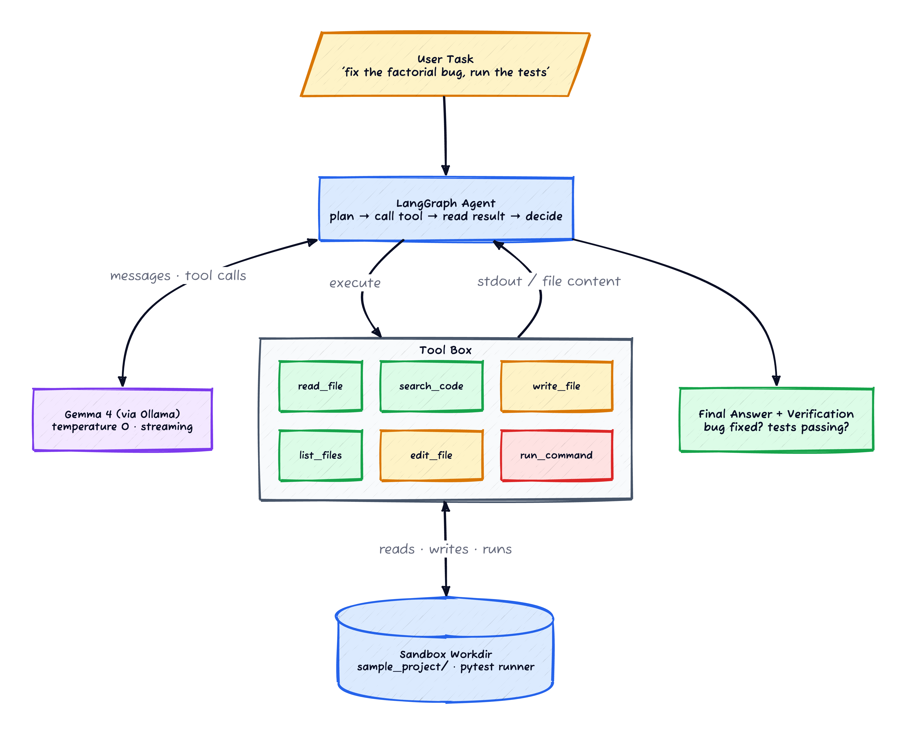
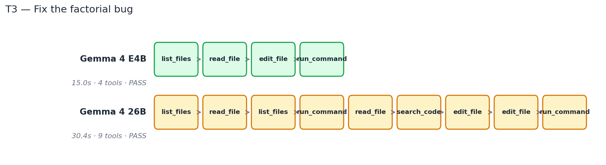
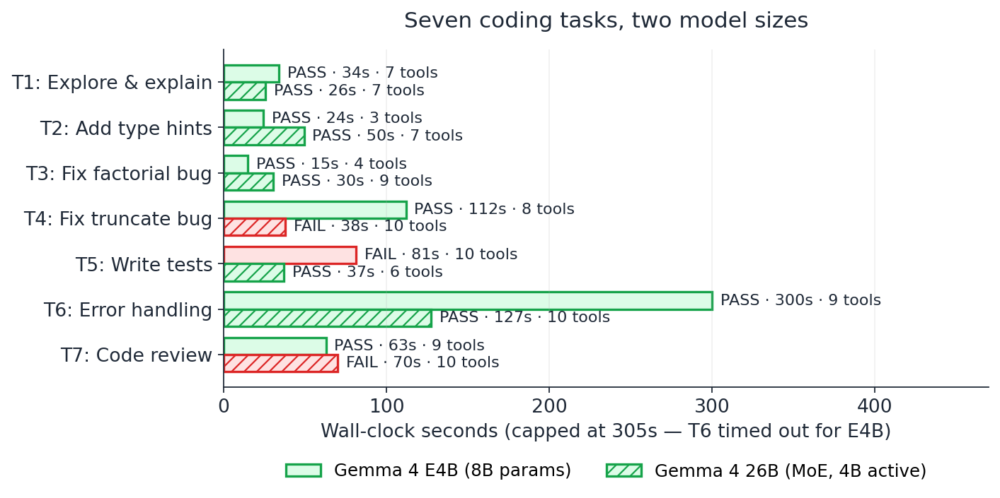

*Prerequisites: Familiarity with LLM tool use and agent loops. This post uses [LangGraph](https://langchain-ai.github.io/langgraph/) as the agent framework and runs the LLMs locally through [Ollama](https://ollama.com/). If you've never built a tool-using agent before, LangGraph's [quickstart](https://langchain-ai.github.io/langgraph/tutorials/introduction/) is a good warm-up.*

The popular intuition about agent quality is: bigger model = better agent. More parameters means more reasoning depth, which means smarter tool choices, which means fewer wasted steps. Pay for the heavyweight, get a better agent.

I built a coding agent over a small Python project and ran it on a 7-task benchmark across three Gemma 4 model sizes — the 8B `E4B` (4B active params via MoE), the 12B base model, and the 26B MoE (4B active). My prior going in was "the 26B will lead, the E4B will be a respectable distance behind, the 12B will sit in the middle."

What I found:

- **Gemma 4 E4B (the 8B) passed 6 of 7 tasks, in roughly half the wall-clock time the 26B took on the same tasks.**
- **The 26B passed 5 of 7. It was more thorough but less consistent — over-explored on easy tasks, gave up on harder ones.**
- **The 12B was broken in the agent loop on this stack** (I'll come back to that — it's a tooling story, not a capability story).

The thing the smaller model was better at wasn't *thinking*. It was *acting*. More on what that means below.

## The setup

The agent is a textbook LangGraph state machine. The state is a list of messages. On each step the LLM either emits a tool call (in which case the harness runs the tool and appends the result) or emits a final answer (in which case the loop terminates). Six tools, scoped to a sandboxed project directory:

| Tool | What it does | Risk tier |
|---|---|---|
| `read_file(path)` | Returns file contents | safe |
| `list_files(dir)` | Returns a directory listing | safe |
| `search_code(pattern)` | grep across the project | safe |
| `edit_file(path, old, new)` | Replace a substring in an existing file | mutates |
| `write_file(path, content)` | Create a new file with contents | mutates |
| `run_command(cmd)` | Shell command in the sandbox | side-effect |

One thing I underestimated going in: **the LLM picks tools by reading their docstrings.** Renaming `edit_file` from a one-line description to a two-line one with an explicit "use this only when the file already exists; for new files use write_file" lifted the agent's tool-selection accuracy noticeably. Tool docstrings are a prompt — write them like one. The Anthropic agent guide [[3]](#ref-3) calls this out and it bit me anyway, on a tool I'd written and re-read a dozen times.

*Figure 1: The agent loop. LangGraph drives plan → call tool → read result → decide. Tools are partitioned by side-effect risk — read-only first, mutating next, shell execution last.*

The benchmark target is a small Python project (`sample_project/`) with a calculator module, an API client, and a tests directory. The seven tasks span five difficulty tiers:

| # | Task | Tier |
|---|---|---|
| T1 | Read the project; describe what each module does | Read-only |
| T2 | Add type hints to all functions in `calculator.py` | Single-edit |
| T3 | Find and fix a bug in `calculator.py:factorial` | Edit + verify |
| T4 | Find and fix a more subtle bug in the string-truncation helper | Edit + verify |
| T5 | Write a pytest test file for the calculator module | Create file |
| T6 | Add try/except error handling across three files | Multi-file |
| T7 | Read the project and write a short code review | Open-ended |

Each task has a scripted verifier that runs after the agent stops: does the file diff contain the expected change? Do the tests pass? Was the right function created? Pass/fail is binary, not partial-credit.

Hardware: Apple Silicon laptop, 36 GB unified memory, Ollama. Temperature 0. Step cap at 25. Wall-clock cap at 300 seconds (a model still running at 300s gets timed out and the verifier runs on whatever state exists).

### A sidebar on the harness

The first version of this benchmark gave me numbers that were quietly wrong, in two ways I want to flag because both are easy to make and hard to spot:

- **The "pristine project" reset wasn't pristine.** Between benchmark runs I'd `git reset` the sandbox back to a known state. Except `git reset` doesn't touch untracked files, and earlier notebook runs had dropped `__pycache__`, half-written test files, and stale config into the workdir. The agent was reading those artefacts and getting confused — *and* I was crediting the agent with passing tasks that had already been partially completed by a previous run. Switched to a full directory wipe + restore from a clean tarball between every task. Scores dropped meaningfully and became reproducible.
- **The verifier checked tool calls, not outcomes.** My T3 verifier was originally "did the agent call `edit_file` on `calculator.py`?" That returned true even when the edit was wrong, the tests still failed, or the agent reverted its own change later. Rewrote each verifier to actually check the post-state — did `pytest` pass, did the file contain the expected string, did the new file exist with the expected import. The verifier-tightening cost me a day and changed the headline result.

These are the kind of bugs that don't crash anything. They just give you confidently wrong numbers. I'm flagging them because I have not yet seen an agent-benchmarking writeup that didn't have at least one harness bug of this flavour in its first draft, including mine.

## The headline: a 4-tool fix vs a 9-tool fix

The cleanest illustration of the whole experiment is T3 — find and fix a one-line bug in a `factorial` function that recurses on `n` instead of `n-1`. The bug is signposted with a `# BUG: should be n-1` comment in the source, so this is the easy version of debugging; the hard part is the agent finding the file, applying a clean edit, and running the tests.

Here's what each model actually did:

*Figure 2: Same task, same starting state, same verifier. The 8B took 4 tool calls and 15 seconds; the 26B took 9 tool calls and 30 seconds. Both passed.*

The E4B sequence is the textbook one. **List** the project, **read** the calculator file, **edit** the factorial line, **run** pytest. Four calls, fifteen seconds, done.

The 26B sequence has the shape of a model that *kept second-guessing itself*. After reading the calculator file, it re-listed the directory ("am I in the right place?"). It ran pytest *before* making the edit ("let me see what's currently failing"). It re-read the calculator file. It searched the codebase for `factorial` (which it had already located). Then it edited — twice — and finally ran pytest again.

Every individual step is a defensible thing for an agent to do. The combination is overhead. Both models got the right answer, but the 26B paid for thoroughness in latency and tool-call count without buying any extra correctness.

The same pattern shows up across the rest of the benchmark.

## The task grid

*Figure 3: Green = passed verifier, red = failed. The E4B finished six tasks; the 26B finished five. Where both passed, the E4B was usually faster — except T2 and T6, where the 26B had real advantages.*

A few details worth pulling out:

**T5 (write tests) — the 26B's win, and a story about tools, not models.** The E4B failed this task in the run shown above. Earlier in the experiment, *every* model failed T5, and I spent an embarrassingly long time looking at logs trying to understand why. The answer was that the agent didn't have a `write_file` tool — only an `edit_file` tool, which couldn't create new files. Once I added `write_file`, the 26B started passing T5 reliably. The E4B still struggles with it; it tends to call `edit_file` first, fail, and not always fall back to `write_file`. That's a model-decisiveness story riding on top of a tool-design story: **the most impactful change in the whole experiment was adding one tool, which lifted the entire fleet's capability before any model swap.**

**T6 (multi-file error handling) — the 26B's other win.** This is the only task where the 26B genuinely outperformed the E4B. The task asks the agent to add try/except blocks across three files, which means coordinating edits across multiple reads-and-writes while keeping the system consistent. The E4B hit the 300-second wall-clock cap; the 26B finished in 127 seconds. For multi-file refactoring with cross-file consistency requirements, the larger model's better planning paid for its slower per-step inference.

**T4 (subtle truncate bug) — the E4B's strongest win.** This is the bug-fixing task with the *unmarked* bug — no `# BUG` comment, the agent has to actually understand the function. The E4B passed in 112 seconds (8 tool calls). The 26B failed in 38 seconds (10 tool calls); it identified the wrong line as the problem and confidently "fixed" something that wasn't broken. The E4B was slower but careful. The 26B was faster and wrong.

**T7 (code review) — the E4B's quiet win.** Open-ended task with no pass/fail criterion you'd want to encode strictly; the verifier here is "did the agent produce a substantive review output." E4B did; 26B got distracted re-exploring files and never produced a coherent review. Decisive beats thorough on open-ended tasks too.

The net is six vs five. The bigger story isn't the score — it's the shape of *how* the smaller model wins. It picks the right tool faster, commits to its choice, and produces an answer. The bigger model wastes its parameter budget on the verification-of-its-own-thinking phase.

## Why is the smaller model more decisive?

I've been turning this over since the data came in. My best guess is a combination of two things, neither of which I've tested cleanly enough to call definitive:

**Faster per-token inference compounds over a loop.** The E4B generates at roughly 100 tok/s on this hardware; the 26B generates at roughly 25 tok/s. Over a multi-step agent loop with intermediate tool results being read back into context, the smaller model can do *more* iterations in the same wall-clock window. That alone biases it toward "try the next thing" rather than "think harder about the current thing."

**Smaller models have less rope to hang themselves with.** A larger model can plan a more elaborate sequence of actions — including unnecessary verification steps, redundant exploration, and "let me double-check by re-reading this file" detours. The smaller model has a shorter planning horizon, which on a well-scoped task is closer to the *right* planning horizon. (This is a domain-specific claim. On a poorly scoped open-ended task, the larger model's planning would help.)

Neither of these is a clean falsifiable claim from this experiment alone. They are hypotheses I'd test next.

## The capability cliff is mechanical, not cognitive

Looking at where models failed across the run, *the failure mode was never "the model didn't understand the problem."* Every model — including 12B in the runs where the tool layer worked — correctly identified the bug, correctly chose the right tool to fix it, correctly described its plan. Failures came at the mechanical layer:

- **Exact string matching in `edit_file`.** My `edit_file` implementation required the `old` string to match the file contents exactly, including whitespace. Models would propose `old="return n * factorial(n)"` against a file that actually contained `return n * factorial(n)  # BUG: should be n-1`. The strings don't match; the edit fails. Cloud agents fix this with fuzzy diff matchers; mine didn't, and the models occasionally tripped on it.
- **Import paths and directory layout.** "Write a test for `calculator.py`" can become "where do test files go in this project, and what import statement do they need," and the smaller models would sometimes guess wrong on the first try.
- **Knowing when to stop exploring.** Read-then-search-then-list-then-read again is a hole that any model can fall into. The bigger model fell into it more often, which I didn't expect.

These are all things a code-specialised agent or a model fine-tuned on tool-use traces would handle better than a general-purpose Gemma run through Ollama with a homemade tool layer. The point isn't that Gemma is bad at coding agents — it's that the **bottleneck is the agent layer's design, not the model's IQ.** A more forgiving `edit_file`, a `find_definition` tool, a `run_tests` tool that wrapped pytest cleanly — any of these would have lifted every model in the lineup.

## The 12B footnote

The Gemma 4 12B was released in June 2026, after I'd finished the rest of this experiment. I added it to the run as a courtesy — and watched it fail almost every task with two tool calls or fewer per task.

After some debugging, this wasn't a Gemma 12B problem; it was a Gemma-12B-through-LangChain-Ollama-tool-binding problem. The model's tool-call output format wasn't being parsed correctly by the version of `langchain-ollama` I was using, and the agent loop would terminate after the first round when the LLM emitted a response that didn't include a parseable tool call. Ollama's native tool-call format [[6]](#ref-6) is well-documented; the bug was in the adapter on top of it, not in the underlying support.

I confirmed the underlying model could call tools correctly when invoked directly through the Ollama API outside LangChain. So this is a **integration-layer compatibility issue**, not a model capability statement. By the time you read this it's probably been fixed in `langchain-ollama`. I'm flagging it for two reasons: (a) the same kind of integration-layer problem will bite anyone trying a new model in a tool-using agent, and the symptom looks exactly like "the model is bad at agents"; (b) honesty about why I excluded 12B from the per-task analysis above.

If you're evaluating a new model in an agent loop and it seems to be failing at zero tool calls, **check the framework integration before you blame the model.**

## When this doesn't apply

- **Seven tasks is not a benchmark.** It's a sketch. The cluster of "E4B and 26B both pass" tasks are exactly the kind of thing single-run variance could flip in a different direction. The bigger claim — *the smaller model holds up on a loop-heavy workload* — is more durable than any per-task score.
- **One sandbox project.** Real codebases have hundreds of files, ambiguous module layouts, intermittent test failures, and dependencies the agent needs to install. None of which my benchmark exercised.
- **No comparison to code-specialised models.** I tested general-purpose Gemmas. A model like `qwen2.5-coder` or `deepseek-coder-v2` would be the right baseline for "is this Gemma's coding skill or just Gemma's tool-using skill." That's a follow-up experiment, not this one.
- **No comparison to cloud APIs — deliberately.** The question I cared about was *"can I run a useful coding agent on my own laptop, with no API key?"* — answering that question required a strictly-local lineup. A cloud comparison (GPT-5 / Claude / Gemini against the same tool layer) would absolutely tell you whether the on-laptop ceiling is the local model or the loop, and it's a useful follow-up — but it's a different experiment with a different question.
- **My tool layer was minimal.** No fuzzy edit matching, no test runner abstraction, no LSP-backed `find_definition`. A production coding agent has all of these and would lift every model in the lineup substantially.

## The methodology lesson

The lesson from this experiment that I'd carry forward:

> **Before you compare models on an agent task, count the tool calls per success. Compare on tool-call efficiency, not just pass-rate.**

Two models can both pass a task — and one is using 4 tool calls per pass and the other is using 9. Over a real workload that ratio determines your latency, your cost, and how often the agent times out before finishing. The pass-rate column is necessary but not sufficient. Tool calls per pass is the column that tells you how the model will actually feel in production.

It also tells you something about the model's *self-confidence under uncertainty*, which is a more useful trait in an agent than raw reasoning depth. The decisive-but-slightly-wrong model is often better than the thorough-but-slow one, because the agent loop gives you cheap correction signals (the test failed, the file doesn't exist, the command returned an error). What the loop doesn't give you cheaply is time.

## Where to go from here

Across this sequence so far — [structured extraction](/posts/slm-structured-extraction/), [vision](/posts/slm-vision-extraction/), [RAG](/posts/slm-rag-shootout/), and now agents — the pattern that keeps recurring is that **a free small model gets you most of the way there, on tasks where "the way there" is well-defined.** Structured extraction has a known schema. Vision has known fields. RAG has a known retriever output. Agents have a known tool layer.

The next obvious question is what happens when you *change the model's weights themselves* — not in-context examples, not prompt tuning, but actual fine-tuning. Can you take a small open-weight model and teach it a specialised behaviour cheaply? That's what [the next post in this sequence](/posts/slm-fine-tuning/) takes on, and the answer is more complicated than the popular "just LoRA it" narrative suggests.

If you want to take *this* experiment further yourself:

- **Add a better edit primitive.** The single biggest lift in my tool layer was adding `write_file`. The second biggest, untested, would be a fuzzy-diff `edit_file` (search for the line ignoring whitespace, then apply the change). LangGraph's design makes this kind of swap cheap.
- **Test on a real project.** Pick something with ~50 files and a real test suite. The dynamics change once the agent can't fit the entire project in its context window.
- **Compare against a code-specialised model.** `qwen2.5-coder:7b` is a strong baseline; if it doesn't outperform `gemma4` E4B on T3-T6, that's a meaningful data point.
- **Instrument tool-call efficiency directly.** My benchmark counts tools per pass post-hoc; an agent that *tracked* tool calls during the loop and bailed at a threshold would be a useful primitive on its own. The "obviously stuck" detection problem is its own area of interest.

For framework reading: AutoGPT [[1]](#ref-1) was the early thing-that-worked; LangGraph [[2]](#ref-2) is the current most-flexible substrate for this style of agent; Anthropic's "building effective agents" piece [[3]](#ref-3) is the best published taxonomy of the design space. For deeper understanding of MoE behaviour at small parameter counts [[4]](#ref-4) [[5]](#ref-5), the Gemma model card and the Mixtral paper are the right primers.

## References

**[1]** **Significant-Gravitas (2023)** — [AutoGPT repository](https://github.com/Significant-Gravitas/AutoGPT). The first widely-shared tool-using LLM agent; established the plan → act → observe → decide loop most modern agents still follow.

**[2]** **LangChain** — [LangGraph documentation](https://langchain-ai.github.io/langgraph/). State-machine-based agent framework; the substrate used in this experiment.

**[3]** **Anthropic (2024)** — [Building effective agents](https://www.anthropic.com/research/building-effective-agents). Taxonomy of agent patterns (chain, router, parallelisation, orchestrator-worker, evaluator-optimiser, autonomous) with concrete examples of when to use each.

**[4]** **Google DeepMind** — [Gemma model family](https://ai.google.dev/gemma). E4B and 26B use MoE routing with ~4B active parameters per forward pass; the parameter-count vs active-compute distinction matters for the decisiveness analysis in this post.

**[5]** **Mistral AI (2024)** — [Mixtral of Experts](https://arxiv.org/abs/2401.04088). The seminal modern paper on sparse mixture-of-experts language models; introduces the routing trade-offs that motivate the speculative argument above about why bigger-MoE may not equal more-decisive.

**[6]** **Ollama** — [Tool support documentation](https://ollama.com/blog/tool-support). Native tool-calling format for Ollama-served models; the integration layer issue with Gemma 4 12B in this experiment likely lived in the LangChain adapter on top of this.
