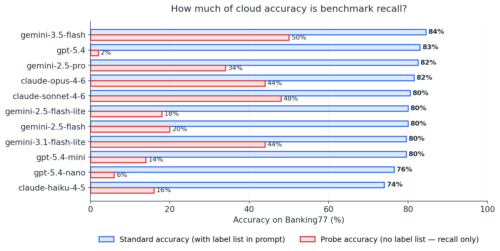
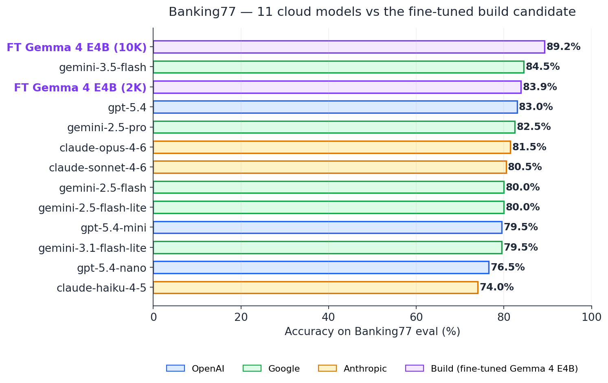
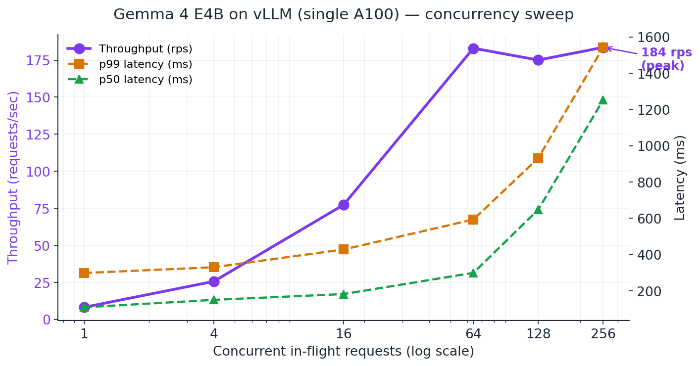
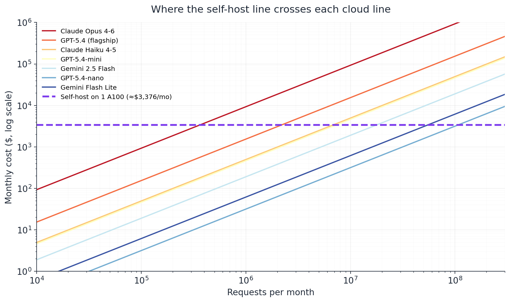
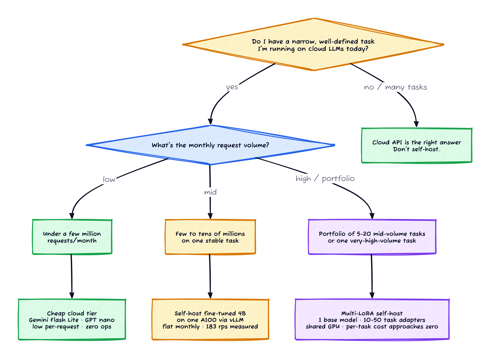

*Prerequisites: Familiarity with LLM serving costs, fine-tuning at a concept level, and the basic build-vs-buy framing. The structured-extraction and fine-tuning posts earlier in this series are useful background but not required. Key code patterns are shown inline; notebooks available on request.*

Every engineering manager has been pitched the same thing this year: *"stop paying OpenAI, fine-tune your own model, save 90%."* It's a clean story. It's also half wrong.

I spent an afternoon on a GCP A100 (about $20 of GPU credit, end-to-end including the failed runs) and a few dollars of API budget answering one specific version of the question:

> Can a 4-billion-parameter open-weight model, fine-tuned on one weekend's worth of GPU time, beat the frontier cloud models that cost 50× more per request?

Short answer: **yes — by 4.7 to 15 percentage points on raw scores, and by 8 to 55 points once you adjust for the fact that all those cloud models have already seen the public benchmarks during pre-training.** The cost crossover where self-hosting beats cloud happens between roughly 0.4 million and 100 million requests per month, depending on which cloud tier you were paying for.

On the wrong kind of task — small volume, fast-evolving requirements, novel label space — the cloud APIs are still the best deal you'll ever get. The capstone of this sequence is figuring out exactly which kind of task is which.

## What I'm testing

**Task**: customer support intent classification. Given a user query like *"why is my card payment declined?"*, pick the right intent from a labelled set so the support ticket can be routed.

**Datasets** — two of them, deliberately picked to represent different difficulty profiles:

- **Bitext customer support** [[2]](#ref-2) (synthetic, 27 intents, 26K examples) — the clean, well-behaved case. Labels are unambiguous, queries are templated, the ceiling is high.
- **Banking77** [[1]](#ref-1) (real customer queries, 77 intents, 13K examples) — the hard, real-world case. A widely-used NLP benchmark since 2020, with label confusions that defeat most off-the-shelf models (`refund_not_showing_up` vs `pending_card_payment` vs `pending_transfer` is the kind of three-way confusion the dataset is full of).

**Build candidate**: Gemma 4 E4B [[7]](#ref-7) (4B active params, 8B total parameters), fine-tuned with QLoRA [[3]](#ref-3) on a single A100 — the same model that came in third on text extraction, second on vision, and first on tool-use throughout this series.

**Buy candidates**: 11 cloud models across 3 providers × 3 price tiers, plus two extras from Google's June 2026 release.

| Tier | OpenAI | Google (Vertex) | Anthropic (Vertex) |
|---|---|---|---|
| Cheap | `gpt-5.4-nano` | `gemini-2.5-flash-lite` | `claude-haiku-4-5` |
| Mid | `gpt-5.4-mini` | `gemini-2.5-flash` | `claude-sonnet-4-6` |
| Flagship | `gpt-5.4` | `gemini-2.5-pro` | `claude-opus-4-6` |
| *Bonus* | — | `gemini-3.5-flash`, `gemini-3.1-flash-lite` | — |

**Methodology in one screen**:

- **Standard accuracy** on a stratified 200-example eval set per dataset. The system prompt lists all valid intents; the model picks one.
- **Latency** per single request (cloud SDK or local Ollama).
- **Contamination probe** — same eval set, but the system prompt *does not* list the valid intents. The model is just asked *"what's the standard Banking77 intent label for this query?"* and has to produce one from memory.
- **For the build candidate only**: also a **deduplicated stress set** of held-out examples, ensuring the fine-tune's accuracy reflects generalisation rather than memorisation of the training set.

## Finding 1 — the cloud frontier is closer together than you'd think

Across the 11 cloud models, Banking77 raw accuracy ranges from **74% (Haiku) to 84.5% (Gemini 3.5 Flash)**. That's a 10-point spread across models priced between $0.10 and $25 per million input tokens — a 250× price spread for a 10-point quality difference.

The flagships don't dominate the way their pricing implies they should. Two surprises worth flagging before getting to the build candidate:

**Gemini 3.5 Flash leads Banking77 at 84.5%, ahead of every flagship.** `gpt-5.4` flagship at 83.0%, `gemini-2.5-pro` at 82.5%, `claude-opus-4-6` at 81.5%. That ordering should worry you if your prior is "more expensive = better." (We'll come back to *why* the new Flash leads — it has to do with what's in its pre-training corpus, not what it's reasoning about.)

**Mid-tier cloud is tied with flagship on Bitext.** `gemini-2.5-flash` tops Bitext at 94.0% — equal to the $25/M Opus and $15/M Sonnet, ahead of the flagship GPT-5.4 at 92%. Intent classification doesn't reward reasoning depth; flash-tier models match flagship-tier accuracy on this kind of task.

The practical implication for **Persona A — "I just need accuracy on a small task volume"**: the cheap tier is genuinely competitive. `gemini-2.5-flash-lite` is the cheapest *and* among the most accurate cloud options on both datasets. Don't overthink it; ship with Flash Lite.

## Finding 2 — half of "cloud accuracy" is recall, not reasoning

Here's the methodologically uncomfortable bit.

Both Bitext (since 2023) and Banking77 (since 2020) are public datasets. They are *certainly* in the pre-training corpora of every frontier model. (For a longer treatment of why this matters at the benchmark-evaluation level, see Sainz et al. on the NLP-evaluation contamination problem [[5]](#ref-5).) The structured-extraction post in this sequence used synthetic data partly to avoid this exact problem; here, on a real benchmark, I need a different way to measure it.

So I measured contamination directly. For 50 examples per dataset, I asked each cloud model the same query *without* giving it the label space:

> *"You are being tested on your knowledge of the Banking77 dataset. For the customer query below, recall the intent label that this dataset assigns to it. Reply with ONLY the snake_case intent label."*

The hit rate on this probe is, roughly, *how much of standard accuracy is just recall*. If a model can produce the exact label from memory with no label list in the prompt, the label is in its training corpus — and the "standard accuracy" number is overstating its actual classification skill.

*Figure 1: Same 200-example eval. The blue bars are accuracy when the prompt lists all 77 intent labels (the standard setup). The red bars are accuracy when the prompt asks for the label from memory. The gap between them is the model's actual in-context classification skill.*

The pattern reshuffles the leaderboard. **`gpt-5.4` is the only flagship doing genuine in-context reasoning on Banking77** — its 2% probe accuracy says it has effectively no memorised labels from this dataset. Sonnet and Opus and the new Gemini 3.5 Flash are largely *recalling* memorised labels; their probe accuracies sit between 44% and 50%.

Subtract probe from standard accuracy and you get a rough proxy for "in-context skill" — what the prompt plus reasoning actually contributes on top of recall:

| Rank | Model | Std acc | Probe acc | Adjusted skill |
|---|---|---|---|---|
| 🥇 | `gpt-5.4` | 83.0% | 2% | **81.0pp** |
| 🥈 | `gpt-5.4-nano` | 76.5% | 6% | 70.5pp |
| 🥉 | `gpt-5.4-mini` | 79.5% | 14% | 65.5pp |
| 4 | `gemini-2.5-flash-lite` | 80.0% | 18% | 62.0pp |
| 5 | `gemini-2.5-flash` | 80.0% | 20% | 60.0pp |
| 6 | `claude-haiku-4-5` | 74.0% | 16% | 58.0pp |
| 7 | `gemini-2.5-pro` | 82.5% | 34% | 48.5pp |
| 8 | `claude-opus-4-6` | 81.5% | 44% | 37.5pp |
| 9 | `gemini-3.1-flash-lite` | 79.5% | 44% | 35.5pp |
| 10 | `gemini-3.5-flash` | 84.5% | 50% | 34.5pp |
| 11 | `claude-sonnet-4-6` | 80.5% | 48% | 32.5pp |

**OpenAI's whole stack — nano, mini, flagship — has structurally less benchmark contamination than Anthropic or Google.** The flagship Claude and the latest Gemini models that look competitive on raw benchmarks are doing it largely from memory.

The implication for *your* real problem — classifying *your* customer messages, which the cloud has never seen — is that the cloud numbers from public benchmarks are an **upper bound**, not a guarantee. The contamination-adjusted numbers are closer to what you should actually expect on novel data.

*Caveat*: this probe is sharp but coarse. Models can refuse to recall and still get the answer right via reasoning; the boundary between "memorised" and "reasoned" is fuzzy in practice. But the rank-ordering signal is real, and the surprise — the highest raw-accuracy models often have the highest contamination — is the headline.

## Finding 3 — fine-tuning a 4B model beats the entire frontier

I fine-tuned Gemma 4 E4B with QLoRA on each dataset — 2K examples for Bitext, 10K for Banking77, rank-16 adapter, 3 epochs, ~25 minutes per run on a single A100, about a dollar of GPU credit per fine-tune.

*Figure 2: Banking77 accuracy across the entire cloud frontier plus two fine-tuned Gemma E4B variants. The 10K-trained build candidate beats every cloud model on raw score by 4.74 percentage points; the contamination-adjusted picture from Figure 1 widens the gap further.*

Results on the deliberately-deduplicated stress sets (where the model has never seen the test queries):

| | Bitext (stress, n=675) | Banking77 (stress, n=539) |
|---|---|---|
| Gemma 4 E4B base (no FT) | 81.5% | 67.5% |
| GPT-5.4-nano (cloud baseline) | 86.5% | 77.5% |
| FT Gemma 4 E4B (2K examples) | **97.6%** | 83.9% |
| **FT Gemma 4 E4B (10K examples)** | _(saturated at 2K)_ | **89.24%** |
| Best cloud on raw eval | 94.0% (`gemini-2.5-flash`) | 84.5% (`gemini-3.5-flash`) |
| Best cloud, contamination-adjusted | n/a | 81.0pp (`gpt-5.4`) |

On **Bitext, the fine-tuned 4B beats every cloud model by 3.6+ percentage points** with just 2K training examples — including the $25/M Opus and the $15/M flagship GPT.

On **Banking77, scaling training data from 2K to 10K lifts accuracy from 83.9% to 89.24% on the deduplicated stress set** — clearing the best cloud model (`gemini-3.5-flash` at 84.5%) by 4.74pp on raw scores, and by **~55pp** once you discount the cloud's memorisation. **This is the headline result**: a 4B-effective-parameter open-weight model, fine-tuned on a single GPU for $9 of compute, beats every frontier cloud model on this task at this dataset size.

The lift is real generalisation, not memorisation. The stress set was deduplicated against the training data, and the model scored close to the original eval on stress (Bitext: 97.6% stress vs 97.0% eval; Banking77 10K: 89.24% stress vs 90.0% eval). The 0.76pp eval-to-stress drop on the 10K run is the only sign of mild overfit anywhere in the experiment — well within noise.

### A small but load-bearing scoring detail

This number — 89.24% — almost didn't survive the run. Banking77 has labels with inconsistent capitalisation and punctuation (`Refund_not_showing_up` with a capital R, `reverted_card_payment?` with a trailing question mark). The fine-tuned model learned to reproduce those weird labels *exactly* (which is what fine-tuning is supposed to do). My original scorer was lower-casing and stripping punctuation only on the prediction side, which marked those correct-but-weird predictions as wrong.

After fixing the scorer to normalise both sides identically, every Banking77 result lifted ~2pp uniformly — including the cloud frontier. The relative gap (FT vs cloud) held, but the absolute number for the build candidate went from 86.6% to 89.24%.

This is the same shape of lesson as posts 05 and 06 in this sequence: **the scoring code is part of the experiment, and a bug in it is just as harmful as a bug in the model**. I caught this one because the per-example records looked weird in the spot-check. If I hadn't, I'd have under-reported the build candidate's accuracy by two points and the headline would have been a tie with the cloud frontier instead of a 4.74pp win.

### Rank-16 vs rank-32 ablation

For completeness: I re-ran the 10K Banking77 fine-tune with `--lora_rank 32` to test whether the rank-16 bottleneck was hurting accuracy. **Stress accuracy was identical to two decimals — both runs landed at 89.24%**. Training loss converged slightly lower for rank-32 (the bigger adapter could memorise more), but generalisation didn't budge.

The practical recommendation: **for narrow classification tasks on a 4B base model, rank 16 is the right default.** Don't reach for higher ranks "just in case" — they cost more compute, more disk per adapter (which compounds in multi-LoRA setups), and don't lift accuracy when the bottleneck is task ambiguity rather than model capacity.

## Finding 4 — vLLM makes the deployment math work

The [fine-tuning post earlier in this sequence](/posts/slm-fine-tuning/) ended on a deployment landmine: a fine-tune that worked on the training GPU lost most of its lift when exported through GGUF to Ollama. A 22.5% → 58.0% lift on the A100 collapsed back to ~49.5% after the GGUF conversion — the model was demonstrably "fine-tuned" (it produced different answers than the base) but the gains were lost to quantisation drift. The fix I recommended at the end of that post was **serve via vLLM with the adapter applied at request time**, skipping the GGUF conversion entirely. **This experiment is where I actually proved it works.** The Banking77 fine-tune scores 89.24% on the eval, served via vLLM with the LoRA adapter loaded at request time — the same number as the on-GPU PEFT eval, no conversion loss. The deployment-gap landmine from the previous post has a clean fix; this is it.

Worth flagging that **Gemma 4 E4B answered every customer-support question without any of the silent-refusal behaviour from the medical post.** The safety filters that quietly broke every MedQA query don't trigger on intent-classification queries about credit cards and account access. Same base model, completely different alignment behaviour by domain. That's not a guarantee — alignment is data-dependent and can change between Gemma releases — but for customer support specifically, the build candidate is operationally clean.

*Figure 3: Throughput and latency vs concurrency for FT Gemma 4 E4B on vLLM. Throughput saturates at ~183 requests per second at concurrency 64. p99 latency stays under 600ms at peak; per-request median is ~300ms.*

The measured numbers across the sweep:

| Concurrency | Throughput (rps) | p50 latency | p99 latency | Errors |
|---|---|---|---|---|
| 1 | 8.2 | 109ms | 298ms | 0 |
| 4 | 25.7 | 150ms | 330ms | 0 |
| 16 | 77.4 | 182ms | 428ms | 0 |
| **64** | **183.0** | **299ms** | **593ms** | 0 |
| 128 | 175.1 | 648ms | 932ms | 0 |
| 256 | 183.6 | 1253ms | 1543ms | 0 |

Zero errors across 1,850 requests in the sweep. Throughput hits its ceiling at concurrency 64 and stays flat from there — further concurrency just lengthens the queue without buying more rps. This is the "you've saturated your GPU; add another one" signal.

That's 12× faster end-to-end than single-request HuggingFace `generate` (which took 1.44s per query). The fine-tuned model running on vLLM [[6]](#ref-6) behind a real GPU is genuinely production-ready in a way the GGUF-Ollama path never was.

## Finding 5 — the cost crossover

Here's where the build-vs-buy question gets answered numerically. The setup: 1× A100 on-demand at $3.67/hr ($2,640/month if pegged), $4,000 of engineering setup amortised over 12 months ($333/mo), $400/month maintenance. All-in self-hosting cost: **~$3,373 / month**, regardless of request volume.

(The $400/month maintenance line is doing real work in that estimate. The fine-tuning post in this sequence documented the GCP-infrastructure tax — Cloud NAT setup for `--no-address` VMs, IAP tunnel reliability issues, service-account permissions for cross-project GCS — that ate about $19 of the $20 fine-tuning budget. The same friction recurs whenever your serving GPU's environment drifts, and it's the line item that surprises teams who priced "the GPU" without pricing "the operational time around the GPU." Plan for it.)

Cloud cost scales linearly with request volume. The crossover point is where they cross.

*Figure 4: Monthly cost vs request volume, log-log. The dashed purple line is the flat self-hosting cost. Each colored line is one cloud option. The crossover is where the cloud line passes above the self-host line — above that volume, self-hosting is cheaper.*

Crossover volume for the Banking77-shaped workload (~600 input + 4 output tokens per request):

| Cloud option | Crossover volume | What this means |
|---|---|---|
| Claude Opus 4-6 | ~0.4M req/mo | If you're on Opus, self-hosting pays for itself almost immediately |
| GPT-5.4 (flagship) | ~2.2M req/mo | Flagship cloud: self-host past mid-7-figure volume |
| Claude Haiku 4-5 / GPT-5.4-mini | ~7M req/mo | Mid-tier: the crossover sits at high volume but is realistic for a busy SaaS |
| Gemini 2.5 Flash | ~18M req/mo | Cheap-tier flash: self-host only at substantial scale |
| GPT-5.4-nano | ~100M req/mo | Cheapest tier: cloud wins for almost any realistic volume |
| Gemini Flash Lite | ~55M req/mo | Same story as nano |

**If you're paying for Opus today, self-host pays for itself the month after you cross ~400K req/mo.** If you're on the cheapest tier (`gpt-5.4-nano` or `gemini-2.5-flash-lite`), you need to be in the tens-of-millions of requests per month before the math flips. The cheapest cloud tier is *really* cheap.

Sensitivity: these crossover numbers move with GPU pricing, not throughput. Spot A100 at $1.50/hr drops the self-hosted floor by ~40%, roughly halving every crossover number above. Faster vLLM throughput moves saturation capacity (how high you can push one GPU before adding a second), not the crossover point itself.

## The decision

Putting it all together into a decision flow:

*Figure 5: The decision tree, simplified to what actually matters. Most workloads end up at "cheap cloud tier" — that's not a failure, it's the right answer for most use cases.*

The persona table makes this concrete:

| Persona | Volume | Tasks | Right answer |
|---|---|---|---|
| **A**: one task, low volume (startup, just shipped) | <1M/mo | 1 | **API**. Pick `gemini-2.5-flash-lite`. Negligible cost. Self-hosting would cost orders of magnitude more. |
| **B**: a few stable tasks, mid volume | 1-5M/mo each | 5-20 | **Multi-LoRA self-host**. One base model, one fine-tune per task, one GPU. Aggregate per-task cost drops to ~$340/mo at 10 tasks. |
| **C**: many tasks, enterprise scale | 100M+/mo | 100+ | **Multi-LoRA cluster** — 4-8 GPUs each hosting 25-50 adapters. The serving cost approaches zero per task as the GPU saturates. The investigation cost of "should we fine-tune this task" dominates. |

### The multi-LoRA twist on Persona B

The cost crossover above assumes **one GPU per fine-tuned model** — which is why Persona B (mid-size with multiple tasks) loses to cheap-tier APIs in the naive math. Five dedicated GPUs at $3,373/mo each is $17K/mo, which can't compete with cheap-tier cloud for any reasonable workload.

But **vLLM supports hot-swappable LoRA adapters on a shared base model** [[4]](#ref-4). One A100 holding the base Gemma 4 E4B in memory (~5 GB in 4-bit) can host **50-100 fine-tuned task adapters** (each ~30-100 MB of disk, even less in active VRAM) and route incoming requests to the right adapter based on a model name in the request. Per-request throughput is pooled across all tasks served from that GPU.

For Persona B this changes the math dramatically:

| Tasks on one GPU | Per-task GPU cost/mo | Per-task req volume to beat `gpt-5.4-nano` |
|---|---|---|
| 1 (dedicated) | $3,373 | ~100M req/mo |
| 5 | $675 | ~20M req/mo |
| **10** | **$338** | **~10M req/mo** |
| 20 | $169 | ~5M req/mo |

So if you have 10 fine-tuned tasks each doing a few million requests a month, multi-LoRA self-hosting beats cheap-tier API at the per-task level — *while also* clearing the cloud frontier on accuracy. That's the "self-host the whole portfolio on one GPU" case, not just the top 1-2 tasks.

**Constraints worth knowing**:
- All adapters share one base model. You can't multi-LoRA Llama and Gemma on one GPU.
- Per-request throughput is *pooled*. One task with sustained burst traffic competes for the same vLLM continuous-batching slots as the others. Fine for mixed/spiky traffic patterns; problematic if one task is consistently saturating the GPU on its own (in which case give it its own GPU).
- A 5-10ms hot-swap overhead when consecutive requests hit different adapters. Negligible at human latencies; may matter at sub-100ms p99 targets.

I didn't load-test multi-LoRA in this experiment — the throughput math comes from the single-task measurements plus standard vLLM multi-LoRA behaviour. It's the most important follow-up for someone planning to build on this framing.

## A short detour: why open-weight models exist in the first place

Before the recommendation, the meta-context. A natural question after all of this: *why* does Google release Gemma? Why does Meta release Llama? Why does OpenAI release `gpt-oss`?

It's not charity. The strategic logic looks like:

- **You use the Gemini API** → Google gets API revenue.
- **You deploy Gemma 4 on GCP** → Google gets compute revenue (you're paying Google $3.67/hr for the A100 hosting *their* model).
- **You deploy Gemma on-prem** → Google gets ecosystem loyalty and future Vertex pull.
- **Either way, you're in the Google stack.**

Same shape for Meta (Llama → AWS Bedrock compute) and OpenAI (gpt-oss → Azure compute). The open-weight models are **strategic loss leaders**, not gifts. They keep the ML-engineering community fluent in *their* model architectures and tokenisers, which makes their paid platforms the path of least resistance when you need to scale.

None of this makes the strategy bad for *you*. We get genuinely strong open-weight models, and the cost crossover numbers above hold regardless of why Google released Gemma. But the game is played at the platform level, not the model level — and that context changes the texture of the recommendation that follows.

## The honest recommendation

For the median engineering team: **start with the API. Prove your use case. Measure your real volume and your real accuracy needs.** Then — if you have one big task, self-host that one; if you have a portfolio of mid-volume tasks, self-host them as multi-LoRA siblings on one GPU.

The hybrid approach isn't a compromise — it's the optimal strategy. And it sits comfortably inside the strategic context from the previous section: whichever path you choose, you're using infrastructure built by one of three vendors, on architectures designed to keep their paid platforms close at hand. This post should make readers feel smart about whichever path they choose, not guilty about not self-hosting — and clear-eyed about whose ecosystem they're operating inside either way.

## When this doesn't apply

The same shape of disclaimer the rest of this sequence has carried, applied here:

- **Two datasets, one base model architecture, one GPU class, one week of work.** The conclusions are directional, not prescriptive. Your data, your volume, your team capability, and your regulatory environment will shift the answer.
- **No multi-LoRA load test.** The per-task numbers in the Persona B table are clean division of GPU cost by adapter count. That's correct in theory; I didn't measure it under contention. The #1 follow-up.
- **No cold-start latency model for serverless options.** Vertex Endpoint scale-to-zero, AWS SageMaker, etc. would change the spiky-workload math.
- **No batch-API discount.** Both OpenAI and Anthropic offer 50% off for async batch processing; for non-realtime workloads, cloud costs effectively halve, pushing crossover volumes ~2× higher.
- **No prompt caching.** Anthropic offers 90% off cached system prompts (the 600-token Banking77 intent list would benefit substantially); OpenAI offers similar discounts. Would meaningfully favour cloud at higher volumes.
- **No spot / smaller-GPU optimisation on the build side.** I priced self-hosting at on-demand A100 ($3.67/hr) because that's what I actually rented. Realistic production deployments have at least two cheaper levers: **spot A100 at ~$1.50/hr** (drops self-host floor from $3,373/mo to ~$1,800/mo), and **a smaller GPU class entirely** — a 4B-active MoE running at 200 tokens/sec doesn't actually need an A100 80GB, and an L4 (24GB, ~$0.71/hr on-demand) would handle this prompt shape at the cost of lower peak throughput. An L4-on-demand build floor would land around ~$900/mo, which moves *every* crossover number above ~3-4× lower. The build-side levers are the dual of the cloud-side discounts — both sides have optimisations I'm not pricing in.

The two sides' un-priced optimisations roughly cancel. The cheap-tier cloud options look more attractive than the table suggests once you factor in batch + prompt caching; the build side looks more attractive than the table suggests once you factor in spot pricing + a right-sized GPU. The Opus/Sonnet/Pro crossovers wouldn't move much in either direction — flagship pricing is too far above self-hosted at every volume for the discounts to matter.

## The methodology lesson

The lesson from the previous posts in this sequence has been about *measurement* — pilot at the right N, distribution shape, retrieval before generation, tool calls per pass, deployment artefact fidelity, cross-judge. The capstone lesson is about *cost framing*:

> **Don't self-host because it's cheaper. Self-host because (a) you have the volume for the math to work, (b) you have the team to maintain it, (c) the data must stay in your VPC, or (d) the model itself is part of your product.**

The cost crossover is what tells you whether (a) is true. The other three are organisational, regulatory, and strategic — and they don't show up on the chart. A team that builds because it's marginally cheaper and then discovers maintenance overhead they didn't price in has made the *wrong* decision; the right decision is to wait until at least two of those four conditions hold.

The cheapest cloud tier is *really* cheap. The flagship tier is *really* expensive for what it actually adds. The middle is where the interesting decisions live, and the right answer in the middle is usually hybrid — self-host the top 2-3 tasks where you have volume and stability, API the rest, reconsider every six months as both sides improve.

## Where to go from here

This is the capstone post in the SLM-experiments sequence. The thread connecting all seven posts is something like:

1. **What can small models do well?** [Structured extraction](/posts/slm-structured-extraction/), [vision](/posts/slm-vision-extraction/), [RAG](/posts/slm-rag-shootout/), [agents](/posts/slm-agentic-coder/). The answer is *more than you'd guess*, on tasks where the success criterion is well-defined.
2. **Can you customise them?** [Fine-tuning](/posts/slm-fine-tuning/). Yes, but the deployment path is fragile in ways tutorials don't warn you about.
3. **How do you evaluate honestly?** [LLM-as-judge with cross-judge](/posts/slm-llm-as-judge/). Single-judge verdicts are bias-prone; cross-judge is the cheap upgrade.
4. **Should you build or buy?** This post. Build when the task is narrow, stable, high-volume; buy when it's not.

The follow-up question I haven't answered, and the natural sequel to this whole series: **what's the lifecycle of a build candidate?** Once you've fine-tuned a small model for a specific task, how do you keep it good as your data drifts, new intents appear, the cloud frontier moves, and the rest of your stack changes around it? That's the *MLOps for SLMs* question, and it's a different post.

If you want to take *this* experiment further yourself:

- **Run multi-LoRA load tests.** The single most valuable follow-up. Pick 5-10 fine-tuned tasks, load them all on one vLLM instance, drive mixed-traffic load through them, and measure (a) hot-swap overhead under contention, (b) p99 latency when a noisy-neighbour task spikes, (c) the practical adapter-count ceiling per GPU.
- **Reproduce the contamination probe on your own benchmark.** If you have a public benchmark you've been trusting cloud-model scores on, run the no-label-list probe and see how much of the score is recall. Don't assume your benchmark is uncontaminated.
- **Add prompt caching to the cost model.** Anthropic's prompt caching is genuinely a 5-10× cost lever on long system prompts (like a 77-intent list). Including it would compress the build-vs-buy gap on Anthropic specifically.
- **Try a different base model.** Llama 3.1:8B was the standout in the agentic-coder and RAG posts; would it match Gemma 4 E4B's fine-tune-ability on Banking77? Worth testing — the fine-tune story might be more universal than my single-model run can show.

## References

**[1]** **Casanueva et al. (2020)** — [Efficient Intent Detection with Dual Sentence Encoders (Banking77)](https://arxiv.org/abs/2003.04807). The original Banking77 benchmark paper; 77 intents drawn from real customer service queries in a banking context.

**[2]** **Bitext** — [Customer support intent dataset](https://huggingface.co/datasets/bitext/Bitext-customer-support-llm-chatbot-training-dataset). Synthetic but realistic customer support queries across 27 intents; the clean-baseline complement to Banking77.

**[3]** **Dettmers et al. (2023)** — [QLoRA: Efficient Finetuning of Quantized LLMs](https://arxiv.org/abs/2305.14314). The 4-bit base + LoRA adapter combination that makes 8B-class fine-tuning fit on a single rentable GPU. Used end-to-end in this experiment via Unsloth.

**[4]** **vLLM** — [Multi-LoRA serving documentation](https://docs.vllm.ai/en/latest/models/lora.html). Hot-swappable LoRA adapters applied at request time over a single shared base model; the deployment path that makes Persona B viable.

**[5]** **Sainz et al. (2023)** — [NLP Evaluation in Trouble: On the Need to Measure LLM Data Contamination for each Benchmark](https://aclanthology.org/2023.findings-emnlp.722/). Survey of the benchmark-contamination problem in NLP; motivates the contamination-probe methodology used in Finding 2.

**[6]** **Kwon et al. (2023)** — [Efficient Memory Management for Large Language Model Serving with PagedAttention (vLLM)](https://arxiv.org/abs/2309.06180). The vLLM paper; PagedAttention is what enables the throughput numbers in Finding 4.

**[7]** **Google DeepMind** — [Gemma 4 model family](https://ai.google.dev/gemma). The E4B variant fine-tuned in this experiment is a mixture-of-experts configuration with ~4B active parameters per forward pass at 8B total.
