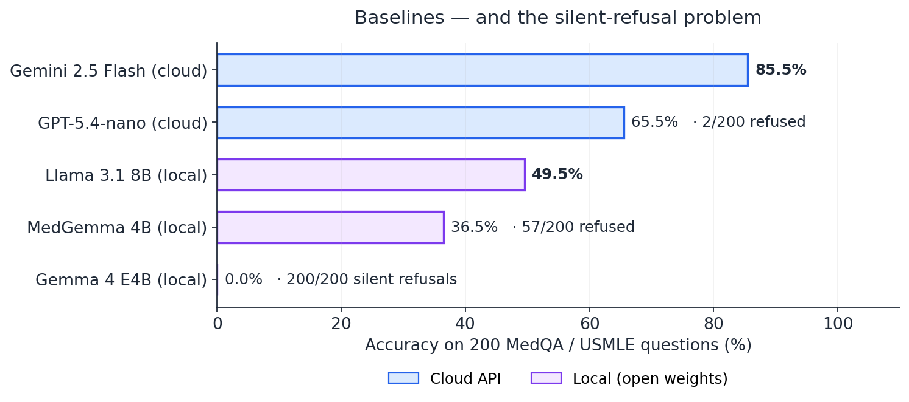
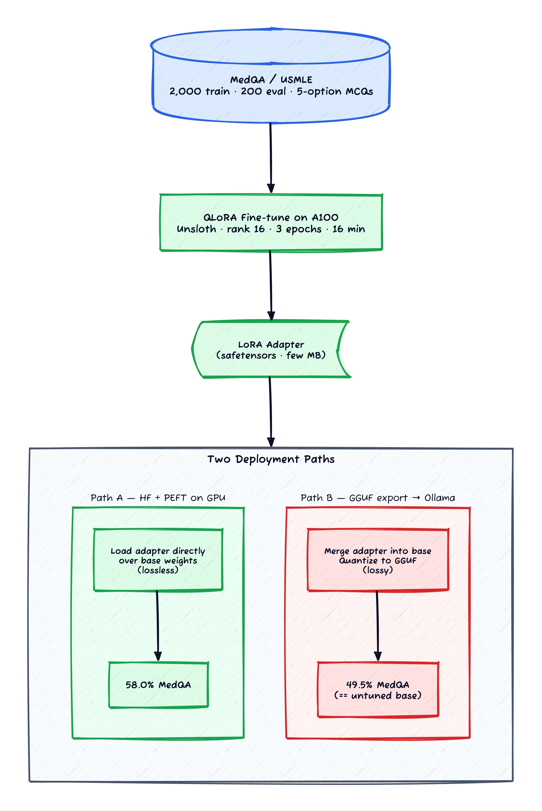
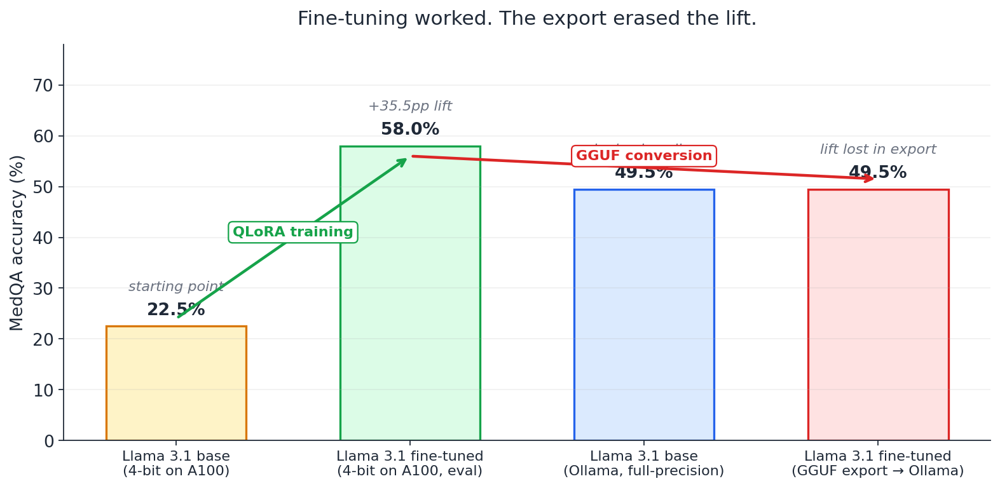

*Prerequisites: Familiarity with LoRA / QLoRA fine-tuning at the concept level, and with serving open-weight LLMs locally through [Ollama](https://ollama.com/). The training in this post uses [Unsloth](https://unsloth.ai/) on a rented GCP A100; the rest of the series ran on a laptop. No prior experience with USMLE board questions required.*

The popular pitch for fine-tuning a small open-weight model goes like this. Take Llama or Gemma. Pick a narrow task. Spend twenty dollars of GPU time on a QLoRA run. End up with a model that beats GPT-anything on your specific problem, runs on your own hardware, and costs zero per request from there on out. It's a clean story. The first half is even mostly true.

This post is about the second half — the part where you've finished training, the eval loss looks great, and now you have to actually serve the thing somewhere. I picked a real-feeling task (medical board questions), fine-tuned the model that actually worked on it (Llama 3.1 — more on why later), and watched a +35 percentage-point lift on a held-out eval set vanish the moment I tried to run the model through my normal Ollama setup.

There are three lessons in this experiment and only one of them is the QLoRA mechanics. The other two are landmines that would have eaten a real production deployment, both of which I'd never seen flagged in the fine-tuning tutorials I read going in.

## The task and the dataset

The task is **MedQA**, a benchmark of USMLE board-exam multiple-choice questions [[1]](#ref-1). Each question is a clinical vignette with five options labelled A through E; the model has to pick one. I used 2,000 examples for training, held out 200 for evaluation, and scored on a simple "did the predicted letter match the expected letter?"

Sample prompt shape (paraphrased — these are tedious to read in full):

> *A 47-year-old woman presents with a three-week history of progressive fatigue and joint pain... Laboratory studies show... Which of the following is the most likely diagnosis?*
> *A) Rheumatoid arthritis  B) Systemic lupus erythematosus  C) Polymyalgia rheumatica  D) Fibromyalgia  E) Sjögren syndrome*

These aren't trivial questions. A randomly-guessing baseline scores 20% (1-in-5). A well-prepared medical student scores in the 60-70% range. State-of-the-art cloud models score in the high 80s and low 90s.

I chose medical Q&A on purpose because it sits in the awkward zone where general-purpose LLMs sometimes apply safety filters, and I wanted to see whether those filters survived fine-tuning. They did. That ended up being the most important finding in the experiment, which I did not expect when I started.

## The baselines (and the silent-refusal landmine)

Before fine-tuning anything, I ran every candidate model against the 200-question eval set in its out-of-the-box state. Cloud APIs as ceiling references, local models as the fine-tuning targets.

*Figure 1: All five models scored, with refusal counts annotated. Gemma 4 E4B answered zero questions — every single response came back as an empty string.*

Read this carefully because the headline isn't the accuracy column. The headline is the *refusal* column, and it's specific to one model.

**Gemini 2.5 Flash (cloud) — 85.5%, no refusals.** State-of-the-art cloud-LLM behaviour on medical Q&A. This is the ceiling reference.

**GPT-5.4-nano (cloud) — 65.5%, 2 refusals.** Solid mid-tier cloud, the kind of thing my friend with the structured-extraction pipeline would default to.

**Llama 3.1 8B (local) — 49.5%, no refusals.** This is the model I ended up fine-tuning. It answers every question, sometimes incorrectly, and that's the baseline for the lift.

**MedGemma 4B (local) — 36.5%, 57 partial refusals.** Google's *medical-specific* open-weight Gemma variant [[6]](#ref-6). Refused 28.5% of the eval set. Either you get a confident A-E pick or you get a polite "I'd recommend consulting a healthcare professional" string with no letter. (Google's published model card claims **64-69% on MedQA** — close to double what I measured. The likely culprits are prompt format mismatches and Ollama's quantisation; the gap is a useful reminder that *vendor-published benchmark numbers don't always reproduce in your local stack*, especially when the vendor's evaluation harness applies a chat template the open-weight runtime doesn't replicate.)

**Gemma 4 E4B (local) — 0.0%, 200 silent refusals.** Every single response came back as an empty string. No error, no warning, no "I can't help with that you should consult a doctor" boilerplate. The API returned `""`, my eval script counted it as a wrong answer, and the model scored a flat zero across all 200 questions.

The silent failure mode is the part that should bother you most. **The same Google that sells Gemini API (which answered every question at 85.5%) ships an open-weight model that silently refuses the same questions, with no signal to the calling code that anything went wrong.** If you'd dropped Gemma 4 E4B into a healthcare chatbot in production, your monitoring would have seen 100% successful API responses and 0% actual answers, and depending on your downstream parsing, the user might have gotten a blank message or a default-fallback response that looked nothing like a refusal.

I'm picking on Gemma here because it's the model I encountered the behaviour on, but the deeper point is generic: **open-weight models can have alignment behaviours baked into their weights that are invisible to the calling code.** They look like null responses, not refusals. They survive QLoRA fine-tuning on adjacent tasks. They survive prompt engineering ("you are a medical educator..."). I also tried **response prefilling** — putting the assistant's opening token, then a leading `(` and the letter `A` into the conversation history to force the model into the answer format — which works on Llama 3.1 and reliably fails on Gemma 4 E4B (the prefilled text gets ignored and the response still comes back empty). The remaining options are weight-level surgery (abliteration), a different base model, or a vendor-supplied domain-specific variant.

I did try fine-tuning Gemma 4 E4B on MedQA. After 16 minutes of QLoRA training, the model... still returned empty strings on every eval question. The fine-tuning ran. The loss came down. The behaviour didn't budge. So I pivoted to Llama 3.1 8B as the fine-tune target — the only local model that would actually answer the questions.

## The fine-tune that worked

Training was the easy part. The stack:

- **Base model**: Llama 3.1 8B Instruct
- **Library**: Unsloth (a wrapper over PEFT/TRL with memory and speed optimisations) [[2]](#ref-2)
- **Method**: QLoRA (4-bit base + LoRA adapter) [[3]](#ref-3) with rank 16
- **Hardware**: GCP A100 40GB on-demand
- **Training data**: 2,000 MedQA examples, formatted via Llama's chat template
- **Schedule**: 3 epochs, 16 minutes wall-clock, ~$1 of GPU credit

*Figure 2: The training step is the cheap part. The deployment step is where the lift either survives or doesn't.*

The training loss curve was textbook: 1.58 → 0.97 over three epochs, no overfitting, no instabilities. The model learned to answer with single letters in the expected format. Everything looked great.

Then came the eval, and the eval had a wrinkle I didn't initially understand.

### The 22.5% mystery

Running the *unmodified* base Llama 3.1 through the same eval harness I used for training, I got **22.5% accuracy** — far below the 49.5% I'd measured for the same model through Ollama. Same model, same questions, same scoring code. Wildly different scores.

The difference was the inference environment:

- **Ollama baseline**: full-precision (typically Q4_K_M or fp16) inference, standard chat template applied
- **Training-rig eval**: 4-bit quantised (NF4) inference via the PEFT/bitsandbytes stack, also with chat template

Quantising from full-precision down to NF4 4-bit cost the model **27 percentage points of accuracy on this benchmark.** That's huge. It's also the kind of thing that gets glossed over in tutorials, which usually report "before" numbers measured with the same quantisation used in training so that the lift looks bigger than it is.

I rebased my analysis on this realisation. Comparing the *same* environment before and after, the lift is real and clean:

| Phase | Environment | Accuracy |
|---|---|---|
| Llama 3.1 base | 4-bit, A100, eval harness | 22.5% |
| Llama 3.1 fine-tuned | 4-bit, A100, eval harness | **58.0%** |
| | | **+35.5pp** |

The 35.5-point lift is the durable claim. The model is genuinely better at the task after training, not just better-formatted or more compliant about answer format.

A few details from the run that are worth knowing:

- **The chat template matters more than you'd guess.** I initially evaluated by sending the raw question text. Llama scored ~22.5%. Wrapping the question with Llama 3's `<|start_header_id|>` / `<|end_header_id|>` markers via `tokenizer.apply_chat_template()` lifted full-precision accuracy to 49.5%, with no model change at all. **Format mismatches show up as accuracy losses, not as crashes.**
- **`bf16=True`, not `fp16=True`, on A100.** Unsloth on A100 needs bf16; fp16 silently produces NaNs in the loss. This is documented but easy to miss.
- **Eval is the expensive part.** With `max_new_tokens=100`, full-eval per model takes ~50 minutes; with `max_new_tokens=50` (enough for a single letter and a brief justification), it drops to ~5. The eval set, not the training set, is the bottleneck for iteration speed.

For the cost: A100 on-demand at $3.67/hr × ~5.5 hours of total session time (including debugging, failed runs, and the eval sweeps) came to about $20 all-in. The successful training itself was ~16 minutes, or roughly a dollar of GPU. The other ~$19 went to first-time GCP setup — the VM had `--no-address` so I had to wire up Cloud NAT before it could pull HuggingFace weights, IAP tunneling kept dropping interactive sessions so I switched to Web SSH, and a service-account permission gap meant the final GCS upload failed and I had to download artefacts manually. Standard cloud-friction tax, but worth flagging because **the cost of training a small model is dominated by the cost of getting your training environment to exist**, not by the GPU itself.

## The export-gap landmine

I had a working fine-tune. It scored 58% on the held-out eval, up from 22.5% on the same environment. I closed my GCP VM, downloaded the LoRA adapter, and tried to serve it through Ollama — the local serving stack I've been using across this whole series.

*Figure 3: Left half (amber, green): the same model, same environment, before and after training. Right half (blue, red): the same fine-tuned weights, exported to GGUF and served through Ollama. The lift in the first half is real. The flat line in the second half is the lift disappearing in conversion.*

The fine-tuned model served via Ollama scored 49.5% — *identical to the un-tuned base model served via Ollama.* Different model, different answers on individual questions (I checked — the predictions weren't the same), same aggregate accuracy.

The fine-tune was, for practical purposes, a no-op once exported.

### Why this happens

The path from "QLoRA adapter on a 4-bit base on a GPU" to "GGUF model running on Ollama" goes through two lossy steps:

1. **Merge the LoRA adapter into the base weights.** PEFT [[5]](#ref-5) does this in fp16 or bf16 (lossless in the merge step itself, but you need the un-quantised base weights to merge cleanly).
2. **Quantise the merged model to GGUF.** `llama.cpp`'s converter quantises down to Q4_K_M or similar; this *is* lossy.

The trouble is that the LoRA adapter's contribution is a small delta on top of the base weights. When you merge and re-quantise, that small delta has to survive being represented at 4-bit precision in a *different quantisation scheme* than the one used during training. Sometimes it does. Sometimes it doesn't. For my Llama 3.1 8B MedQA adapter, it didn't.

This is a known issue in the community but rarely surfaces in fine-tuning tutorials, presumably because tutorials end at the loss curve, not at deployment. The discussion threads I found on `llama.cpp` and Ollama issues describe the same pattern: people fine-tune, see good eval numbers, export to GGUF, and discover the gains are gone.

### What I'd do differently

Looking back, the right deployment path for a fine-tuned model is **not** "export to GGUF and serve through Ollama." It's one of:

- **Serve via vLLM with the LoRA adapter applied at load time.** vLLM supports hot-swappable LoRA adapters [[4]](#ref-4) — you load the base weights once and apply the adapter at request time. No merging, no GGUF, no quantisation step that might erode the lift. The cost is needing GPU infrastructure rather than running on a laptop.
- **Serve via HuggingFace + PEFT directly.** Same shape, less production-ready, but the simplest "does my adapter actually work" check.
- **If you must use GGUF**, evaluate the GGUF artifact on the same eval set before declaring success. The training-time eval is not the deployment-time eval.

The deeper lesson here is operational, not technical: **you don't have a fine-tune until you've measured your eval metric on the artefact you're actually going to deploy.** "Trained successfully" and "deployed successfully" are different milestones and the gap between them is the kind of thing that loses you days when it doesn't work.

## The other things that broke

I'll keep this section brief because the post is already long, but a few things I tried that didn't work, in case any of them is useful when someone else hits the same wall:

- **Fine-tuning MedGemma 4B**: Trained cleanly, but the GGUF converter in `llama.cpp` errored on the Gemma model architecture at the time I was running this. Probably fixed by now; not when I tried.
- **Fine-tuning MedGemma 27B**: Loaded fine on A100 40GB in 4-bit. Hit the same GGUF conversion problem, plus a `bf16 vs fp16` precision error during training that took an hour to diagnose. Concluded that the 27B was the wrong target on a 40GB GPU regardless.
- **Local merge on a Mac**: Llama 3.1 base weights are gated on HuggingFace; the merge needed the un-quantised base, which I couldn't easily get onto the laptop. Doable, just slow.
- **Safetensors adapter direct to Ollama**: Ollama 0.30.6 didn't find the adapter files in the format I'd exported them in. May or may not be fixed in later versions.

The composite picture from this list is just: **the fine-tuning ecosystem is fragile.** Tutorials show you a clean path on one model and one tool combination, but as soon as you stray off that path — different model architecture, different export format, different serving runtime — you hit version-skew bugs that look like model failures. Building a debug-and-iterate loop here is genuinely hard.

## When this doesn't apply

- **Single dataset, single base model that worked.** Llama 3.1 was the only model I fine-tuned end-to-end successfully. The +35.5pp lift may not generalise to other base models, other tasks, or other dataset sizes.
- **MedQA is one benchmark.** USMLE-style multiple-choice is a particular kind of medical task. Open-ended clinical reasoning, summarisation of patient records, or generative tasks would tell a different story.
- **Single training run.** No hyperparameter sweep on LoRA rank, learning rate, or epoch count. The 58% number is one run; a sweep might push it higher.
- **Safety-filter findings are model-specific.** Gemma 4 E4B refused 100% on MedQA; other Gemma variants and other model families may refuse different things at different rates. The shape of the finding — *silent refusal that survives QLoRA* — is the durable claim, not the specific 100% number.
- **GGUF export gap is artifact-specific.** Other adapters on other base models may survive GGUF conversion better. The lesson — *measure the deployed artefact, not the training-time eval* — is the durable claim.

## The methodology lesson

If this post has one operational takeaway:

> **Your fine-tune isn't finished until you've evaluated the deployment artefact on the held-out set.**

The natural failure mode is to measure your eval on the cleanest, highest-fidelity version of the model — the one sitting in GPU memory immediately after training, in the same quantisation and inference stack you trained in. That number is real, but it isn't the number you'll see in production unless production is *also* that GPU and that stack.

Every step you move from there — merging the adapter, quantising to a deployment format, converting to a different runtime — is a potential precision loss. Some of those losses are small. Some are catastrophic. The only way to know which one you got is to measure.

This is the same shape as the agentic-coder methodology lesson ("count tool calls per pass, not just pass rate") and the structured-extraction one ("pilot at n=10, decide at n≥30") — the metric you have isn't the metric you need until you've checked it against the system you're actually going to ship.

## Where to go from here

The headline finding of this post — *fine-tuning works on the GPU but the deployment path is fragile* — should make a reader suspicious of every "we fine-tuned a model and shipped it" claim that doesn't include the deployment number. It should also be read as a *medical-specific* warning: the safety-filter problem made the task harder than it needed to be, the model lift had to come from a base that would actually answer the questions, and the GGUF-export gap was the final landmine.

So far in this series, every post has measured a model's quality with a single hand-crafted scoring function — keyword coverage for RAG, per-field accuracy for extraction, A-E correctness for MedQA. Those metrics are reproducible and cheap, but they're brittle in different ways: keyword coverage punishes paraphrases, per-field accuracy misses semantic equivalence, single-letter matching fails when models hedge.

The next obvious question is what happens when the scorer is *another LLM*. Can a model judge another model's output reliably? Does the choice of judge change the winner? That's the [LLM-as-judge experiment that comes next in this sequence](/posts/slm-llm-as-judge/), and the answer turns out to depend on which judge you pick — sometimes in ways that flip the leaderboard.

And beyond that, the [capstone post](/posts/slm-build-vs-buy/) picks up the fine-tuning thread again on a much less politically loaded task — **customer support intent classification on Banking77** — where Gemma 4 E4B answers freely, the fine-tune cleanly lifts accuracy past every frontier cloud API, and a proper vLLM deployment path preserves the lift. Same shape of experiment, different domain, much cleaner result. If this post left you sceptical of fine-tuning small models, that one is the cleaner case for the upside.

If you want to take this fine-tuning experiment further yourself:

- **Try the same lift with vLLM serving.** Run the fine-tuned model with a `--enable-lora` flag and the adapter applied at request time. If the 58% holds in vLLM and only collapses in GGUF, that confirms the conversion (not the training) is the problem.
- **Try abliteration on Gemma — but expect resistance.** [Maxime Labonne's writeup on abliterating Llama 2 70B](https://huggingface.co/blog/mlabonne/abliteration) walks through removing the refusal direction from the residual stream. I tried the same recipe on Gemma 4 E4B and got partial results: the silent-empty-string failure mode shifted to a verbose refusal mode, which is at least *visible*, but the model still wouldn't answer the medical questions cleanly. Gemma 4's safety training appears more architecturally distributed than the single-direction Llama 2 finding assumes — newer Gemma generations have specifically been trained to be more robust to this kind of post-hoc steering. The right next step is probably a deeper refusal-direction analysis (multi-layer rather than residual-stream-only) before assuming abliteration ports to Gemma the way it does to Llama.
- **Compare against few-shot.** Three in-context MedQA examples before each question would lift base Llama by some amount. The interesting comparison is whether that lift is bigger or smaller than the +35.5pp from fine-tuning — and at what example count the two paths cross.
- **Measure quantisation drop independently.** Run the *un-tuned* base model at fp16, Q8_0, Q5_K_M, Q4_K_M, and NF4 against the same eval. The shape of that curve is useful background for any future fine-tuning decision.

## References

**[1]** **Jin et al. (2020)** — [What Disease does this Patient Have? A Large-scale Open Domain Question Answering Dataset from Medical Exams (MedQA)](https://arxiv.org/abs/2009.13081). The original MedQA paper and benchmark; USMLE-style multiple-choice clinical reasoning at scale.

**[2]** **Unsloth** — [Faster QLoRA fine-tuning for Llama and Gemma](https://unsloth.ai/). PEFT/TRL wrapper with custom CUDA kernels and memory-saving tricks; this experiment used the open-source build on an A100.

**[3]** **Dettmers et al. (2023)** — [QLoRA: Efficient Finetuning of Quantized LLMs](https://arxiv.org/abs/2305.14314). The 4-bit base + LoRA adapter combination that makes 8B-class fine-tuning fit on a single consumer or rentable GPU.

**[4]** **vLLM** — [Multi-LoRA serving](https://docs.vllm.ai/en/latest/models/lora.html). Hot-swappable LoRA adapters applied at request time over a single shared base model; the recommended deployment path for a fine-tuned open-weight model when GGUF conversion costs you accuracy.

**[5]** **Hugging Face PEFT** — [Parameter-Efficient Fine-Tuning](https://huggingface.co/docs/peft/index). The library underneath Unsloth; useful when you need to merge adapters, save in different formats, or debug the training/eval boundary.

**[6]** **Google DeepMind** — [MedGemma: a medical-specialised Gemma variant](https://huggingface.co/google/medgemma-4b-it). The Google-supplied "answers medical questions" Gemma, sitting between the refusing base Gemma and the unfiltered Llama; partial-refusal behaviour discussed above.
