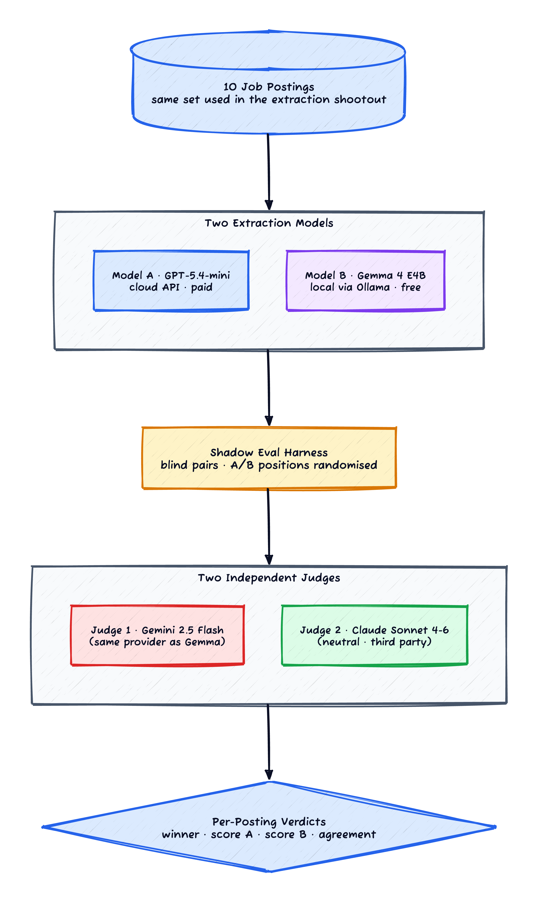
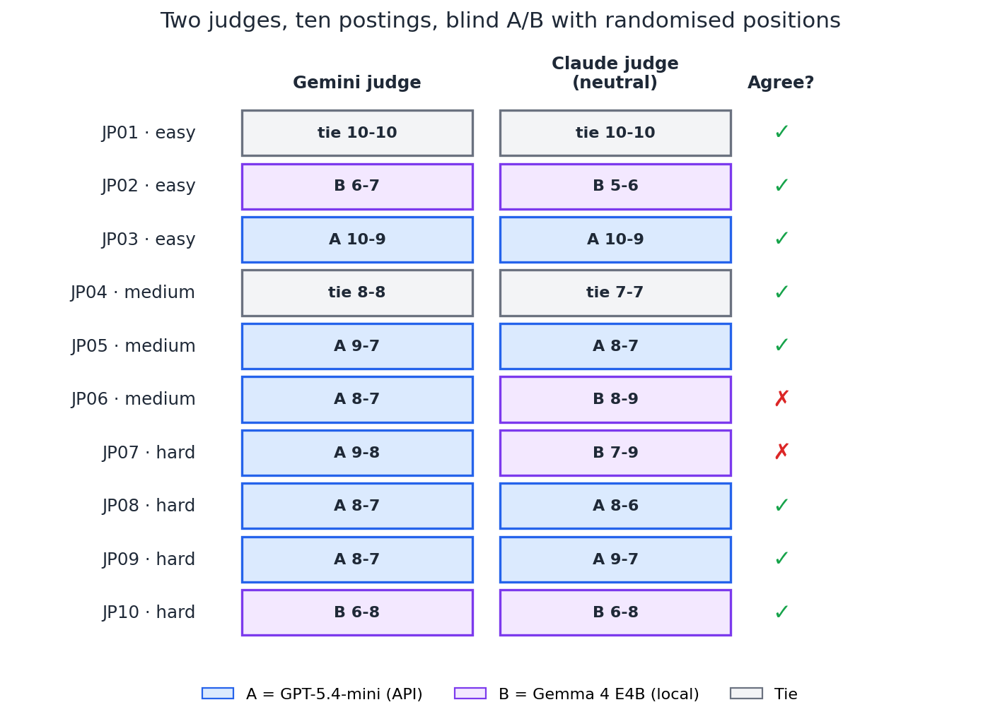
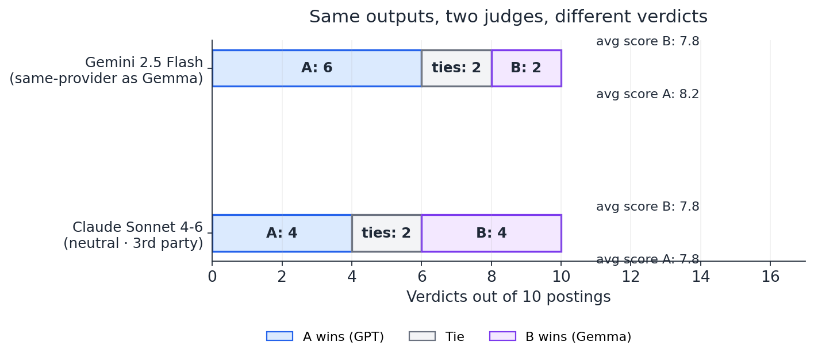

*Prerequisites: Familiarity with the LLM-as-judge evaluation pattern at a concept level. If it's new to you, Anthropic's LLM-as-judge cookbook [[3]](#ref-3) and the original NeurIPS 2023 paper [[1]](#ref-1) are the right primers.*

Every previous post in this sequence scored model outputs against a *fixed reference*. Keyword coverage on RAG answers. Per-field accuracy on extracted JSON. Letter matching on multiple-choice questions. That works when the reference is unambiguous, but it falls apart the moment your task has multiple acceptable answers — paraphrased summaries, plausible-but-different extractions, several correct ways to phrase the same fact.

The standard fix is **LLM-as-judge**: stop comparing model output to a fixed string, and instead ask another LLM whether the output is good. The judge sees the input, the output, optionally a reference, and returns a score (or a winner if you're comparing two candidates head-to-head).

It works. It also has a problem nobody bringing up the pattern likes to dwell on: **the judge has its own opinions.** If the judge happens to share a vendor with one of the candidates being judged, or if its training data over-represents the style of one candidate, the verdict gets quietly biased and you ship a decision based on that bias.

This post is about catching that bias by running the same evaluation through two judges from different providers and seeing whether they agree. In my case, they mostly did — but in a way that flipped the verdict from "cloud wins clearly" to "it's a clean tie."

## The production question

The scenario I built this around is the same one that motivated the [structured-extraction post](/posts/slm-structured-extraction/): a friend pays for `gpt-5.4-mini` to extract structured JSON from job postings, and he asked me whether he could drop the API bill by swapping in a free local Gemma 4 E4B.

That post answered the question with hand-crafted per-field scoring on a 30-posting set and concluded the two models were within about one percentage point. That's the *narrow* answer. The *production* answer would also factor in things like:

- *Does Gemma's output read as well as GPT's, even when both contain the right facts?*
- *On the cases where the two disagree, who's right? Is one of them confidently wrong, or are they both reasonable in different ways?*
- *Would a human reviewer choose one over the other given the chance to read both?*

Per-field accuracy can't answer any of those. They're qualitative, comparative, blind-A/B-test-shaped questions. They're what LLM-as-judge is supposed to be for.

So I built a shadow-eval pipeline. Same 10 postings (a subset of the 30 from the extraction post). Both models produce a JSON extraction for each one. A judge LLM sees the two outputs side by side, with their positions randomised, and returns a verdict: A wins, B wins, or tie, with a numeric score for each on a 0-10 scale.

*Figure 1: One set of inputs, two extraction candidates, two judges from different providers. The cross-judge step exists because a single judge has its own opinions you can't easily measure.*

## The first judge

I started with **Gemini 2.5 Flash** as the judge — it's cheap, fast, and I'd been using it for everything else in this series. The judge prompt is short: *"Here is a job posting. Here are two structured extractions from it. Which one is better, and what's the score 0-10 for each? Be specific about what you're rewarding."*

Position is randomised per posting (with a fixed seed for reproducibility). The judge doesn't know which output came from GPT and which came from Gemma. It just sees "Output A" and "Output B."

Gemini's verdict over the ten postings: **A wins 6, B wins 2, ties 2.** Average score A = 8.2, average score B = 7.8.

(A side note on noise floor: re-running the same Gemini judge over the same outputs a few hours later produced a 5-4-1 split instead of 6-2-2. Same data, same prompt, same judge, two flips. So even before adding a second judge, the single-judge verdict already has run-to-run variance bigger than the gap it's claiming to measure. That's not specific to Gemini; it's a general property of LLM judges with temperature > 0 on close calls.)

If I'd shipped this as the answer, I'd have written it up as "Gemini judge confirms the keyword-coverage finding — the paid API is meaningfully better than the free local model, by about half a point on a 10-point scale." It's a clean number. It's the kind of result you can paste into a slide and move on.

But there was an obvious objection sitting in the back of my head. **Gemini and Gemma are both Google models.** They share a vendor, they probably share training data, and they may share style preferences. A single Google-shaped judge over a Google-shaped contestant against a third-party contestant is exactly the configuration where you'd worry about provider bias. The right thing to do — even if the verdict is small — is to check the verdict against a judge from a different provider.

## The second judge

I added **Claude Sonnet 4-6** as the second judge. Different provider from both contestants, so neither has a same-vendor advantage. Same prompt, same randomised pairs, same 0-10 scoring.

(My first attempt at a cross-judge used GPT-5.4-mini, since it's also a different provider from both contestants. It returned a verdict on every pair... and *every single verdict was B wins for Gemma*, 10-0. That's so suspicious it has to be wrong, and it was — the API call was silently returning the same template response on every input, probably from a malformed request that the SDK was not surfacing as an error. **The "judge can't differentiate" check is also useful as an alarm that your judge is broken.** I switched to Claude Sonnet, which actually produced varied verdicts, and moved on.)

*Figure 2: Two judges, ten postings. The two judges agree 8/10 times. Where they disagree (JP06, JP07), both judges flip the same direction — Gemini picks GPT, Claude picks Gemma.*

Claude's verdict: **A wins 4, B wins 4, ties 2.** Average score A = 7.8, average score B = 7.8.

Not approximately equal. *Exactly* equal. Within the precision of a one-decimal-place average over ten postings, the two models produced indistinguishable extraction quality under a third-party judge.

*Figure 3: Same model outputs. Same postings. Same prompt template. Different judge. The cloud model wins under one judge and ties under the other.*

This is the kind of result that should make you very careful about what you claim when you have one judge. Reading the per-posting breakdown:

- **8 of 10 postings: the judges agreed.** Both picked GPT, both picked Gemma, or both called it a tie. The agreement is concentrated on the postings where one extraction is unambiguously stronger or weaker than the other.
- **2 of 10 postings: the judges flipped.** Both were on the hard tier (JP06 and JP07). Both flipped *the same way*: Gemini scored GPT higher, Claude scored Gemma higher. These are the postings where the two models produced genuinely different-but-plausible extractions — one might list more skills, the other might pick a more specific seniority guess, neither is obviously wrong, and the call comes down to which style the judge prefers.

## The bias I was worried about, and the bias I actually had

Going in, my worry was: *"Gemini will favour Gemma because they're both Google."*

The data shows that's not what happened. Gemini, the same-vendor judge, was *harder* on Gemma than the neutral judge was. Gemini gave Gemma a 7.8 average; Claude gave Gemma a 7.8 average — same number. But Gemini gave GPT an 8.2, while Claude gave GPT a 7.8. **The cloud-favoring gap exists only under the Gemini judge.**

So the bias direction is the opposite of the obvious one. The same-provider judge over-rewarded the cross-provider contestant. I have a few hypotheses about why, none of them clean:

- **Style mismatch with itself.** Gemma 4 E4B is a small open-weight model from Google. Its output style — short, declarative, sometimes a little blunt — may be more recognisable to a judge that was trained on overlapping data, in a way that makes the judge unconsciously hold it to a higher standard. (You're harder on the cousin who's making the same mistakes you made yourself.)
- **GPT's style is closer to the average API extraction.** Most of the public LLM-output data the judges have seen was probably generated by OpenAI models. If the judges have absorbed any prior about "what a competent extraction looks like" from their training data, that prior is GPT-shaped. Gemma's output isn't worse — it's just less *familiar*.
- **Single-run noise.** With only 10 postings, the difference between 4-4-2 and 6-2-2 is two postings. Two flips. The "Gemini is biased against Gemma" claim survives this sample size only weakly. With 100 postings the bias direction might or might not hold.

The honest thing to say is: **the cross-judge revealed that the single-judge verdict was sample-size-and-prior-dependent in ways I couldn't see from inside the single-judge frame.** The bias might be "Gemini against Gemma" or it might be "Gemini just being a stricter scorer in general." I can't tell which from this data. What I can tell is that the *single* judge's verdict isn't durable enough to ship a swap decision on.

## Evaluation method changes the verdict

There's a bigger thread that runs through this entire experiment and the structured-extraction one before it. The same models, on the same task, produced **three different verdicts** depending on how I chose to score them:

| Scoring method | Verdict | Gap |
|---|---|---|
| Per-field keyword scoring ([structured-extraction post](/posts/slm-structured-extraction/)) | GPT-5.4-mini wins | +3.0pp (95.5% vs 92.6% at n=10) |
| Gemini-as-judge (this post) | GPT-5.4-mini wins | +0.4pt (8.2 vs 7.8 on a 0-10 scale) |
| Claude-as-judge (this post) | **Tie** | 0.0 |

The models didn't change. The data didn't change. The *scoring function* changed, and each scoring function had different opinions about what "better" meant. Keyword coverage rewarded extracting the exact tokens in the reference; the LLM judges rewarded plausible extraction including reasonable paraphrases; Claude was more generous with paraphrases than Gemini was.

If you'd shipped this swap decision based on the [structured-extraction post's](/posts/slm-structured-extraction/) keyword scoring, you'd have stayed on the paid API. If you'd shipped it based on Gemini-judge, same. If you'd shipped it based on Claude-judge, you'd have switched to the free local model. **Three different scoring approaches, three different production decisions.** None of the three is wrong, but they answer subtly different questions.

The methodology takeaway here isn't "use LLM-as-judge instead of keyword scoring" or "use Claude instead of Gemini." It's:

> **Your scoring method is a load-bearing design decision. Pick it before you run the eval, justify it on what you actually care about, and run at least one cross-check that uses a different method or a different judge.**

If your scoring methods agree, you have a robust finding. If they disagree, you've discovered something more interesting about what the question actually was.

## The shadow-eval pattern is worth keeping anyway

Even with all the caveats above, **the shadow-eval pattern is the right shape for production model-swap decisions.** It's worth describing the architecture in enough detail that you could re-implement it.

If you want a more polished starting point than rolling your own, OpenAI's `evals` framework [[4]](#ref-4) and Hugging Face's LLM-as-judge cookbook [[5]](#ref-5) both have ready-to-go pairwise harnesses with the bias-control primitives built in.

The pipeline (which Figure 1 sketches) is:

1. **Pick a small representative input set.** I used 10 postings, which is too small for a real decision but enough to validate the harness. For production, 50-100.
2. **Run both candidate models against every input.** Save the outputs separately, keyed by input ID and model.
3. **Build judge prompts that show the two outputs blind.** Randomise positions per input so the judge can't learn "A is always the new one." Don't tell the judge which model produced which output.
4. **Run at least two judges from different providers.** Same prompt, same blind pairs. Calculate verdict and aggregate score per judge.
5. **Compute inter-judge agreement.** If high (≥80%), the disagreements are signal — look at them. If low (<70%), your judge prompt is probably ambiguous and you need to tighten it before trusting any verdict.

Two practical notes that bit me and are worth flagging: position bias is real (randomise per pair with a fixed seed), and judges return free-form rationale alongside their verdict — *spot-check it*, because that's how I caught a prompt of mine that was implicitly rewarding *longer* extractions because the judge interpreted "more comprehensive" as "more content."

## When this doesn't apply

- **Ten postings is too small to ship from.** The cross-judge methodology generalises to larger samples; the specific 4-4-2 vs 6-2-2 numbers don't survive a 100-posting rerun necessarily.
- **No human anchor.** The judges might both be wrong in the same direction. Occasional human spot-checks on the disagreement cases are what closes the loop — without them you're trusting that "two LLMs from different providers" approximates "ground truth" [[1]](#ref-1)[[2]](#ref-2).
- **Single domain.** Both output formats are recognisable as valid JSON with the right fields. On generative tasks (summaries, emails, code) the judges have wider latitude to disagree, and the cross-judge agreement rate would likely be lower.

## The methodology lesson

If the [RAG post](/posts/slm-rag-shootout/) was *"measure retrieval before you measure the LLM,"* this one is its cousin:

> **A single judge isn't an evaluation. Always cross-judge with a different provider before you ship a verdict.**

The cost of the second judge is one extra API call per pair. The cost of *not* having it is shipping a model-swap decision based on a number that turns out to come from your judge's training data overlap with your contestant's vendor.

The deeper version of this lesson, which I think generalises beyond LLM-as-judge: **whenever your evaluation runs through a learned component (judge, embedding model, classifier, reward model), you have to be skeptical that the component is measuring what you think it's measuring.** Hand-crafted scoring is brittle but at least its biases are inspectable. Learned scoring is less brittle but you can't easily see what it's actually rewarding. The cross-check — different judge, different prompt, different scoring method — is what closes that loop.

The series has had a version of this lesson in every post:

- [Structured extraction](/posts/slm-structured-extraction/): pilot at n=10, decide at n≥30 (statistical robustness).
- [Vision extraction](/posts/slm-vision-extraction/): plot the per-image distribution, not just the mean (distribution shape).
- [RAG](/posts/slm-rag-shootout/): measure retrieval hit rate before end-to-end accuracy (layer attribution).
- [Agentic coding](/posts/slm-agentic-coder/): count tool calls per pass, not just pass rate (efficiency vs binary outcome).
- [Fine-tuning](/posts/slm-fine-tuning/): evaluate the deployment artefact, not the training-time eval (system fidelity).
- This post: cross-judge to catch bias the single judge can't see (judge robustness).

They're all the same shape underneath: **the metric you have isn't the metric you need until you've validated it against the system you'd actually ship.**

## Where to go from here

This is the last "is the local SLM good enough?" post in the series. The previous five have built up an answer that's something like *"yes for narrow, well-defined tasks; the gap to cloud is small under most reasonable scoring methods; deployment is harder than training."* What I haven't done yet is the *money* question. At what request volume does self-hosting beat the API bill? How much would fine-tuning the smaller model lift it above the cloud frontier on a single specialised task? Where does the build-vs-buy line actually fall?

That's [the capstone post in this sequence](/posts/slm-build-vs-buy/) — a deliberately quantitative cost crossover across cloud tiers and self-hosted serving, with a fine-tuning twist that pushes the build candidate past every frontier API on a real benchmark. It builds on every prior post in this sequence, including this one.

If you want to take *this* experiment further yourself:

- **Add a third judge.** GPT-5 as judge would close the triangle (one judge per major provider). With three judges you can use majority vote and flag the cases where the third judge breaks a 2-1 tie as the genuinely contested ones.
- **Compare two judge prompts.** Same judge, same pairs, two different prompt formulations ("which extraction is more accurate" vs "which extraction is more complete"). Measure verdict shift. That's the prompt-bias check that complements the provider-bias check from this post.
- **Add human anchors on the disagreement cases.** For the JP06 / JP07 postings where the judges flipped, sit down for ten minutes and pick a winner yourself. Are the LLM judges wrong in different directions, or is the answer genuinely ambiguous? Either result is informative.
- **Scale to 50-100 postings.** The cross-judge methodology validated here at n=10 should produce a sample-size-robust verdict at n=100. That's the right size for an actual production model-swap decision.

## References

**[1]** **Zheng et al. (2023)** — [Judging LLM-as-a-Judge with MT-Bench and Chatbot Arena](https://arxiv.org/abs/2306.05685). The foundational paper on LLM-as-judge as an evaluation pattern; documents position bias, verbosity bias, and self-enhancement bias.

**[2]** **Panickssery et al. (2024)** — [LLM Evaluators Recognize and Favor Their Own Generations](https://arxiv.org/abs/2404.13076). Empirical evidence for self-enhancement bias — judges score outputs from the same model family more favourably. Directly motivates the cross-judge step.

**[3]** **Anthropic** — [LLM-as-judge cookbook](https://github.com/anthropics/anthropic-cookbook/tree/main/misc). Practical recipes for building judge prompts, pairwise comparisons, and rubric-based scoring with Claude.

**[4]** **OpenAI** — [Evals framework](https://github.com/openai/evals). Open-source eval harness with built-in support for LLM-as-judge graders and pairwise comparison templates.

**[5]** **Hugging Face** — [LLM-as-judge evaluation guide](https://huggingface.co/learn/cookbook/en/llm_judge). Walkthrough of building a judge harness with position randomisation and inter-judge agreement metrics; good operational reference.
