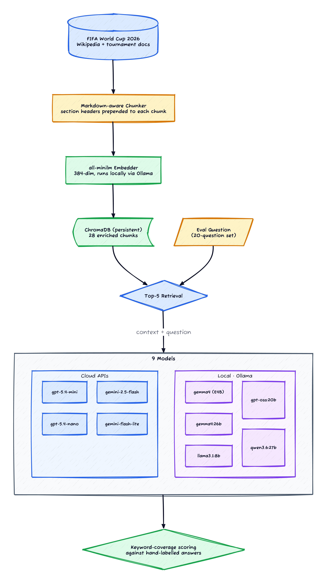
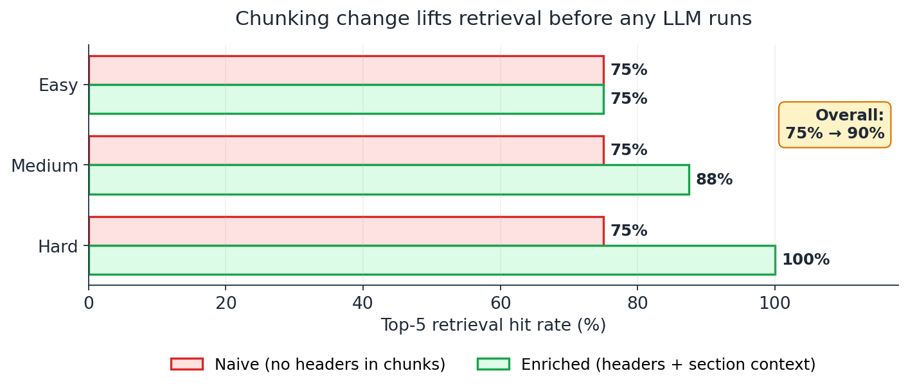
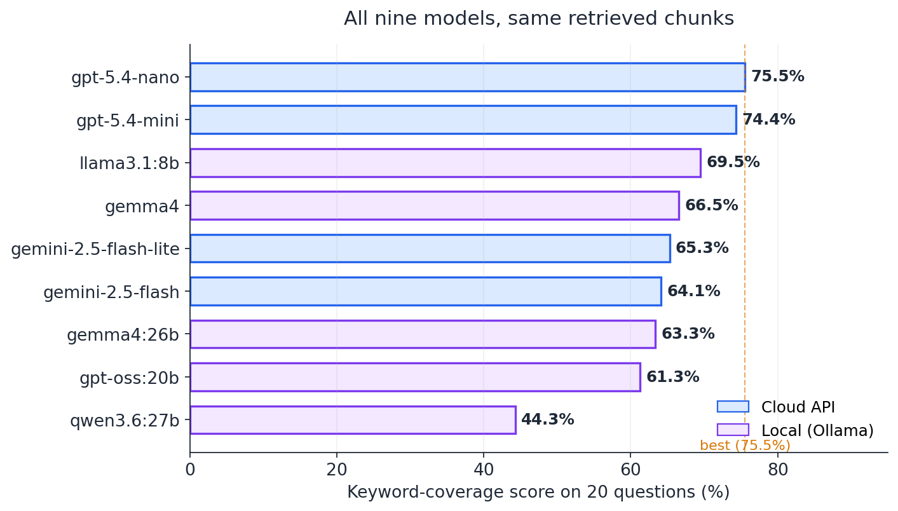

*Prerequisites: Familiarity with RAG (Retrieval-Augmented Generation) — chunking, embeddings, vector search, and feeding retrieved passages to an LLM. If you're new to RAG, [Pinecone's RAG guide](https://www.pinecone.io/learn/retrieval-augmented-generation/) is a clean overview. This post uses ChromaDB and Ollama; the patterns apply to any vector DB + LLM combination.*

When I started this experiment I was sure the interesting question was *which model gets the answer right*. Nine LLMs, the same retrieved chunks, the same questions — line them up, see who wins. That's the shootout I came to run.

The shootout did happen — a small cloud model beat the field, the bigger local models surprised on the downside, and the gap between cloud and local was narrower than I'd guessed. But by the time I was looking at the results table, I'd already learned that **the most expensive accuracy mistake in the whole pipeline had nothing to do with the LLM.** It was that the chunks I'd loaded into the vector DB didn't carry their own section headers. Fixing that one detail moved retrieval hit rate from 75% to 90% — a 15-point lift that no model in the lineup could match, before any model got involved.

This is the post about both findings: the model shootout (with caveats), and the chunker lesson (with a chart).

## The setup

The knowledge base is the 2026 FIFA World Cup — group stage assignments, venues, schedule, format changes, qualification history. About 30 KB of markdown scraped from public tournament docs, naturally hierarchical: tournament → group stage → individual groups → match details. Plenty of section boundaries, which turned out to matter.

The tournament is **current-events material as of the time I ran this** (June 2026, group stage in progress). That's deliberate. Every model in the lineup was trained before the tournament happened, so none of them have the venue assignments, group draws, or schedule in pre-training data — a model that scores well here is doing it from the retrieved chunks, not from memory. (The structured-extraction post used synthetic data for the same reason; the build-vs-buy capstone later in this sequence digs into the contamination problem in more rigorous terms.)

The eval set is 20 hand-built question/answer pairs, evenly split across factual lookups ("Which three countries are co-hosting?") and small reasoning tasks ("What is the largest stadium being used in the tournament and where is it located?"). Difficulty is roughly 4 easy / 8 medium / 8 hard. Each question has a hand-labelled gold answer.

Scoring is **keyword coverage** — I count the significant words from the gold answer and check how many appear in the predicted answer. It's a deliberately crude metric, and I'll come back to that.


*Figure 1: The pipeline. The chunker is the one box that quietly outperformed the rest of the system.*

The retrieval stack is unsurprising: `all-minilm` for embeddings [[6]](#ref-6) (384 dims, runs locally via Ollama, fast), ChromaDB for storage, top-5 retrieval per query, hybrid scoring left off because the simpler dense-only setup was sufficient at this corpus size. The LLM step is the only variable in the model shootout — same chunks, same question, same prompt template, different model on each pass.

A side note on the embedder: I tested `all-minilm` against two more recent alternatives — `nomic-embed-text` (768 dims) and `mxbai-embed-large` (1024 dims). On this corpus and these 20 questions, `all-minilm` matched the hit rate of both larger embedders. At a 384-dim footprint and noticeably faster encoding, it was the right default — bigger embedder ≠ better retrieval, mirroring the bigger-model finding on the LLM side.

The nine LLMs were the same set I've been using across these experiments — `gpt-5.4-mini`/`nano`, `gemini-2.5-flash`/`flash-lite`, plus five local models running on an Apple Silicon laptop (36 GB unified memory) via Ollama (`gemma4` E4B, `gemma4:26b`, `llama3.1:8b`, `gpt-oss:20b`, `qwen3.6:27b`).

## The chunking lesson, with a chart

I want to do this part of the post first, because it's the finding I'd most want a reader to walk away with.

My initial chunker split the source markdown into paragraphs and discarded the section headers. That seemed reasonable on the surface — headers aren't *content*, they're navigation. What I didn't think through is that the chunker was also splitting the Group Stage sections into one tiny chunk per group, each looking something like this:

```
Group A
- Mexico
- Country B (TBD)
- Country C (TBD)
- Country D (TBD)
```

…with the literal `Group A` heading stripped before embedding. So what got embedded was just `Mexico\nCountry B (TBD)\nCountry C (TBD)\nCountry D (TBD)` — 32 characters of disconnected names. The embedder had no way to know this chunk had anything to do with the World Cup, let alone the group stage. Questions like "which group is Mexico in?" retrieved completely unrelated chunks (venue lists, format history, anything with the word "Mexico" in a different context).

The fix was two-line: prepend the section header to each chunk's content, and merge the eight tiny group chunks into a single richer chunk that included the heading and intro paragraph. The same chunk now read:

```
Group Stage > Group A
The group will be played at venues in the United States and Mexico.

- Mexico
- Country B (TBD)
- Country C (TBD)
- Country D (TBD)
```

Same source data. Different chunk content. The embedder now has a fighting chance.


*Figure 2: Top-5 retrieval hit rate on the same 20 questions, before and after the chunking change. Easy questions were unaffected (they were already finding their answer). Medium and hard questions are where the lift lived — hard went from 75% to a perfect 100%.*

A few things worth pulling out of that chart.

**The aggregate lift is real but underspecified.** 75% to 90% is a 15-point swing. What that number doesn't show is *where* the lift came from. The easy questions were already at 75% and stayed there — the few they were missing were genuine gaps in the corpus, not retrieval failures. The lift came from medium and hard questions where the answer required understanding *what section a chunk belonged to*. Adding the headers turned ambiguous chunks into self-contained ones.

**Hard questions benefited most.** Going from 75% to 100% on the hard tier was the single biggest move in the experiment, larger than any model swap downstream. This is the kind of result that, in a less honest write-up, would have been the headline. ("Hard-question accuracy improved 33% with one trick!") In context it's a less dramatic story: the previous retrieval was bad enough on hard questions that almost any improvement would look big.

**The baseline I'm reporting isn't the absolute worst case.** An earlier version of this experiment had a *more* broken naive baseline — the chunker was also stripping intro paragraphs, which dropped hit rate closer to 60% on the same 20 questions. I'm reporting the cleaner "naive after fixing the obvious bug" baseline at 75%, because reporting against the worst possible baseline would inflate the lift. The 15-point measured swing from headers-and-merge is the durable claim.

I'm going to come back to this in the methodology section, but the headline finding is: **the chunker was doing more accuracy work than the LLM was, and I almost shipped without realising it.**

## The model shootout

With the retrieval pipeline fixed, all nine models saw the same top-5 chunks for each question. Differences in downstream accuracy reflect how well each model can read context and produce a complete, correct answer.


*Figure 3: Same retrieved chunks for each query. The differences come from how each model reads context and frames its answer. Keyword scoring is crude — see caveats.*

Two things stood out.

**GPT-5.4-nano was the cheapest *and* the most accurate.** At $0.20 per million input tokens it's the cheapest API in the lineup, and it scored 75.5% — narrowly above its more expensive sibling (gpt-5.4-mini at 74.4%). For pure RAG — read context, extract answer — the premium model added nothing. This is genuinely useful to know if you're picking a cloud option: don't auto-upgrade to mini for RAG; nano is fine.

Quick sanity check, because I was sceptical of these numbers: I re-asked GPT-5.4-nano the same questions with the retrieved context *removed*, leaving only the bare query. Accuracy collapsed — the only questions it still got right were the few whose answers (host countries, total team count) had leaked into general news coverage before the model's training cutoff. The harder questions (specific stadium capacities, exact group assignments) it couldn't answer at all. A related signal from the main run: on the few questions where the retriever returned the wrong chunks, GPT correctly replied with *"I don't have enough information to answer this question"* rather than hallucinating from training data — exactly the behaviour you want from a context-grounded model. **The cloud lead in the table is RAG comprehension, not benchmark recall.**

**The best local model was Llama 3.1, *not* any of the newer Gemma or Qwen models.** Llama 3.1:8B (released July 2024, the previous-generation baseline I included almost as a control) scored 69.5%. Newer Gemma 4 E4B scored 66.5%. Newer Qwen3.6:27B — the largest model in the lineup — scored 44.3%, far below every other model in the table. That last result needs explanation.

### Where Gemma and Qwen lost points

The keyword-coverage scoring helped me figure out the failure modes, even with its limitations.

**Qwen3.6:27b lost points to its thinking mode.** Same problem I documented in the structured-extraction post: Qwen produces a `<think>...</think>` block before its answer, and the LangChain Ollama integration strips the think block when surfacing the response. On a long RAG context with multiple retrieved chunks, Qwen sometimes uses up most of its output budget on the think trace, then truncates the answer. On other questions it returns the literal string "I don't have enough information" even when the context clearly contains the answer. The `/no_think` directive [[5]](#ref-5) helped but didn't fully fix it. At 28-second average latency, Qwen is the wrong model for RAG regardless.

**Gemma 4 was more conservative about answering across chunks.** Several questions in the eval set required pulling pieces from two different retrieved chunks and synthesising — "what is the largest stadium being used and where is it located?" might pull both the stadium capacity list and the city assignment list, and the model has to combine them. Llama 3.1 would happily stitch the answer together; Gemma 4 would more often respond with "the provided context does not contain enough information to fully answer" even when the pieces *were* there. This looks like a prompt-sensitivity issue more than a capability gap — I'd bet that with a system prompt explicitly authorising synthesis across multiple retrieved chunks, Gemma would close most of that gap. I didn't tune for it in this run because I wanted apples-to-apples comparisons with the same prompt across all nine models.

This is the kind of finding that takes a sceptical reader exactly as far as the data should take it: **what I'm measuring isn't intelligence; it's instruction-following style on a particular prompt template.** With different prompting, the ranking could shift meaningfully.

### Why the gemini-flash models underperformed

Both Gemini Flash variants scored in the lower-middle of the pack (65.3% and 64.1%), below the GPT cheap tier. I'd been calling Gemini with `thinking_budget=0` to keep latency comparable across the lineup, and Flash may genuinely need a small thinking budget on synthesis questions. I'd treat the Gemini rows here as understated by a few points; the rest of the table is roughly representative.

## "Bigger local model" is not "better local model"

For the third experiment in a row, the larger Gemma underperformed the smaller one. `gemma4:26b` at 63.3% lost to `gemma4` E4B at 66.5%, and to Llama 3.1:8B at 69.5%. The 27B Qwen lost to everyone.

I keep wanting this to be wrong, because the intuitive prior — "more parameters reads context more carefully" — is so strong. It isn't holding up in my data. On RAG specifically, where the model's job is to read 2-3 retrieved passages and pull out an answer, none of the local 20B+ models I tested justified their memory and latency overhead. The 8B-class models are the practical sweet spot, and that includes a model released two summers ago.

If you only take one operational finding from this post about local model selection, take this one: **for RAG with a clean retrieval pipeline, start with Llama 3.1:8B or Gemma 4 E4B, not with the biggest local model your hardware can fit.**

## Latency

| Model | Source | Score | Avg latency |
|---|---|---|---|
| `gpt-5.4-mini` | cloud | 74.4% | **0.81s** |
| `gpt-5.4-nano` | cloud | 75.5% | 0.89s |
| `llama3.1:8b` | local | 69.5% | 1.16s |
| `gemini-2.5-flash-lite` | cloud | 65.3% | 1.45s |
| `gemini-2.5-flash` | cloud | 64.1% | 2.72s |
| `gpt-oss:20b` | local | 61.3% | 3.42s |
| `gemma4:26b` | local | 63.3% | 5.58s |
| `gemma4` (E4B) | local | 66.5% | 5.90s |
| `qwen3.6:27b` | local | 44.3% | **27.84s** |

Llama 3.1:8B at 1.2 seconds per query is the standout — fast enough to feel interactive on a laptop, and the best local accuracy in the run. The MoE-architecture Gemmas (E4B and 26b) are noticeably slower per query than the dense Llama at smaller parameter counts, which surprised me. The MoE routing overhead on Apple Silicon may not be paying its way for inference at this scale; on a server-class GPU with proper kernels, the picture would likely flip.

The cloud-vs-local latency picture is the usual one: cloud is sub-second, local sits at multi-second on a laptop, and that gap closes when you put the local model on real serving infrastructure (vLLM on an A100 or similar). For an interactive chatbot that gap matters; for a nightly batch over a knowledge base, it doesn't.

## When this doesn't apply

The honest caveats, in roughly increasing order of how much they could change the ranking:

- **20 questions is small.** A single noisy question swings a model's score by 5 points. The cluster of models between 60% and 70% on this leaderboard are all within plausible run-to-run noise of each other. The clearer separations — GPT-nano at the top, Qwen at the bottom — are more durable.
- **Keyword scoring is crude.** A predicted answer that contains *most* of the right nouns but with a wrong relationship between them scores high; a correct paraphrase that uses synonyms scores low. The score correlates with answer quality but isn't the same thing. An LLM-as-judge run would be a better metric and I'd expect it to compress the table somewhat.
- **One prompt template across all nine models.** Gemma's conservative refusal behaviour and Gemini Flash's thinking-budget sensitivity are both prompt-sensitivity findings, not capability findings. Per-model prompt tuning would change the picture.
- **One corpus.** The FIFA 2026 docs are well-structured markdown with strong section headers. The chunking lesson generalises (any hierarchical corpus benefits from preserving structure in chunks); the absolute hit rates won't.
- **Single run, no variance.** Same disclaimer as the previous posts in this sequence.

## The methodology lesson

The lesson from posts 03 and 04 was about sample size and distribution shape. The lesson here is more architectural:

> **Measure retrieval hit rate before you measure end-to-end accuracy. The retriever has a ceiling the LLM cannot lift.**

If your retriever returns the wrong chunks, no model on the leaderboard rescues the answer. If your retriever returns the right chunks, the spread between the best and worst LLM in the lineup is smaller than the spread between a broken retriever and a fixed one.

The order of operations that would have saved me the most time in this experiment, with hindsight:

1. **Measure retrieval hit rate alone** — does the top-K include a chunk that contains the answer? This is independent of any LLM.
2. **Fix retrieval until that number stops moving easily.** Header context, chunk boundaries, merging adjacent small chunks, top-K tuning, hybrid scoring. All of it before the LLM. (For chunk size and overlap specifically, NVIDIA's chunking benchmark [[3]](#ref-3) and Chroma's chunking evaluation [[4]](#ref-4) are good places to calibrate against published numbers rather than guessing.)
3. **Then run the LLM comparison.** That's where you find out which model converts retrieved chunks into well-formed answers, and that's the right phase to start picking between models.

I did them in the opposite order in this experiment and lost time chasing model-shaped explanations for what was actually a chunking problem. Don't be me.

## Where to go from here

RAG is the *prompt-in, retrieved-context-in, answer-out* pipeline. Take away the retrieval step and you have plain prompt-out-of-context (which is what the [structured-extraction post](/posts/slm-structured-extraction/) was). Add a multi-step loop — let the model run tools, read intermediate results, decide whether to keep going — and you have an *agent*. [The next post in this sequence](/posts/slm-agentic-coder/) is the agent version of the same question: can a small local model drive a multi-step coding loop, with tool use and decision-making, and stay coherent?

If you want to take this RAG experiment further yourself:

- **Add an LLM-as-judge scorer.** Keyword coverage was useful for spotting failure modes but isn't a great final metric. A judge prompt that scores predicted answers against the gold answer would give a less noisy comparison. (I'll come back to this in the eval post later in this sequence.)
- **Compare retrievers at fixed model.** The reverse experiment — same Llama 3.1, different chunking strategies, different embedding models, different top-K — would attribute more of the variance to the right layer. It's also where the dual-index-rag pattern [[1]](#ref-1) becomes relevant: list-shaped queries and scalar-shaped queries want different chunk sizes.
- **Tune Gemma's prompt for synthesis.** The "conservative refusal" pattern is fixable. A system prompt that explicitly authorises combining information across multiple retrieved chunks would close most of the gap between Gemma and Llama on the synthesis-heavy questions, without changing models.
- **Add hybrid (BM25 + dense) retrieval.** The dense-only retrieval was sufficient at 30 chunks; at corpus sizes in the thousands or higher, mixing BM25 with the dense vectors materially improves hit rate. Anthropic's contextual retrieval write-up [[2]](#ref-2) is a good reference here.

## References

<span id="ref-1">**[1]**</span> **Dual-Index RAG** — [Why One Chunk Size Doesn't Fit All](/posts/dual-index-rag/). My earlier post on running two parallel chunk-size indices when your queries split between "list me everything" and "summarise this paragraph" shapes.

<span id="ref-2">**[2]**</span> **Anthropic (2024)** — [Introducing Contextual Retrieval](https://www.anthropic.com/news/contextual-retrieval). Prepending a model-generated summary of *where each chunk sits in the source document* to the chunk before embedding. Same family of fix as "prepend the section header"; more sophisticated and more general.

<span id="ref-3">**[3]**</span> **NVIDIA (2024)** — [Finding the Best Chunking Strategy for Accurate AI Responses](https://developer.nvidia.com/blog/finding-the-best-chunking-strategy-for-accurate-ai-responses/). Benchmarks seven chunking strategies across five datasets; useful baseline for choosing chunk size and overlap.

<span id="ref-4">**[4]**</span> **Chroma Research** — [Evaluating Chunking Strategies for Retrieval](https://research.trychroma.com/evaluating-chunking). Empirical comparison of fixed-size, recursive, and semantic chunking; recursive at 400 tokens hit 88-89% recall on their benchmark.

<span id="ref-5">**[5]**</span> **Qwen Team** — [Qwen3 thinking mode and `/no_think` directive](https://qwenlm.github.io/blog/qwen3/). Background on Qwen's thinking/non-thinking duality, which keeps showing up as a footgun for short-output tasks across this series.

<span id="ref-6">**[6]**</span> **HuggingFace** — [`sentence-transformers/all-MiniLM-L6-v2`](https://huggingface.co/sentence-transformers/all-MiniLM-L6-v2). The embedding model used in this experiment — 384-dim, fast, and well-suited to short chunks.
