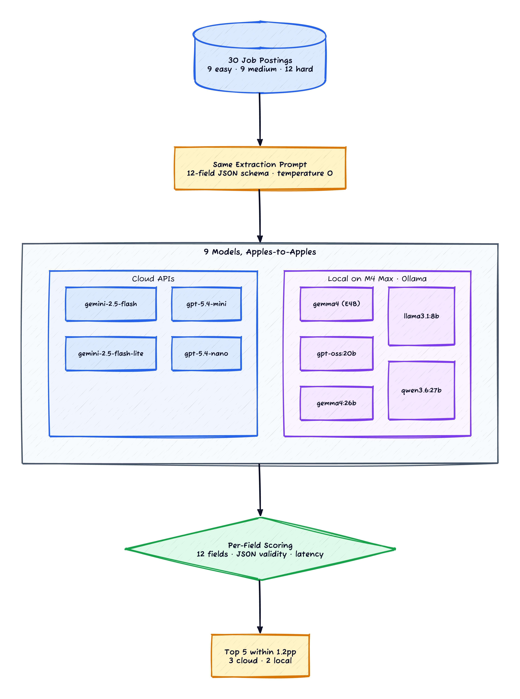
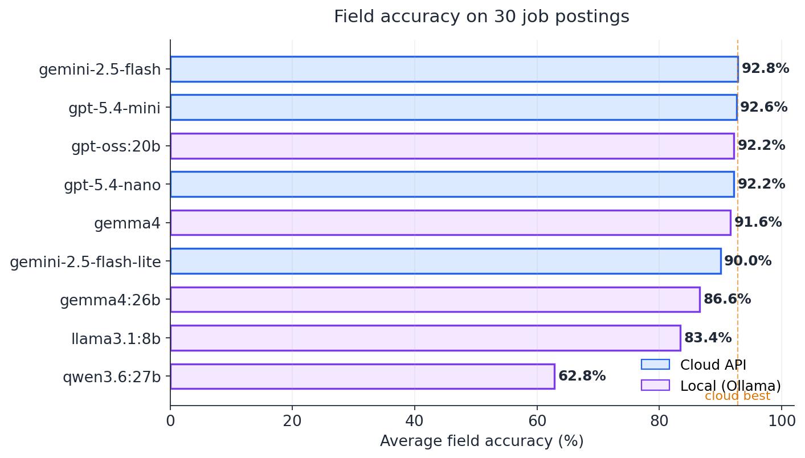
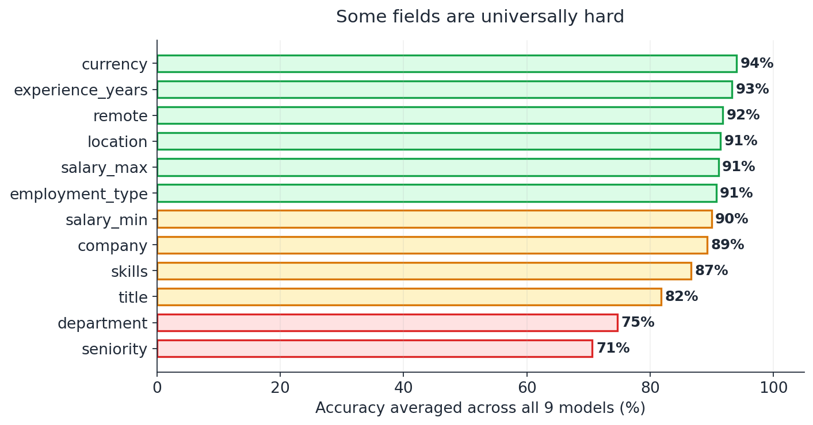

*Prerequisites: Familiarity with LLM prompting and JSON output. The local models in this post run through [Ollama](https://ollama.com/); the cloud calls go through the OpenAI and Vertex AI SDKs. No fine-tuning or retrieval — pure prompt-in, JSON-out.*

*This is the first post in a seven-part series on small language models — extraction, vision, RAG, agents, fine-tuning, evaluation, and a build-vs-buy capstone. **The series reports exploratory experiments on public datasets and publicly available models. Results are from single runs unless noted otherwise. Findings are directional, not statistically rigorous benchmarks. No medical, financial, or legal advice intended.***

A friend of mine is paying OpenAI $0.75 per million tokens to convert messy job postings into structured JSON. The pipeline runs millions of postings a month. It works well. He asked me whether he could swap in a free local model and pocket the bill, or whether the API was earning its keep.

I had a vague answer ("Gemma is fine for that, probably") and no data. So I built the dumbest possible benchmark I could — 30 job postings, one prompt, nine models, twelve fields per posting — and pointed it at the question. This is the post about what fell out.

**Short answer:** for structured extraction with a clear schema, the top five models cluster within 1.2 percentage points of each other. Three of them are cloud APIs. Two of them run on a laptop. The free open-weight Gemma 4 E4B (8B parameters, 4B active) lands 1.2 points behind the best cloud option. At any non-trivial volume, that's not a billable gap.

The longer answer has some nuance — JSON validity is mostly solved but not always, "reasoning" models are a liability here, and a couple of fields are universally hard regardless of who runs the model — so I'll walk through the data.

## The setup

I built 30 job postings across three difficulty tiers — **10 hand-written by me, 20 synthesised by Claude Sonnet to match the difficulty distribution of the originals.** I'll come back to the synthetic-data trade-off in the caveats section; the upside worth flagging up front is that the postings are all brand-new and won't appear in any model's pre-training corpus, so the scores below aren't inflated by memorisation.

- **Easy (9):** clean labelled sections — "Job Title: ...", "Salary: ...", "Skills Required: ...". The kind of posting a corporate ATS spits out.
- **Medium (9):** prose paragraphs with the information embedded — *"Our AI team at DeepMind Health (London, UK) is looking for an ML Engineer with at least 4 years of PyTorch experience..."*
- **Hard (12):** the chaos tier — Slack-style messages, marketing copy with rockstar/ninja/guru language, multi-paragraph descriptions where the salary is buried under a footer, deliberate typos. My favourite is JP07:

> *hey so we're looking for a devops person, maybe SRE, not sure about the exact title yet lol. basically someone who can manage our k8s clusters and CI/CD pipelines. we're a 20-person startup in berlin, fully remote, paying somewhere around 70-85k eur depending on experience. terraform, ansible, github actions are must-haves. prometheus/grafana would be nice. probably need like 3 years experience minimum? full time obvs. hit me up if interested.*

The model has to figure out that the title is "DevOps Engineer" (the user couldn't decide), the company isn't named, the location is Berlin, the salary range is 70,000–85,000 EUR, k8s means Kubernetes, and the seniority is "mid" (3 years isn't junior, isn't senior). All in one shot, returning valid JSON.

Each posting is paired with a hand-labelled ground truth — a JSON object with twelve fields:

```
title           location         employment_type
company         salary_min       seniority
remote          salary_max       department
skills          currency         experience_years
```

The prompt is one screen of plain text — "Return ONLY valid JSON with these fields..." followed by the field list and the posting. Temperature 0 everywhere. No function calling, no JSON-mode, no schema enforcement at the API level. I wanted to see what each model would produce with a vanilla prompt, the way you'd write it on day one.


*Figure 1: Same postings, same prompt, same scoring. The only variable is which model runs the call.*

### The lineup

I picked nine models to cover the range I'd actually consider:

| Model | Size / type | Where it runs | Per-1M input |
|---|---|---|---|
| `gemini-2.5-flash` | Frontier | Vertex AI | $0.30 |
| `gemini-2.5-flash-lite` | Cheap tier | Vertex AI | $0.10 |
| `gpt-5.4-mini` | Cheap tier | OpenAI API | $0.75 |
| `gpt-5.4-nano` | Cheapest | OpenAI API | $0.20 |
| `gemma4` (E4B) | 8B params, 4B active (MoE) [[1]](#ref-1) | Local · Ollama | $0 |
| `gemma4:26b` | 26B params | Local · Ollama | $0 |
| `gpt-oss:20b` | 20B MoE, 3.6B active [[2]](#ref-2) | Local · Ollama | $0 |
| `llama3.1:8b` | 8B dense | Local · Ollama | $0 |
| `qwen3.6:27b` | 27B dense, thinking model [[3]](#ref-3) | Local · Ollama | $0 |

Hardware for the locals: Apple Silicon laptop, 36 GB unified memory. Nothing exotic — anyone reading this post can reproduce the local half of the run for the price of a `brew install ollama`.

Two things worth flagging about the model set before the results:

**Gemma 4 E4B is the smallest "real" model in the lineup.** It's an MoE with ~4B active parameters per forward pass, which means the memory and latency footprint is closer to a 4B dense model than to its 8B parameter count. That matters for "could I run this on the cheapest GPU I can rent?" arithmetic.

**Qwen3.6 is a thinking model.** It emits a `<think>...</think>` block before its actual answer, the way GPT-style reasoning models do. That turns out to matter a lot for this task, in a bad way — more on that below.

## Headline result

Average field accuracy across all 30 postings:


*Figure 2: Average accuracy across twelve fields × thirty postings. The orange dashed line is the best cloud score.*

The top five models — `gemini-2.5-flash`, `gpt-5.4-mini`, `gpt-oss:20b`, `gpt-5.4-nano`, and Gemma 4 E4B — finish within 1.2 percentage points of each other. Three are cloud APIs; two run on the laptop. The cheapest cloud option (`gemini-2.5-flash-lite`) drops about 2 points behind that cluster but still does fine.

Below the cluster the field separates:

- **`gemma4:26b` at 86.6%** — surprisingly mediocre for a 26B model. It also lost one posting to invalid JSON output, which is annoying for a model that should be the heavyweight in the local lineup.
- **`llama3.1:8b` at 83.4%** — last year's open-weight default. Still respectable, but noticeably behind Gemma 4 E4B at the same parameter class.
- **`qwen3.6:27b` at 62.8%** — a category mistake on my part. The thinking-mode footgun is real.

The honest read: if you cared about getting the JSON right, the answer between the top five is noise. Any of them is a defensible choice, and that includes a model that runs offline for free.

### About that "1 point gap"

I should be upfront about the sample size before anyone over-rotates on the table above. This is **a single run on 30 postings**, with no variance bars. A pilot version of this experiment used only 10 postings, and at n=10 the top of the table looked like *"GPT-5.4-mini clearly wins by 3 points."* That gap mostly evaporated at n=30:

| Model | n=10 | n=30 | Δ |
|---|---|---|---|
| `gpt-5.4-mini` | 95.5% | 92.6% | −2.9 |
| `gemma4` (E4B) | 92.6% | 91.6% | −1.0 |
| `gemini-2.5-flash` | 83.6% | 92.8% | **+9.2** |
| `qwen3.6:27b` | 54.4% | 62.8% | +8.4 |

The big swings (gemini-2.5-flash up 9 points, qwen up 8) were models whose pilot score was disproportionately wrecked by a single invalid-JSON case. Tripling the sample size washed that out. The compression at the top is the more interesting effect: the n=10 result was overstating the cloud premium because the cloud models happened to ace a small sample.

Treat the 1-point gap as directional, not definitive. The bigger claim — *the top five are within noise of each other* — survives the sample-size correction. The narrower claim — *gemini-2.5-flash specifically beats Gemma E4B by 1.2pp* — needs more runs before I'd bet anything on it.

## Where the field actually separates

Average accuracy hides the more interesting story, which is *which fields* every model struggles with. Averaged across all nine models:


*Figure 3: Some fields are solved across the board; two are unreliable everywhere, including for the cloud frontier.*

The green band — currency, experience_years, remote, location, salary_max, employment_type — is essentially solved. Every model gets these right ~91-94% of the time. These are fields where the answer is either literally in the text ("EUR", "5+ years", "Remote OK") or trivially derivable from boolean signals.

The amber band — salary_min, company, skills, title — is the medium-hard tier. Salary_min is interesting; it's a hair *below* salary_max, because the harder postings phrase compensation as "starting at $X" or "up to $Y" rather than as a clean range. Skills depends partly on the scoring (I credit case-insensitive set overlap, so "PostgreSQL" vs "postgresql" doesn't punish anyone, but "REST APIs" vs "REST" does).

The red band — **department at 75%, seniority at 71%** — is where every model, cloud or local, struggles. These two fields require *inference from context*. Nobody writes "department: engineering" in a job posting; you have to deduce that from "We're hiring a Backend Engineer for our Platform team..." And nobody writes "seniority: mid"; the model has to map "3 years experience minimum" + "managing junior devs" → mid, while "Director of Engineering" + "12+ years" → lead, while "Junior Frontend Developer" → junior. The label space is fuzzy and the source signal is implicit.

Here's the kicker: the frontier cloud models do not do meaningfully better at this. They guess inconsistently in the same way the local models do, on the same postings. That tells me **the bottleneck is the task, not the model size.** A bigger model wouldn't help; clearer category definitions in the prompt, or a separate classifier per fuzzy field, probably would.

## The Qwen thinking-mode trap

Reasoning models are great for math problems and bad for structured extraction. I learned this the painful way. (There's a worse cousin of this failure mode where an open-weight model returns an empty string on a whole category of inputs, with no error or refusal text — I hit it on medical questions during the fine-tuning experiment and it's a much harder failure to debug than Qwen's behaviour here.)

`qwen3.6:27b` is a "thinking" model — it produces a chain-of-thought inside `<think>...</think>` tags before its final answer. The LangChain `ChatOllama` integration helpfully strips the think block when surfacing the response, which means in the first naive run my parser got back empty strings. Zero valid JSON, zero score, every posting.

The documented fix is a system prompt of `/no_think`, which Qwen recognises as a directive to skip the chain-of-thought and answer directly. That helped — JSON validity climbed to 67%. But it never made it to 100%. On longer or messier postings, the model would *ignore* the `/no_think` directive and emit a think block anyway, and the response would come back empty or truncated.

The same pattern probably bites every reasoning model the same way:

- **Reasoning models pay for accuracy on multi-step problems** by burning a chunk of their output budget on planning. For a structured-extraction task where the prompt is "read this paragraph, fill in these twelve fields, return JSON," there's no multi-step problem to plan. The think block is pure overhead — and worse, it competes with the JSON for the model's output token budget. Truncate the response and you lose the JSON, not the reasoning.
- **Latency goes up by an order of magnitude.** Qwen averaged **104 seconds per posting** on my laptop. The next-slowest model was `gemma4:26b` at 23 seconds. Most of that delta is the think block.

The takeaway I'd encode as a rule: **for structured extraction, prefer non-thinking models, or disable the thinking mode if the model supports it.** Gemini's API exposes a `thinking_budget` parameter for this exact reason — for short structured outputs, set it to 0. OpenAI's reasoning models (`o1`, `o3` family, the GPT-5 reasoning variants) have a similar knob. If your model doesn't expose one, pick a non-reasoning model and move on.

## JSON validity is (mostly) solved

Eight of nine models produced valid JSON 100% of the time across 30 postings. The exception (besides Qwen) was `gemma4:26b`, which lost one posting — a long, complex one where it ran into a token-budget cliff and truncated mid-array. Bumping `num_predict` from 1024 to 2048 fixed it; this is a settings issue, not a capability issue.

A few practical notes from making this work across nine models:

- **For Ollama models, pass `temperature=0` and `num_predict=2048`.** The default `num_predict` of 128 will truncate any non-trivial structured output and you'll wonder why JSON is malformed.
- **For OpenAI, use the `response_format={"type": "json_object"}` parameter.** Cheap insurance against malformed output. (I didn't use it in this run — wanted the prompt-only baseline — and still got 100% validity, but in a production system I'd belt-and-brace.)
- **For Vertex AI, set `thinking_config=ThinkingConfig(thinking_budget=0)`.** This is the Gemini equivalent of `/no_think` and matters even for the non-thinking models — without it, the flash-tier models default to a small but non-zero thinking budget that adds latency without changing the output quality on this task. (Gemini Pro requires `thinking_budget >= 128`; the lighter models can go to 0.)
- **If you're forced to use a thinking model, add `format="json"` to Ollama's `/api/generate` payload [[4]](#ref-4).** That forces a strict JSON-only response and overrides the model's instinct to emit prose. It still won't fix the underlying truncation problem with Qwen, but it'll at least give you a fighting chance.

There's a whole ecosystem of structured-generation libraries — Outlines, Instructor, LangChain's PydanticOutputParser — that enforce JSON validity at decode time by masking invalid tokens. None of that is necessary for the eight models in this run. For Qwen, it would have helped with validity but not with the deeper "the model is using the wrong tool for the job" problem.

## Latency: the local penalty is real

The accuracy story flatters local models. The latency story does not.

| Model | Source | Score | Avg latency / posting |
|---|---|---|---|
| `gemini-2.5-flash-lite` | cloud | 90.0% | **0.75s** |
| `gpt-5.4-mini` | cloud | 92.6% | 1.03s |
| `gpt-5.4-nano` | cloud | 92.2% | 1.52s |
| `llama3.1:8b` | local | 83.4% | 2.22s |
| `gemini-2.5-flash` | cloud | 92.8% | 2.95s |
| `gpt-oss:20b` | local | 92.2% | 7.46s |
| `gemma4` (E4B) | local | 91.6% | 7.86s |
| `gemma4:26b` | local | 86.6% | 23.12s |
| `qwen3.6:27b` | local | 62.8% | 104.80s |

Cloud responses come back in roughly 1-3 seconds. Local responses on a 36 GB laptop range from 2 seconds (Llama 8B) to 23 seconds (Gemma 26B), with the top-five locals (Gemma E4B and gpt-oss:20b) sitting around 7-8 seconds per posting.

This is not a fair comparison — the laptop is single-stream, one query at a time, while the cloud APIs are running on serving infrastructure with batching, prefix caching, and aggressive GPU saturation. The right local comparison is what you'd see from vLLM on an A100 or an H100, which has measured throughputs north of 100 requests per second for 4-8B models on similar prompt shapes. That changes the per-request latency picture entirely.

But for a small-scale or development workflow — running a few thousand postings overnight on a laptop — 8 seconds per posting is fine. The point is just to be honest about which dimension the local models lose on.

## The actual cost question

This is where the back-of-the-envelope arithmetic that motivated the experiment lives. The numbers below use the prompt shape from this run: about 180 input tokens (preamble + posting) and 100 output tokens (the twelve-field JSON), so roughly **280 tokens per request**.

At 1M postings per month, that works out to:

| Option | Monthly cost @ 1M req | Accuracy |
|---|---|---|
| `gemini-2.5-flash-lite` (cheap cloud) | ~$60 | 90.0% |
| `gpt-5.4-mini` (mid cloud) | ~$435 | 92.6% |
| Gemma 4 E4B self-hosted on A100 ($3.67/hr) | ~$2,640 | 91.6% |

The cheap cloud tier is *absurdly* cheap at this shape. At a million requests a month, `gemini-2.5-flash-lite` costs less than a typical SaaS subscription. You'd need to be doing somewhere in the tens of millions of requests per month before self-hosting beats it — and at that scale you're also paying for someone to operate the GPU, which the table doesn't include.

The middle-tier cloud option (`gpt-5.4-mini`) crosses over to self-hosting earlier — somewhere around 6-8M requests per month, depending on overhead. That's still a lot.

So the cost framing collapses into three rough buckets, and the right answer depends on which one you're in:

- **Low volume (under a few million requests/month) and you want it cheap:** ship `gemini-2.5-flash-lite`. It's the cheapest *and* one of the most accurate options. Don't overthink it.
- **High volume (tens of millions of requests/month) on one stable task:** self-host Gemma 4 E4B or `gpt-oss:20b`. The GPU bill flattens out while the API bill keeps climbing linearly.
- **Mixed bag of small tasks, none high-volume:** stay on the cheap cloud tier. The marginal cost is rounding error and the operational simplicity is worth real money.

The conclusion I keep landing on is that **for structured extraction specifically, model choice is no longer the lever it used to be.** Volume is the lever. Get the volume right, then pick the deployment that matches it.

## When this doesn't apply

A few honest caveats so I'm not over-selling.

- **My postings are synthetic.** Twenty were synthesised by Claude Sonnet to match the difficulty distribution of the original ten hand-written ones. The upside of this design choice is that **no model in the lineup could have seen these postings during pre-training** — there's zero benchmark-contamination risk inflating any model's score. The downside is the inverse: the test set may favour patterns Claude finds natural, which could bias the field accuracy table in subtle ways I can't fully correct for. Production extraction on PDF resumes, OCR'd job ads, or HTML-scraped postings would likely show larger gaps and lower absolute scores.
- **The schema is friendly.** Twelve flat fields, two of them fuzzy. Real-world extraction schemas often have nested objects, lists of objects (multiple salary tiers per role, per-skill proficiency levels), conditional fields. The gap between "model that handles flat extraction" and "model that handles nested schemas with cross-field dependencies" is real and not measured here.
- **No few-shot examples in the prompt.** A handful of in-context examples would lift every model by some amount — probably the weaker ones more than the stronger ones, which would compress the table further. I wanted the zero-shot baseline.
- **Single run, no variance.** One run per (model, posting). The cluster ordering at the top is within plausible run-to-run noise. With three runs and standard error bars I'd have a more defensible claim about *which* of the top five is actually best; with one run, all I can defensibly say is that they're a cluster.

If the cluster at the top is the durable finding, the specific ordering within it isn't.

## The methodology lesson

The one habit I'd carry forward to any "should we swap our LLM?" evaluation:

> **Pilot at n=10 to debug your pipeline. Decide at n≥30.**

The pilot is for catching the embarrassing mistakes — the LangChain parser stripping Qwen's think tags, the default `num_predict` truncating Gemma's JSON, the Vertex retry storm that ate one of your cloud results. You'll find ten of those in the first ten postings. At n=30, those infrastructure bugs are paid down and single-case unlucky models stop dominating the ranking.

The pilot in this experiment told me "GPT-5.4-mini wins clearly." The n=30 run told me "the top five are a cluster, and Gemma E4B is in it." Same models, same prompt, same scoring. Three times the data. Completely different decision.

That's the cheapest methodological upgrade you can buy in this kind of evaluation. Don't ship a model swap decision off a pilot.

## Where to go from here

Structured extraction from text is where the local-cloud gap has all but closed. The interesting question is whether the same holds for *visual* extraction — receipts, invoices, scanned forms. The schema is identical (return JSON with these fields), but the input is now a pixel buffer rather than a string, and the local vision models haven't traditionally kept up with the cloud ones. That's what [the next post in this sequence](/posts/slm-vision-extraction/) takes on.

If you want to take this one further yourself:

- **Run it on your own schema.** The eval harness is small — a JSON schema, a prompt, and per-field scoring with a forgiving comparator for strings and a `±10%` tolerance for numbers. Swap in your fields, your sample postings, and re-run. The relative ordering of models on *your* task is what matters; mine is just an existence proof.
- **Add structured-output constraints.** Outlines [[5]](#ref-5), Instructor [[6]](#ref-6), and the major API providers' native JSON modes [[7]](#ref-7)[[8]](#ref-8) all close the JSON-validity gap deterministically. For a production system that's where I'd start.
- **Try few-shot.** Two or three in-context examples will move the weaker models more than the stronger ones, and may collapse the table further. It's also the smallest possible intervention.
- **Push the schema.** Add nested objects, optional fields, lists-of-objects. That's where the cloud premium might re-emerge, if it's going to re-emerge anywhere.

## References

<span id="ref-1">**[1]**</span> **Google DeepMind** — [Gemma model family](https://ai.google.dev/gemma). The E4B variant referenced here is a mixture-of-experts configuration with ~4B active parameters per forward pass at 8B total.

<span id="ref-2">**[2]**</span> **OpenAI** — [Introducing gpt-oss](https://openai.com/index/introducing-gpt-oss/). Open-weight model release notes; the 20B variant used here is a 3.6B-active MoE.

<span id="ref-3">**[3]**</span> **Qwen Team** — [Qwen3 thinking mode and `/no_think` directive](https://qwenlm.github.io/blog/qwen3/). Background on the thinking/non-thinking duality and how to switch between them.

<span id="ref-4">**[4]**</span> **Ollama** — [Structured outputs (JSON mode)](https://ollama.com/blog/structured-outputs). Pass `format="json"` (or a full JSON schema) to constrain any Ollama model's output.

<span id="ref-5">**[5]**</span> **Outlines** — [Structured generation for LLMs](https://github.com/dottxt-ai/outlines). Library for constraining LLM outputs to a regex, JSON schema, or context-free grammar at decode time. Eliminates malformed-JSON failures.

<span id="ref-6">**[6]**</span> **Instructor** — [Structured outputs powered by LLMs](https://github.com/jxnl/instructor). Pydantic-first library for type-safe LLM responses; retries on validation failure.

<span id="ref-7">**[7]**</span> **OpenAI** — [Structured Outputs guide](https://platform.openai.com/docs/guides/structured-outputs). JSON-schema-conformant decoding; guarantees the output parses against the schema you supply.

<span id="ref-8">**[8]**</span> **Google Vertex AI** — [Controlled generation with Gemini](https://cloud.google.com/vertex-ai/generative-ai/docs/multimodal/control-generated-output). Schema-constrained JSON output for the Gemini family.
