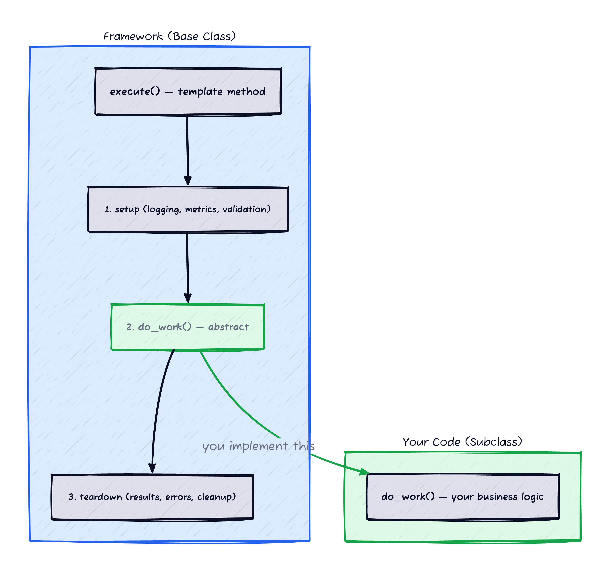
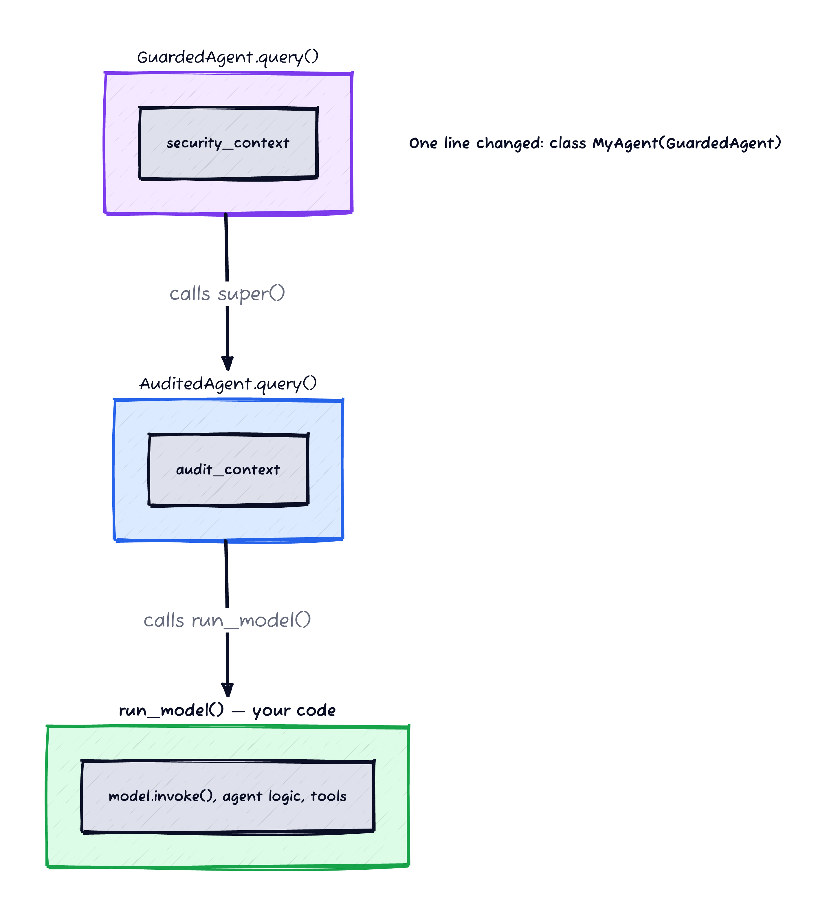
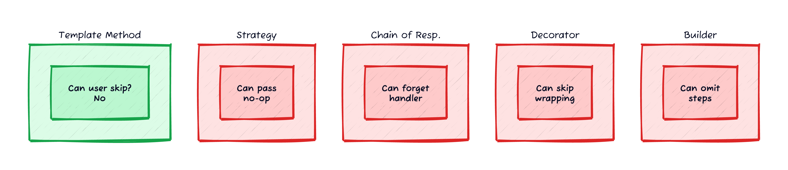

*Prerequisites: Basic familiarity with object-oriented design patterns. No ML-specific knowledge needed — the examples are self-contained.*

Every ML platform team eventually faces the same problem. You've built shared infrastructure — audit logging, metrics, error handling, graceful shutdown. You need every model, pipeline, and agent to use it. But you also need teams to own their business logic without the platform getting in the way.

The instinct is to write documentation. "Please call `configure_metrics()` before your model runs. Please wrap your prediction in a `try/except` and log errors. Please shut down the sidecar proxy when your job finishes." Then you discover that half the teams forgot the metrics call, a quarter swallow exceptions silently, and someone's CronJob hangs indefinitely because they never shut down the sidecar.

Documentation doesn't work because it's opt-in. Code review catches some of it, but not all, and not consistently. What you need is a pattern where the framework *owns the lifecycle* and the team *owns the business logic* — and there's no way to do one without the other.

The people writing models aren't the people who care about audit compliance. In ML organisations, there are typically three roles:

- **Platform engineers** build the infrastructure — logging, metrics, security, deployment. They care deeply about compliance, observability, and operational guarantees.
- **ML engineers** build framework extensions — adding cross-cutting concerns like security scanning or model versioning on top of the platform primitives.
- **Data scientists** build the models — the prediction logic, the prompt engineering, the feature transformations. They care about model quality, not infrastructure plumbing.

The DS shouldn't need to *know* about audit contexts, security scanning, or sidecar shutdown. They implement one method — `run_model()`, `Run()`, `predict()` — and the platform handles everything else. If the DS has to remember to call `configure_metrics()` or `shutdown_sidecar()`, something is wrong with the architecture.

The pattern that solves this has been in the Gang of Four book since 1994. It's the template method.

## The Pattern in 30 Seconds


*Figure 1: The framework owns execute() — setup, teardown, error handling. The subclass only implements do_work(). Cannot skip, cannot reorder.*

Template method defines the skeleton of an algorithm in a base class, deferring specific steps to subclasses. The base class controls *when* things happen. The subclass controls *what* happens.

```python
class Base:
    def execute(self):      # template method — framework owns this
        self.before()       # framework step
        result = self.do_work()  # subclass step (abstract)
        self.after(result)  # framework step
        return result

class MyImplementation(Base):
    def do_work(self):      # subclass owns this
        return "business logic here"
```

The subclass can't skip `before()` or `after()`. It can't reorder the steps. It can't forget to call the framework code. The guarantee is structural — enforced by the class hierarchy, not by documentation or code review. (In Python, a subclass *can* override `execute()` since there's no `final` keyword. The guarantee holds by convention — but it's a much louder violation than forgetting a function call, and code review catches it trivially.)

## Why It's Perfect for ML Pipelines

ML pipelines are sequential step chains with a shared lifecycle. Every pipeline needs:

1. **Setup** — configure logging, metrics, tracing, validate config
2. **Business logic** — the model prediction, the data transformation, the agent conversation
3. **Teardown** — record results, handle errors, clean up resources, shut down sidecars

The setup and teardown are the same across all pipelines. The business logic varies wildly — one team runs a transformer model, another runs a SQL aggregation, a third orchestrates a multi-turn chatbot. Template method lets you enforce the shared parts while giving teams complete freedom in the middle.

### Example: Data pipeline in Go

Here's a data pipeline framework where the base struct owns the lifecycle and the user implements `Runner`:

```go
// Runner interface — the user implements this
type Runner interface {
    Register()
    Run(ctx context.Context, logger *Logger) int
}

// Pipeline struct — the framework owns this
type Pipeline struct {
    *Job
    Runner
}

// Execute is the template method
func (p *Pipeline) Execute(ctx context.Context) int {
    p.Register()                           // 1. user registers config
    p.jobID = uuid.New().String()          // 2. framework assigns ID

    logger, err := NewLogger(ctx, p.Component)
    if err != nil {
        return 1
    }
    defer logger.Close()

    if err := p.validateJob(); err != nil { // 3. framework validates
        logger.Error(err)
        return 1
    }

    logger.Info("Starting %s...", p.Name)
    defer ShutdownSidecar(logger)           // 4. framework shuts down sidecar

    exitCode := p.Run(ctx, logger)          // 5. USER'S CODE RUNS HERE

    if exitCode != 0 {                      // 6. framework handles failure
        p.sendFailureEmail(ctx, logger)
    }
    return exitCode
}
```

The user writes a struct that implements `Runner`:

```go
type MyETLJob struct{}

func (j *MyETLJob) Register() {
    // set job metadata
}

func (j *MyETLJob) Run(ctx context.Context, logger *Logger) int {
    // actual ETL logic — SQL queries, transformations, writes
    return 0
}

func main() {
    pipeline := NewPipeline(ctx, &MyETLJob{}, &Job{
        System: "analytics", Component: "daily-aggregation",
    })
    os.Exit(pipeline.Execute(ctx))
}
```

The ETL developer never thinks about logging setup, sidecar shutdown, failure emails, or job validation. They can't forget them. They can't do them wrong. They implement `Run()` and the framework handles the rest.

### Example: LLM agent in Python

Same pattern, different domain. An LLM agent framework where the base class wraps the model's business logic with audit logging and security scanning:

```python
class AuditedAgent(AgentInterface):
    """Base class — framework owns query()."""

    def query(self, request_dict, thread_id, output_writer, **kwargs):
        with audit_scope(user_ref=..., session_ref=...) as ctx:
            ctx.prediction_input = json.dumps(request_dict)
            try:
                result = self.run_model(         # subclass step
                    request_dict, thread_id, **kwargs
                )
            except Exception as e:
                self._finalize_audit(ctx, error=e)
                raise
            ctx.prediction_output = json.dumps(result)
        self._finalize_audit(ctx, result=result)

    @abc.abstractmethod
    def run_model(self, request_dict, thread_id, **kwargs):
        """Implement model business logic here."""
```

The model developer:

```python
class MySideEffectsAgent(AuditedAgent):
    def run_model(self, request_dict, thread_id, **kwargs):
        model = create_model("gpt-4o-mini")
        return model.invoke(request_dict["content"])
```

Every LLM call inside `run_model()` is automatically captured in the audit trail. The model developer writes zero audit code. They can't skip it. They can't misconfigure it. The `audit_scope` wrapping in `query()` is the template method.

*(I cover the audit logging architecture in detail in [Zero-Touch Audit Logging for LLM Applications](/posts/zero-touch-llm-auditing/) — here I'm focused on the pattern itself.)*

### Layering: security on top of audit


*Figure 3: GuardedAgent wraps AuditedAgent wraps run_model(). Three layers, one line changed in the model code.*

The pattern composes beautifully. Add a security layer without touching the audit code:

```python
class GuardedAgent(AuditedAgent):
    """Adds security context on top of audit context."""

    def query(self, request_dict, thread_id, output_writer, **kwargs):
        with guard_context(agent_name=type(self).__name__) as sec_ctx:
            try:
                super().query(              # delegates to AuditedAgent.query()
                    request_dict, thread_id, output_writer, **kwargs
                )
            finally:
                self._log_security_findings(sec_ctx)
```

Now the model developer switches one line:

```python
# Before: audit only
class MyAgent(AuditedAgent):

# After: audit + security
class MyAgent(GuardedAgent):
```

The security context wraps the audit context, which wraps `run_model()`. Three layers, each owning its lifecycle, the model code unchanged. That's template method composition — and it's the property that makes "zero-touch" infrastructure possible.

## Why Not the Others?


*Figure 2: The key question for each pattern: can the user skip the framework behavior? Only template method says no.*

Four other patterns come up in this context. Each solves a different problem, and each fails the same test: **can the user skip the framework behavior?**

**Strategy** separates the algorithm from the context — you pass audit and security strategies as constructor parameters. The caller controls the lifecycle: they can pass a no-op strategy, call `before()` without `after()`, or skip the strategy entirely. Strategy is right for interchangeable algorithms (sorting, routing). It's wrong when certain steps must always happen.

**Chain of Responsibility** passes a request through a chain of handlers. Two problems: chain assembly is the caller's responsibility (forget the audit handler and nothing complains), and each handler must explicitly call `next_handler` (if one throws, downstream handlers don't run). Template method's `try/finally` handles teardown-on-failure cleanly. Chain of responsibility is right for HTTP middleware where handlers are independent. It's wrong when lifecycle steps have ordering dependencies.

**Decorator** wraps an object with additional behavior: `AuditDecorator(SecurityDecorator(MyAgent()))`. Wrapping is optional — someone can construct `MyAgent()` without the decorators. You're back to documentation: "please wrap your agent in `AuditDecorator`." Decorator is right for optional runtime behavior (buffered I/O, cached clients). It's wrong when the behavior is mandatory.

**Builder** constructs pipelines step by step: `PipelineBuilder().add_step(Metrics()).add_step(Logic()).build()`. The flexibility is the problem — someone will build a pipeline that skips `RecordResults()` or reorders steps. You can validate at build time, but now you're writing validation code for something template method prevents structurally. Builder is right for objects with many optional parameters. It's wrong for enforcing a fixed lifecycle.

## Where Template Method Doesn't Fit

**When the lifecycle isn't fixed.** If different models need fundamentally different lifecycles — one needs setup/teardown, another needs retry loops, a third needs streaming — template method forces them into the same skeleton. You'll end up with empty hook methods and awkward overrides. Use strategy or composition instead.

**When composition is more natural than inheritance.** In languages and cultures that prefer composition over inheritance (Go, functional programming), template method via inheritance feels unidiomatic. The Go example above uses an interface (`Runner`) rather than embedding, which is Go's way of achieving the same pattern without inheritance. Python's `abc.abstractmethod` is more natural.

**When teams need to control the lifecycle.** If a team has a legitimate reason to change the order of setup/teardown steps — perhaps they need to configure metrics *after* loading the model because the model defines the metric names — template method is too rigid. Give them hooks or callbacks instead.

## The Zero-Touch Property

Here's the property that makes template method uniquely valuable for ML platform engineering:

> If the framework owns `execute()` and the team implements `do_work()`, then any behavior added to `execute()` applies to every implementation automatically — past, present, and future — without touching a single model's code.

When I added security scanning to the LLM agent framework, I didn't modify any model code. I created `GuardedAgent` that wraps `AuditedAgent.query()` with a security context. Every model that switches its base class — one line — gets security scanning on every LLM call. Models that don't switch are unaffected.

When the data pipeline framework added failure notification emails, no pipeline code changed. The `Execute()` method already owned the lifecycle. Adding `sendFailureEmail()` after a non-zero exit code was a framework change, not a pipeline change.

That's zero-touch. Not "easy to add" — *impossible to forget*. Not "convention" — *structure*. The guarantee is in the class hierarchy, not in a wiki page nobody reads.

If you've worked with aspect-oriented programming (Spring AOP, AspectJ), you'll recognise the goal: inject cross-cutting concerns without modifying business logic. Template method achieves the same thing with plain inheritance — no bytecode weaving, no proxy magic, no framework-specific annotations. The trade-off is less flexibility (the lifecycle is fixed), but for ML infrastructure that's a feature, not a bug.

## Where to Go From Here

If you're building ML platform infrastructure — model serving frameworks, data pipeline runners, agent orchestrators — and you're enforcing shared behavior through documentation or code review, consider whether template method gives you the structural guarantee you're looking for.

The pattern is simple. The value is the guarantee.

## References

<span id="ref-1">**[1]**</span> **Gamma, Helm, Johnson, Vlissides (1994)** — *Design Patterns: Elements of Reusable Object-Oriented Software*. Chapter 5.10: Template Method.

<span id="ref-2">**[2]**</span> **Refactoring Guru** — [Template Method](https://refactoring.guru/design-patterns/template-method). Visual walkthrough with examples in multiple languages.
