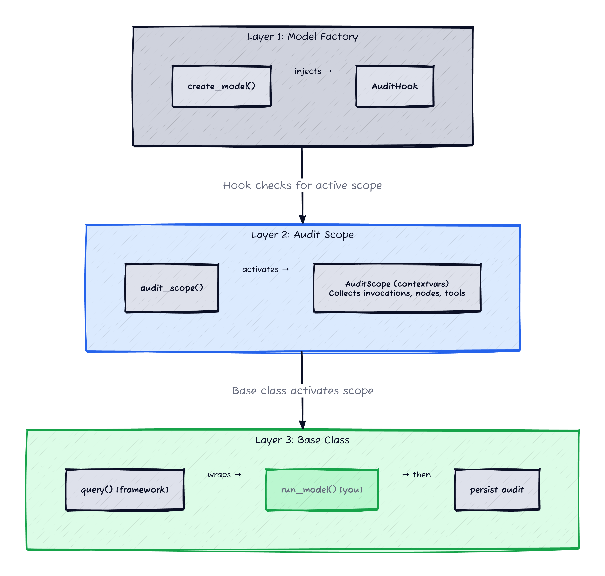
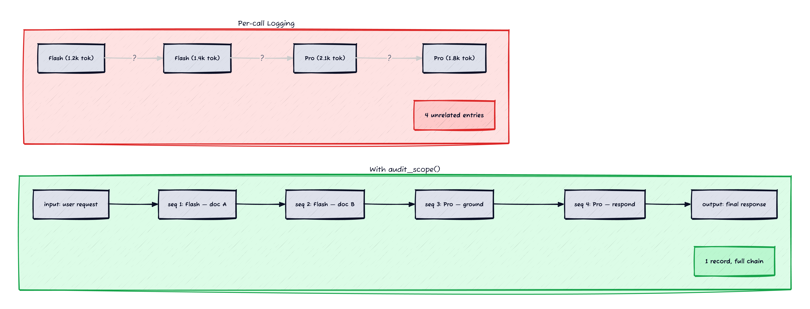
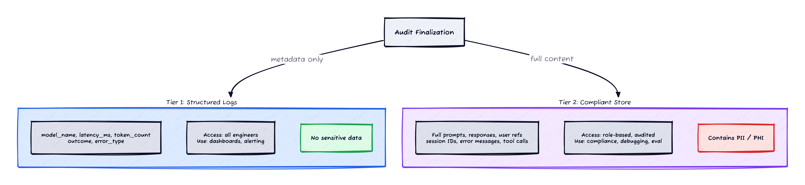

*Prerequisites: Familiarity with LLM-powered applications (chat models, system prompts, LangChain callbacks). No compliance or healthcare-specific knowledge needed — the regulated-environment section is self-contained.*

Every LLM observability tool gives you the same dashboard: latency per call, token usage, cost per model, error rates. That's useful for operations. It's useless for three other things you'll need the moment your application goes to production:

**Compliance.** A regulator or auditor asks "what did the model say to this user on March 14?" You need the full prompt/response chain, not a latency percentile.

**Evaluation.** You're building an LLM-as-judge pipeline to measure model quality over time. You need every prompt/response pair in a queryable format, not scattered across log files.

**Debugging.** A user reports a wrong answer. You need to see exactly what the model received — the full system prompt, the retrieved context, the chat history — and exactly what it returned. Token counts don't tell you why the model hallucinated.

All three require the same thing: capturing the complete prompt and response for every LLM call, correlating multi-step invocations into a single record, and storing it somewhere you can query later.

The standard approach is to ask model developers to add logging. This doesn't work, for the same reason documentation-driven approaches never work: it's opt-in. Some teams forget. Some teams do it inconsistently. Some teams log the prompt but not the response, or the response but not the token usage, or everything but the model parameters. By the time you discover the gaps, you're missing the data you needed.

This post walks through a framework that makes audit logging automatic — injected at the model factory level, gated by a context manager, and invisible to the model developer. The model code doesn't import any audit modules, doesn't call any logging functions, doesn't know audit logging exists.

## The Architecture


*Figure 1: The model factory injects the callback. The context manager scopes what gets captured. The base class activates the context. The developer implements run_model() only.*

Three layers, each independently adoptable:

### Layer 1: Callback at the model factory

The same factory-injection approach used for [runtime security guards](/posts/zero-touch-llm-guarding/) works for audit logging. A central factory function returns configured LangChain models — and injects an `AuditHook` callback into each one:

```python
def create_model(agent_name: str, **kwargs) -> BaseChatModel:
    model = _create_base_model(agent_name, **kwargs)

    model.callbacks = [
        AuditHook(),   # auto-captures every model.invoke()
    ]
    return model
```

The callback implements three LangChain hooks:

- `on_chat_model_start` — captures the prompt (all messages), records the start time, extracts model parameters
- `on_llm_end` — captures the response, token usage, finish reason, latency, tool calls
- `on_llm_error` — captures the error with latency, cleans up per-run state

Every `model.invoke()` triggers these hooks — including nested subagent calls, parallel tasks, and retries. One injection point covers the entire system.

```python
class AuditHook(BaseCallbackHandler):
    def __init__(self):
        self._pending: dict[UUID, PendingCall] = {}

    def on_chat_model_start(self, serialized, messages, *, run_id, **kwargs):
        scope = get_active_scope()
        if scope is None:
            return  # no active scope — do nothing

        self._pending[run_id] = PendingCall(
            prompt=format_messages(messages),
            started_at=time.monotonic(),
        )

    def on_llm_end(self, response, *, run_id, **kwargs):
        scope = get_active_scope()
        if scope is None:
            return

        pending = self._pending.pop(run_id, None)
        if pending is None:
            return

        scope.record(
            prompt=pending.prompt,
            response=parse_response_text(response),
            model=parse_model_name(response),
            tokens=parse_token_usage(response),
            latency_ms=pending.elapsed_ms(),
            tools=parse_tool_calls(response),
        )
```

The `if scope is None: return` check is the gate. Without an active audit scope, the callback does nothing — zero overhead, no state accumulation, immediate return.

### Layer 2: Scoped collection via contextvars

The callback captures every LLM call, but *where* does it put the data? A global list would mix invocations from concurrent requests. A `contextvars.ContextVar` scopes collection to the current request — thread-safe, async-safe, and invisible to the model code:

```python
_active_scope: ContextVar[AuditScope | None] = ContextVar(
    "audit_scope", default=None
)

def get_active_scope() -> AuditScope | None:
    return _active_scope.get()

@contextmanager
def audit_scope(user_ref: str | None = None, session_id: str | None = None):
    scope = AuditScope(user_ref=user_ref, session_id=session_id)
    token = _active_scope.set(scope)
    try:
        yield scope
    finally:
        _active_scope.reset(token)
```

When you enter `audit_scope`, the context is set. Every LLM call within that scope is captured automatically. When you exit, the context is cleared and the accumulated invocations are available for storage.

The context collects:

- **Invocations** — every LLM call with prompt, response, tokens, latency, model ID, tool calls
- **Prediction-level I/O** — the original user input and final model output, distinct from the per-invocation prompts
- **Session correlation** — a session ID for linking multi-turn conversations
- **Metadata** — user reference, model identity, deployment version

This is the same `contextvars` pattern that Python's `logging` module uses for log context, and that OpenTelemetry uses for span propagation. It's async-safe, supports nested scopes, and doesn't require passing context objects through function signatures.

### Layer 3: Base class activates the context

The base class wraps business logic with the audit scope using the [template method pattern](/posts/template-method-ml/) [[1]](#ref-1) — the base class owns the lifecycle, the subclass implements the business logic:

```python
class AuditedAgent(AgentInterface):
    @abc.abstractmethod
    def run_model(self, request, session_id, **kwargs):
        """Implement model business logic here.
        LLM calls via create_model() are auto-captured."""

    def query(self, request, session_id, **kwargs):
        with audit_scope(
            user_ref=self._get_user_ref(request),
            session_id=session_id,
        ) as scope:
            scope.set_input(request)
            try:
                result = self.run_model(request, session_id, **kwargs)
            except Exception:
                self._persist_audit(scope, success=False)
                raise
            scope.set_output(result)

        self._persist_audit(scope, success=True)
        return result

    def _persist_audit(self, scope, success):
        try:
            record = scope.build_record(success=success)
            self.audit_store.write(record)
        except Exception as e:
            logging.error("Audit write failed: %s", type(e).__name__)
```

The `audit_store` is injected at construction — the base class decides where records go (a database, an object store, a message queue), and every subclass inherits that decision.

The model developer:

```python
class SideEffectsAgent(AuditedAgent):
    def run_model(self, request, session_id, **kwargs):
        model = create_model("gpt-4o-mini")
        return model.invoke(request["content"])
```

No imports for logging. No calls to any audit function. No knowledge that audit logging exists. `query()` sets up the scope, `run_model()` runs the business logic, and every `model.invoke()` inside it is captured automatically.

## Invocation Chain Correlation


*Figure 2: Without correlation, a multi-step request produces N unrelated log entries. With audit_scope(), all invocations are linked in a single record with sequence numbers.*

Here's the problem that per-call logging doesn't solve. A single user request often triggers multiple LLM calls:

```
User: "Summarize my recent lab results"
  → LLM call 1: Chunk and summarize document A (Flash)
  → LLM call 2: Chunk and summarize document B (Flash)
  → LLM call 3: Ground the summaries against structured data (Pro)
  → LLM call 4: Generate final response with citations (Pro)
```

With per-call logging, you get four unrelated log entries. You can't tell they came from the same user request. You can't reconstruct the execution flow. You can't answer "what documents did the model use to generate this response?"

The audit context solves this by collecting all invocations within a scope into a single audit record. Each invocation is a separate entity with its own prompt, response, tokens, and model ID — but they're all linked to the same parent record with a monotonic sequence number for replay.

```python
@dataclass
class AuditScope:
    user_ref: str | None = None
    session_id: str | None = None
    _timeline: list[TimelineEntry] = field(default_factory=list)
    _seq: int = field(default=0)

    def record(self, prompt, response, model, tokens, latency_ms, tools=None):
        """Called by AuditHook for each LLM invocation."""
        self._seq += 1
        self._timeline.append(TimelineEntry(
            seq=self._seq,
            kind="llm",
            data=LLMRecord(prompt=prompt, response=response,
                           model=model, tokens=tokens,
                           latency_ms=latency_ms, tools=tools),
        ))

    def build_record(self, success: bool) -> AuditRecord:
        """Build the final audit record from accumulated entries."""
        return AuditRecord(
            timeline=self._timeline,
            input=self._input,
            output=self._output,
            success=success,
        )
```

The resulting audit record for the example above contains:

| Seq | Type | Model | Prompt (truncated) | Tokens |
|-----|------|-------|--------------------|--------|
| 1 | invocation | Flash | [system] Summarize... [user] Doc A content... | 1,200 |
| 2 | invocation | Flash | [system] Summarize... [user] Doc B content... | 1,400 |
| 3 | invocation | Pro | [system] Ground these summaries... | 2,100 |
| 4 | invocation | Pro | [system] Generate response... | 1,800 |

One record, four invocations, full execution chain. The sequence numbers make it possible to replay the exact order of execution. The parent record carries the prediction-level input ("summarize my recent lab results") and output (the final response) alongside the per-invocation detail.

## Beyond LLM Calls: Graph Nodes and Tool Executions

LLM invocations are only part of the story. An agent also makes decisions — which node to execute next, which tool to call. The callback extends the same pattern to graph node transitions and tool executions using LangChain's `on_chain_start/end` and `on_tool_start/end` hooks, filtered to skip internal LangChain plumbing (`RunnableSequence`, `ChannelWrite`, etc.) and capture only user-defined graph nodes.

The audit record becomes a complete interleaved timeline:

| Seq | Type | Name | Latency |
|-----|------|------|---------|
| 1 | node | retrieve_documents | 120ms |
| 2 | tool | vector_search | 85ms |
| 3 | invocation | summarize (Flash) | 340ms |
| 4 | node | validate_output | 15ms |
| 5 | invocation | grounding_check (Flash) | 280ms |
| 6 | node | generate_response | 5ms |
| 7 | invocation | final_response (Pro) | 1,200ms |

This is the execution trace you need for debugging. Not "the model was slow" — but "the vector search took 85ms, summarization took 340ms, and the final response generation took 1.2s."

## Fail-Open: Audit Never Breaks the Model

Every hook in the callback is wrapped in a broad `except Exception`:

```python
def on_llm_end(self, response, *, run_id, **kwargs):
    try:
        scope = get_active_scope()
        if scope is None:
            return
        # ... record the invocation ...
    except Exception as e:
        logging.warning("Audit capture failed (non-fatal): %s", type(e).__name__)
```

And the finalization — building the audit record and writing it to storage — is wrapped separately:

```python
def _persist_audit(self, scope, sink, success):
    try:
        record = scope.build_record(success=success)
        sink.write_audit(record)
    except Exception as e:
        logging.error("Audit persist failed (prediction unaffected): %s", type(e).__name__)
```

This is a deliberate design choice. The callback runs inside the LLM call path — if it raises, `model.invoke()` fails even though the model code is correct. A broken audit trail is recoverable (you missed one record). A broken prediction is not (a user got an error instead of a response).

The error logging uses `type(e).__name__` rather than `str(e)` for the outer wrapper. In regulated environments, the exception message itself might contain sensitive data — a prompt that failed to serialize, a response that couldn't be encoded. Logging only the exception type (`ValueError`, `SerializationError`) is safe; logging the message might not be.

One edge case: the `_pending` dict on the callback instance is keyed by `run_id` (UUID), so concurrent requests don't collide. But if `on_llm_end` never fires — a process crash mid-call, a timeout that kills the request — the entry leaks. In practice this is negligible (UUIDs are small), but for long-lived processes a periodic cleanup or weak references would be more robust.

A note on retries: if a model call fails and is retried (common with rate limits), the scope captures both the failed and successful invocations. This is correct — you want to see retries in the audit trail, including how many attempts it took and what error each one hit.

## What Changes in Regulated Environments

Everything above works for any LLM application. But when your prompts and responses contain sensitive data — PII in a fintech application, PHI in a healthcare system, privileged communications in a legal tool — two additional constraints apply.


*Figure 3: Same audit event, two destinations. Structured logs get metadata for dashboards. The compliant store gets full prompts and responses with proper access controls.*

### Constraint 1: Prompts and responses can't go to your standard logging stack

Your observability tools (Datadog, Splunk, Cloud Logging, ELK) are designed for operational data. They have broad access — on-call engineers, dashboards, alerting rules. When your LLM prompts contain "Patient John Smith, DOB 03/15/1987, presenting with chest pain" or "Account holder Jane Doe, SSN ending 4567, requesting wire transfer to account 8821-0043," that data can't live in a system where every SRE on call can read it.

The solution is two-tier recording:

**Tier 1: Structured logs** get metadata only. Model name, latency, token count, outcome (success/failure), invocation count. Enough for dashboards and alerting. No prompts, no responses, no user data.

**Tier 2: Compliant audit store** gets the full audit record — prompts, responses, user references, session IDs. This store has the same access controls as the sensitive data itself: role-based access, audit trails on access, retention policies, encryption at rest.

The model developer doesn't think about this split. The base class handles it. The callback emits metadata to structured logs on every invocation. The `_persist_audit` method writes the full record to the compliant store at the end. Two destinations, one code path, zero developer decisions.

### Constraint 2: Error messages are a data leak vector

When an LLM call fails, the exception often contains the prompt or response that caused the failure:

```
google.api_core.exceptions.InvalidArgument: Request contains an invalid
argument: "content: 'Account holder Jane Doe, SSN 123-45-6789,
requesting transfer of $50,000 to...'"
```

If you log this exception to your standard logging stack, you've just leaked sensitive data. The fix: strip exception messages at the logging boundary.

```python
def on_llm_error(self, error, *, run_id, **kwargs):
    try:
        scope = get_active_scope()
        if scope is None:
            return
        pending = self._pending.pop(run_id, None)
        # Full error goes to the audit scope (→ compliant store)
        scope.record_error(
            prompt=pending.prompt if pending else "",
            error=str(error),
            latency_ms=pending.elapsed_ms() if pending else None,
        )
    except Exception as e:
        # Only the type name reaches standard logging
        logging.warning("Audit error capture failed: %s", type(e).__name__)
```

The full error message goes to the compliant audit store where it belongs. The standard logs get only the exception type name — enough to alert on error rates, not enough to leak data.

This is easy to get wrong. The natural instinct is `logger.error("LLM call failed: %s", e)` — and now your standard logs contain sensitive data. The fix is simple but must be enforced structurally, not by code review.

## Model Version Tracking

Audit records are only useful if you know which version of the model produced them. The callback extracts the model ID from each LLM response and records it per-invocation. Deployment-level configuration — model identity, version, system prompt template — comes from environment variables set in the deployment manifest, captured once per prediction. Changing any of these creates a new version boundary in the audit trail, making it possible to correlate model quality changes with deployment events.

## Alternatives I Considered

**Wrapping the LLM client.** Create a `LoggingModel` that wraps any LangChain model and logs every call. Simple, no callbacks needed. The problem: it only captures calls made through that wrapper. If a library creates a model internally, or a tool call triggers a nested invocation, those calls are invisible. Callbacks fire on *every* `model.invoke()` regardless of who created the model or how deep in the call stack it runs — including streaming, async, and tool-use paths.

**Manual `log_invocation()` calls.** Have model developers call `self.log_invocation(prompt, response)` after each LLM call. Still requires the developer to remember one line per LLM call. In a multi-model pipeline with error handling branches, it's easy to miss a path.

**Decorator-based approach.** A `@with_audit` decorator that wraps any function. The decorator has the same problem as any opt-in approach: someone can forget to apply it. The template method makes audit activation structural — if you extend `AuditedAgent`, the context activates whether you remembered to think about auditing or not. The decorator is a good option if you don't have common base classes to build on.

**OpenTelemetry spans.** OTel is the standard for distributed tracing, but it's designed for operational data — latency, error rates, throughput. You *can* attach prompts as span attributes, but then your tracing backend becomes a sensitive data store, which it wasn't designed to be. OTel is the right tool for latency monitoring; it's the wrong tool for compliance-grade audit logging.

## Connecting Audit to Security

The audit infrastructure becomes the foundation for security guardrails. When you later add injection detection, output scanning, or system prompt hardening [[2]](#ref-2), the security findings need to be recorded somewhere — and that somewhere is the same audit trail.

Security findings are model events in the audit record, interleaved with the invocations and graph nodes in the same sequence:

| Seq | Type | Name | Detail |
|-----|------|------|--------|
| 1 | node | fetch_context | ... |
| 2 | invocation | classify (Flash) | ... |
| 3 | **security** | **instruction_override** | **severity=HIGH** |
| 4 | node | generate_response | ... |
| 5 | invocation | respond (Pro) | ... |

The security finding at seq 3 is linked to the invocation at seq 2 via a parent run ID. You can see exactly which LLM call triggered the detection, what the prompt contained, and what the model responded. That's the context a security reviewer needs — not a standalone alert, but a finding embedded in the full execution trace.

This linking is why the audit infrastructure must come first. Building security guardrails without an audit trail means your findings float without context. Building the audit trail first means every subsequent layer — security, evaluation, cost analysis — has a natural place to attach its data.

## Where to Go From Here

If you're building LLM applications and relying on model developers to add logging:

1. **Capture at the model factory, not the model.** Inject a callback where every LLM call passes through. The model developer writes zero logging code.

2. **Correlate multi-step invocations.** A context manager that scopes a user request and collects all LLM calls within it. One audit record per request, not N unrelated log entries.

3. **Use the template method for activation.** The base class owns `query()`, the subclass implements `run_model()`. The audit context activates automatically. The developer can't skip it.

4. **Separate metadata from content.** If your prompts contain anything sensitive, structured logs get metadata only. The full prompt/response goes to a store with appropriate access controls.

5. **Build audit before security.** The audit trail is the foundation that security findings, evaluation results, and cost analysis attach to. Building it first gives every subsequent layer a home.

## References

<span id="ref-1">**[1]**</span> **Gamma, Helm, Johnson, Vlissides (1994)** — *Design Patterns: Elements of Reusable Object-Oriented Software*. Chapter 5.10: Template Method. The base class owns the algorithm skeleton; the subclass owns the variable steps.

<span id="ref-2">**[2]**</span> **OWASP (2025)** — [LLM01: Prompt Injection](https://genai.owasp.org/llmrisk/llm01-prompt-injection/). Direct and indirect injection definitions, with mitigation guidance. Security guardrails that detect these attacks need an audit trail to record findings.

<span id="ref-3">**[3]**</span> **OWASP (2025)** — [LLM02: Sensitive Information Disclosure](https://genai.owasp.org/llmrisk/llm02-sensitive-information-disclosure/). The risk of sensitive data leaking through LLM outputs — and through the logging infrastructure that captures them.

<span id="ref-4">**[4]**</span> **OpenTelemetry** — [Specification](https://opentelemetry.io/docs/specs/otel/). The standard for distributed tracing and metrics. Excellent for operational observability; not designed for compliance-grade audit logging with sensitive data.
