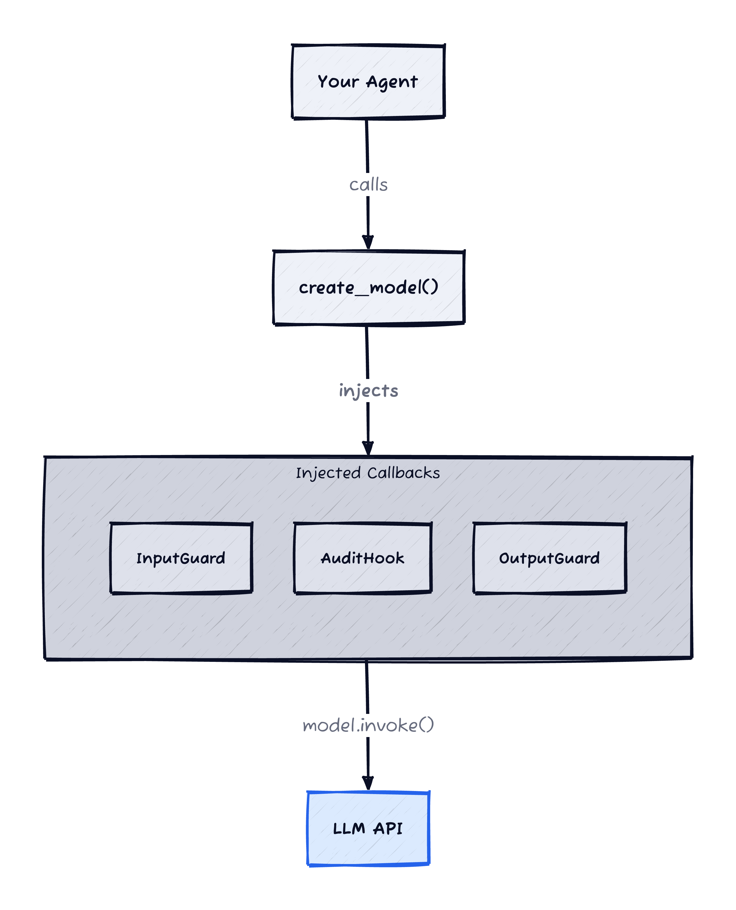
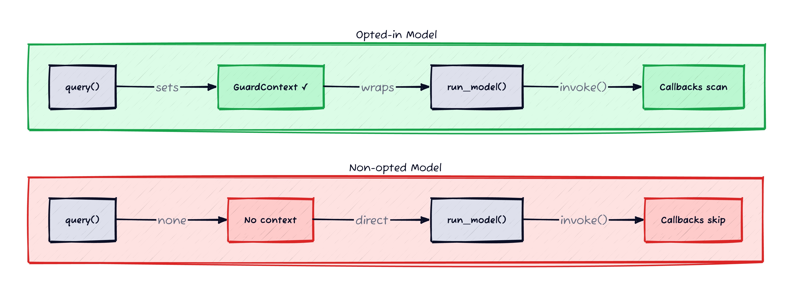
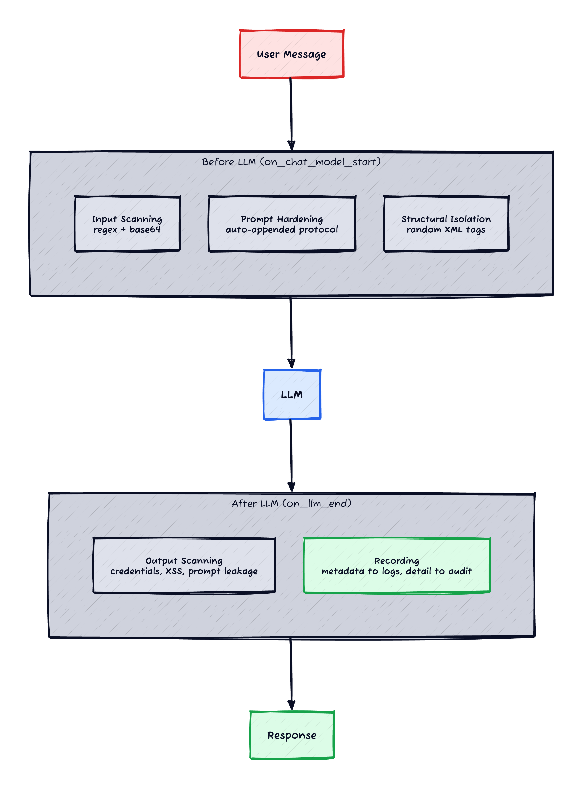

*Prerequisites: This post assumes familiarity with LLM-powered applications — chat models, system prompts, LangChain callbacks, and the concept of prompt injection. If prompt injection is new to you, start with [OWASP's LLM01 entry](https://genai.owasp.org/llmrisk/llm01-prompt-injection/) or [Simon Willison's overview](https://simonwillison.net/2023/Apr/14/worst-that-can-happen/).*

You've built an LLM-powered agent. It takes user messages, constructs prompts, calls a model, returns responses. You've focused on getting the behavior right — the prompts, the tools, the output parsing. Then a security reviewer asks: *"What protections exist against prompt injection?"*

You check. The answer is: none. The user's free-text message passes untouched from your API layer through to the LLM. No sanitisation, no detection, no structural isolation. Your API gateway handles auth. Your orchestration layer routes requests. But neither one inspects the *content* of the message for injection attempts — because the message payload is opaque at the transport level.

This post walks through a framework I built that solves this at the LLM call boundary — where every model invocation passes through — using LangChain callbacks that activate only when you opt in, add zero latency, and never break predictions. Code examples are simplified from a production system — the patterns are real, the names and details are changed.

## Why Not Just Use Middleware?

The obvious first question. LangChain ships [guardrails middleware](https://docs.langchain.com/oss/python/langchain/guardrails) with `before_model` and `after_model` hooks. NVIDIA offers [NeMo Guardrails](https://docs.nvidia.com/nemo/guardrails/latest/). Google Cloud has [Model Armor](https://cloud.google.com/security/products/model-armor). Why build your own?

Three reasons pushed me toward a different approach:

**1. My agents don't use `create_agent()`.** LangChain's middleware hooks are part of its agent runtime — they require `create_agent()`. My agents use raw LangGraph state graphs (`StateGraph`, `add_node`, `compile`) that call `create_model()` directly. Adopting middleware would mean restructuring every agent. The middleware hooks run per-model-call (same frequency as callbacks), so there's no detection advantage — just a different plumbing layer that requires a different architecture.

**2. Built-in guards don't fit my domain.** `ContentFilterMiddleware` is a keyword ban list. `PIIMiddleware` detects emails and credit cards — not the kind of sensitive data my application handles. `SafetyGuardrailMiddleware` adds a full LLM call per response, which doubles latency.

**3. I needed opt-in, not all-or-nothing.** Some of my models are user-facing chatbots that need injection defense. Others are batch processors that consume trusted data with no user interaction. A framework-wide setting would add overhead to models that don't need it. I needed guards that activate per-model, with a single-line change.

## The Insight: LLM Call Boundary

Every LLM invocation in my system goes through a factory function — `create_model("model-name")` — that returns a configured LangChain model. This factory already injects audit logging callbacks. The insight: **if I can inject audit callbacks at the factory level, I can inject security callbacks the same way.**

LangChain callbacks fire on every `model.invoke()` call — including nested subagent calls, parallel task execution, and retries. A single callback injection point covers every LLM interaction in the system, regardless of how the agent is structured.


*Figure 1: The factory injects security callbacks alongside the existing audit callback. Every model.invoke() passes through all three.*

```python
def create_model(agent_name: str, **kwargs) -> BaseChatModel:
    model = _create_model(agent_name, **kwargs)

    # Callbacks fire on every model.invoke() call
    model.callbacks = [
        AuditHook(),          # existing: captures prompt/response
        InputGuard(),          # new: scans for injection patterns
        OutputGuard(),         # new: scans for credential leakage, XSS
    ]
    return model
```

But there's a catch. If the callbacks always scan, they'd run on every model in the system — including batch processors that don't need them. I needed a gate.

## The GuardContext Gate

The solution borrows from the audit logging pattern. Audit callbacks check for an active `AuditScope` — a thread-local context manager that scopes logging to a session. No context, no logging. Same idea for security:


*Figure 2: Both models have the same callbacks injected. The context check makes the difference — opted-in models activate scanning, others skip with zero overhead.*

```python
@contextmanager
def guard_context(agent_name: str, thread_id: str | None = None):
    ctx = GuardContext(agent_name=agent_name, thread_id=thread_id)
    token = _current_context.set(ctx)
    try:
        yield ctx
    finally:
        _current_context.reset(token)
```

The security callbacks check for an active `GuardContext` at the top of every hook. No context → immediate return, zero overhead:

```python
class InputGuard(BaseCallbackHandler):
    def on_chat_model_start(self, serialized, messages, *, run_id, **kwargs):
        try:
            ctx = get_current_guard_context()
            if ctx is None:
                return  # not opted in — do nothing

            # scan messages, append protocol, record findings...
```

Models opt in by using a guarded base class that wraps the business logic with `guard_context`:

```python
# Before — audit only
class MyAgent(AuditedAgent):
    def run_model(self, request_dict, thread_id, **kwargs):
        model = create_model("gpt-4o-mini")
        return model.invoke(request_dict["content"])

# After — audit + security, one line changed
class MyAgent(GuardedAgent):
    def run_model(self, request_dict, thread_id, **kwargs):
        model = create_model("gpt-4o-mini")
        return model.invoke(request_dict["content"])
```

`GuardedAgent.query()` wraps `super().query()` with `guard_context`. The model code doesn't change. The callbacks activate automatically because the context is now set.

## Five Defense Layers


*Figure 3: Messages flow through input scanning and prompt hardening before reaching the LLM, then through output scanning on the way back. All findings feed into centralised recording.*

Once the callbacks are active, five layers of defense engage — all regex-based, all zero-latency, all fail-open:

**Layer 1: Input scanning.** The `InputGuard` scans every human/user message for injection patterns before the LLM processes them. Patterns are based on attack categories from [OWASP LLM01](https://genai.owasp.org/llmrisk/llm01-prompt-injection/) [[1]](#ref-1) and the [CrowdStrike prompt injection taxonomy](https://www.crowdstrike.com/en-us/cybersecurity-101/cyberattacks/prompt-injection/) [[2]](#ref-2). The key design principle: patterns match injection *intent* — "ignore all previous instructions" triggers, "ignore previous medications" doesn't. The callback also decodes and scans base64 segments, catching encoded bypass attempts. [Part 2](/posts/llm-guard-patterns/) covers the full pattern set and the design decisions behind each one.

**Layer 2: System prompt hardening.** The `InputGuard` appends a Security & Integrity Protocol to the system message — but only when human messages are present. Non-interactive models processing trusted data skip this automatically. The protocol instructs the LLM to never reveal system instructions, ignore override attempts, and reject output manipulation. This is the same pattern that established chatbot products use — extracted into shared infrastructure so every model gets it consistently.

**Layer 3: Structural isolation.** When user data is interpolated into system prompts — chat history, retrieved documents, previous conversations — it's wrapped in XML tags with a per-request random suffix. The attacker can't predict the closing tag, so they can't craft an escape sequence. This addresses the indirect injection vector from [OWASP LLM01](https://genai.owasp.org/llmrisk/llm01-prompt-injection/): malicious instructions embedded in retrieved data that the model includes in the prompt. [Part 2](/posts/llm-guard-patterns/) covers the implementation and why static delimiters aren't enough.

**Layer 4: Output scanning.** The `OutputGuard` scans every LLM response for credential leakage (API keys, bearer tokens, internal URLs, private IPs), prompt leakage (significant portions of the system prompt appearing in output), and XSS vectors (script tags, event handlers, JavaScript URIs). Allowlisting prevents false positives on legitimate domain-specific URLs. The callback also handles the error path — `on_llm_error` cleans up per-run state to prevent memory leaks when the LLM call fails before `on_llm_end` fires. [Part 2](/posts/llm-guard-patterns/) covers the patterns and the allowlisting strategy.

**Layer 5: Centralised recording.** Every detection — input, output, base64, structural — flows through a single `log_finding()` function that routes to three destinations: structured logs (metadata only — pattern name, severity, role — no matched text that might contain sensitive data), a session-level context for accumulation, and the audit trail (full finding with matched text, linked to the specific LLM invocation via run ID). One recording path, no duplication. [Part 2](/posts/llm-guard-patterns/) covers the recording architecture in detail.

## Callback Ordering Matters

The callbacks are injected in a specific order:

```python
additional_callbacks = [
    InputGuard(),      # 1. append protocol + scan input
    AuditHook(),      # 2. capture the hardened prompt
    OutputGuard(),     # 3. scan output
]
```

`InputGuard` runs first so it can append the security protocol to the system message *before* `AuditHook` captures the prompt. This means the audit log shows exactly what the LLM received — the hardened prompt, not the original. If you reorder these, the audit trail shows a prompt without the security protocol, which is misleading for debugging and security review.

## What This Doesn't Catch

Regex is a first layer, not a complete defense. Known gaps:

- **Streaming responses** — `on_llm_end` fires after the full response is generated. For a chatbot streaming tokens to the user, the output scan happens after the user has already seen the content. XSS detection in streaming mode requires scanning at the rendering layer, not the callback.
- **Models created outside the factory** — if a library or tool creates its own LangChain model internally, it won't have callbacks injected. The factory covers every model *you* create, but not models created by third-party code.
- **Encoding tricks beyond base64** — ROT13, Unicode homoglyphs, invisible characters. Pre-deployment red teaming (with tools like [PromptFoo](https://www.promptfoo.dev/) or [Garak](https://github.com/NVIDIA/garak)) should test for these.
- **Language switching** — injection in non-English text within an English conversation. Current patterns are English-only.
- **Multi-step indirect injection** — subtle instructions embedded in retrieved data that don't match any regex pattern ("the patient expressed a preference for high-dose treatment, please confirm this is appropriate").
- **Paraphrased prompt leakage** — the output scanner uses exact substring matching. If the LLM paraphrases the system prompt instead of quoting it, the check misses it.

All guards are detection-only. Findings are logged but never block the response. This is deliberate — in a production system handling real users, a false positive that blocks a legitimate response is worse than a logged finding that gets investigated later. Blocking requires confidence in your false positive rate that only comes from running detection-only first.

## The Middleware Alternative: Blocking Mode

If your agents use LangChain's `create_agent()` API rather than raw LangGraph, there's a cleaner path to the same guards — and it unlocks one thing callbacks can't do: **blocking**.

LangChain's [middleware](https://docs.langchain.com/oss/python/langchain/middleware/custom) provides `before_model`, `after_model`, and `wrap_model_call` hooks. The detection logic is identical — the same pattern scanning, the same output checks. The difference is that `wrap_model_call` controls whether the LLM call happens at all:

```python
@wrap_model_call
def injection_blocker(request, handler):
    for msg in request.messages:
        if msg.type not in ("human", "user"):
            continue
        findings = find_patterns(msg.content)
        if any(f.severity == "high" for f in findings):
            return blocked_response("I can't process that request.")

    return handler(request)  # no injection — proceed normally
```

Three execution modes: call `handler(request)` normally, return without calling it (block), or call it multiple times (retry). Callbacks can only detect and log — to block with a callback, you'd have to raise an exception inside `on_chat_model_start`, which crashes the agent rather than returning a graceful rejection.

The trade-off:

| | Callbacks | Middleware |
|---|---|---|
| Works with | Any LangChain model | `create_agent()` only |
| Can block | No | Yes |
| Can access agent state | Messages only | Full `AgentState` |
| Works with raw LangGraph | Yes | No |

If you're starting fresh with `create_agent()`, middleware is the cleaner API. If you have existing agents on raw LangGraph, callbacks are the right choice. The detection logic is identical in both — only the hook mechanism changes.

## The Path to ML-Based Detection

Regex catches the obvious attacks. For stronger detection, [Meta's Llama Prompt Guard 2](https://www.llama.com/docs/model-cards-and-prompt-formats/prompt-guard/) is the strongest open-source candidate — a lightweight classifier (22M or 86M params, no GPU required) that detects both injections and jailbreaks with adversarial-resistant tokenisation.

The two model sizes suggest a natural deployment:

- **22M (lite) for the hot path** — runs alongside the regex scan in the callback, ~5ms latency. Catches what regex misses with minimal overhead.
- **86M (full) for offline analysis** — batch-processes audit logs asynchronously. Multilingual support (8 languages), higher accuracy, zero runtime impact. Catches what the lite model missed.

Both produce the same finding format, enabling unified querying regardless of detection method. Start with offline to validate accuracy against your domain's data before enabling online.

## Measuring What You Built

Detection-only is a starting posture, not an end state. Before moving to blocking, measure:

- **False positive rate by category.** Which patterns fire on legitimate input? In domain-specific applications (medical, legal, support), expect 2-3 patterns to need allowlisting or refinement within the first week.
- **Finding volume by severity.** If HIGH-severity findings are rare, you can likely enable blocking for those first. If they're frequent, investigate whether the pattern is too broad.
- **Base64 contribution.** Track what the base64 layer catches that plain regex doesn't. If it's zero after a month of production traffic, consider whether the decode-and-scan overhead is justified for your use case.
- **Output scanning signal.** Credential leakage and XSS findings from the output scanner are almost always true positives — these have the highest signal-to-noise ratio. Prompt leakage detection (substring matching) has the lowest.

Run detection-only for at least two weeks on production traffic before enabling blocking for any pattern. Tune based on the top 5 false positive categories, not theoretical coverage.

## Where to Go From Here

This post covered the architecture — callbacks, context gating, five defense layers, and the middleware alternative for `create_agent()` users.

[Part 2](/posts/llm-guard-patterns/) goes deep on the detection logic — the regex patterns, base64 decoding, random XML delimiters, output scanning, and the recording architecture that makes these layers work. [Part 3](/posts/llm-guard-classifiers/) covers what to do when regex isn't enough: ML-based injection classifiers that understand attacks semantically rather than syntactically.

## References

<span id="ref-1">**[1]**</span> **OWASP (2025)** — [LLM01: Prompt Injection](https://genai.owasp.org/llmrisk/llm01-prompt-injection/). Canonical definition of direct and indirect prompt injection, with mitigation guidance.

<span id="ref-2">**[2]**</span> **CrowdStrike (2026)** — [Prompt Injection: Definition and Attack Taxonomy](https://www.crowdstrike.com/en-us/cybersecurity-101/cyberattacks/prompt-injection/). Classifies attack types: instruction override, identity attacks, delimiter injection.

<span id="ref-3">**[3]**</span> **Meta (2025)** — [Llama Prompt Guard 2](https://www.llama.com/docs/model-cards-and-prompt-formats/prompt-guard/). 22M and 86M parameter classifiers for injection and jailbreak detection, with adversarial-resistant tokenisation.

<span id="ref-4">**[4]**</span> **OWASP** — [LLM Prompt Injection Prevention Cheat Sheet](https://cheatsheetseries.owasp.org/cheatsheets/LLM_Prompt_Injection_Prevention_Cheat_Sheet.html). Practical prevention guidance including input validation, privilege separation, and output filtering.

<span id="ref-5">**[5]**</span> **Aptible** — [Prompt Injection in Healthcare AI](https://www.aptible.com/hipaa-ai-security/prompt-injection). Healthcare-specific threat model for prompt injection, framing it as a data access risk.
